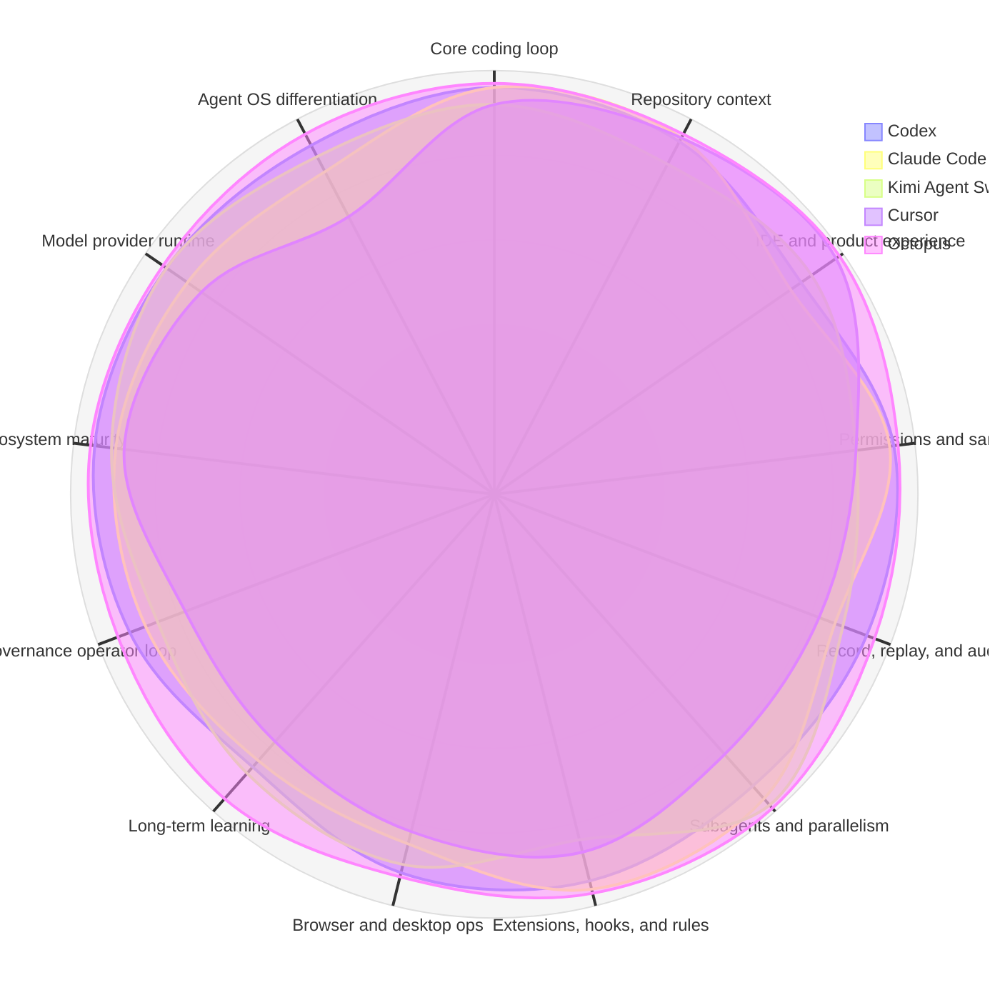

# Agent Runtime Scorecard

- Verdict: `leading`
- Target score: `90`
- Overall: codex=93 claude_code=91 kimi_agent_swarm=90 cursor=86 octopus=96

## Dimensions

| Dimension | Weight | Codex | Claude Code | Kimi Agent Swarm | Cursor | Octopus | Gap vs Codex |
|---|---:|---:|---:|---:|---:|---:|---:|
| Core coding loop | 15 | 96 | 96 | 92 | 92 | 97 | +1 |
| Repository context | 8 | 94 | 95 | 88 | 95 | 96 | +2 |
| IDE and product experience | 7 | 88 | 85 | 91 | 98 | 99 | +11 |
| Permissions and sandbox | 10 | 95 | 94 | 86 | 86 | 96 | +1 |
| Record, replay, and audit | 8 | 94 | 86 | 88 | 82 | 96 | +2 |
| Subagents and parallelism | 8 | 92 | 96 | 98 | 82 | 99 | +7 |
| Extensions, hooks, and rules | 8 | 94 | 96 | 84 | 87 | 97 | +3 |
| Browser and desktop ops | 6 | 92 | 85 | 90 | 82 | 93 | +1 |
| Long-term learning | 6 | 86 | 84 | 88 | 78 | 96 | +10 |
| Governance operator loop | 5 | 92 | 88 | 85 | 78 | 95 | +3 |
| Ecosystem maturity | 4 | 95 | 90 | 91 | 88 | 96 | +1 |
| Model provider runtime | 5 | 94 | 88 | 94 | 84 | 95 | +1 |
| Agent OS differentiation | 10 | 93 | 86 | 90 | 74 | 96 | +3 |

## Radar

- Edges: advantage `13`, gap `0`
- Edges vs best competitor: advantage `13`, strict advantage `13`, ties `0`, gap `0`

## Provider Runtime

- Matrix: `pass` score `100`, rows `3`
- Configured profiles: kimi_coding, openai_compat
- Built-in domestic profile coverage: `11/11`
