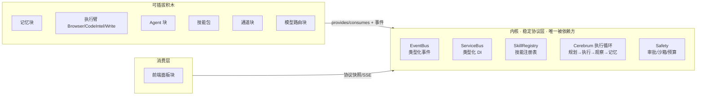

# 积木化设计 · Composition Layer（Blocks）

> 状态：Accepted（P0-P2 + P3 契约层已落地） · 日期：2026-08-18
> 相关文档：[architecture/README.md](./README.md) · [module-map.md](./module-map.md) ·
> [organ-tiering.md](./organ-tiering.md) · [dsh-advantages-absorption-status.md](../dsh-advantages-absorption-status.md) ·
> [ADR-012 组合层](../adr/012-composition-layer.md)

## 0. 一句话

**把已有的"块"（Skill / Agent / 插件）和待拆的"大泥球"（cerebrum / suckers / gateway / 前端 workspace）
统一到一套标准"卡扣"上：`provides/consumes` 声明 + 生命周期拓扑编排 + 类型化事件总线。
借鉴 DSH 的 Cordis 理念（依赖注入、生命周期、可组合），但**不迁移** Cordis，保持
Octopus 的市场 + 信任 + 仿生架构护城河。**

---

## 1. 背景：为什么需要这套设计

### 1.1 已经长成"积木"的部分

| 块 | 位置 | 形态 | 契约 |
|---|---|---|---|
| Agent 块 | `agents/<name>/profile.jsonc` + `agent-core/*.md` | 数据目录 | DID / templateId / capabilities / SOUL / IDENTITY / TOOLS |
| 技能块 | `skills/public/<name>/` + `SkillRegistry` | 目录 + 注册表 | `register()` / `affinity` / `cost_profile` / `trusted_source` |
| 插件块 | `runtime/platform/plugins/` | `plugin.yaml` + `ModulePlugin` | 三层渐进注册：skills → channels → routes |
| 扩展钩子 | `runtime/platform/extensions.py` | 环境变量声明 | `OCTOPUS_SKILL_EXTENSIONS` / `OCTOPUS_APP_EXTENSIONS` |
| 编排原语 | `suckers/_delegation_skills_*.py` | 函数 | `call_agent` / `call_agent_parallel` / `run_orchestration` |

### 1.2 仍然是"大泥球"的部分

| 区域 | 规模（行数） | 问题 |
|---|---|---|
| `runtime/core/cerebrum/` | 97 个文件 | 规划器 + ReAct 循环 + prompt 组装 + 解析器全部内聚，无稳定边界 |
| `runtime/execution/suckers/` | 80+ 文件 | browser / code_intel / write / delegation / memory 技能族平铺混放 |
| `runtime/sensing/gateway/` | `_tool_bridge_loop.py` 2292 / `realtime_turn_lifecycle.py` 1386 / `realtime_event_bridge.py` 1234 | 内核与 UI 的胶水，与 `runtime/protocol` 未版本化 |
| `frontend/src/components/workspace/` | 399 组件；`[thread_id]/page.tsx` 4041 / `workspace-sidebar.tsx` 2878 | 无面板协议，新功能只能硬塞页面 |

### 1.3 核心问题

> 代码库**不缺积木，缺的是"积木之间的标准接口"和"把大文件按接口切出去"**。

现有 `plugins/` + `extensions.py` + `SkillRegistry` 是**注册式**卡扣：插件把东西注册进
registry/channels/routes，但**不声明依赖谁、提供谁、卸载顺序是什么、靠什么通信**。
结果是插件之间只能靠"约定"耦合，无法真正组合、替换、热重载。

---

## 2. 块类型（Block Taxonomy）

定义 6 类块 + 1 类协议层。每类块是独立交付单元，拥有自己的版本、失败模式、演化节奏。

| 类型 | kind | 现有位置 | 契约（输入 → 输出） | 拆解目标 |
|---|---|---|---|---|
| 记忆块 | `memory` | `runtime/memory/` | `store / recall / forget / reflect` + 租户隔离 | journal 作为默认实现；可替换存储后端（向量库/关系库） |
| 执行臂 | `arm` | `runtime/execution/suckers/` 各技能族 | `tool_specs` + `capabilities` + `sandbox_requirements` | 每个技能族（browser/code_intel/write/git…）一个独立插件包 |
| Agent 块 | `agent` | `agents/` | profile.jsonc + agent-core 文档集 | 已是数据块，只补 manifest 校验 |
| 技能包 | `skill-pack` | `skills/public/` | `register(registry)` | 已是数据块，只补 manifest 校验 |
| 通道块 | `channel` | `runtime/adapters/channels/` | `Channel` 接口 + 消息事件 | 已是半块，补事件约定 |
| 前端面板块 | `widget` | `frontend/src/components/workspace/` | `PanelManifest`：`{ id, title, 数据源, 订阅事件, 权限 }` | 新面板 = 新目录 + 注册，页面零改动 |
| 模型路由块 | `model-router` | `runtime/sensing/model_router/` | 任务特征/角色/预算 → 模型+参数策略 | 换供应商/加本地模型不碰 cerebrum |
| 协议层 | （非块） | `runtime/protocol/` | 版本化 wire 协议（事件/items schema） | 前端/桌面只消费协议快照，不 import 内核实现 |

---

## 3. 组合层三件套（本设计的核心）

### 3.1 BlockManifest —— 块的"身份证 + 卡扣"

每个块目录携带 `block.yaml`（或插件延续 `plugin.yaml`），声明：

```yaml
name: octopus.memory
version: 1.0.0
kind: memory                  # memory | arm | agent | skill-pack | channel | widget | model-router

provides:
  - memory                    # 提供的服务名（注入总线时校验）
consumes:
  - journal                   # 依赖的服务名（决定加载/卸载顺序）
  - event_bus

capabilities:                 # 需要哪些能力（浏览器、代码索引、git…）
  - vector_store
dependencies:                 # 可选运行时依赖（桌面版按需安装）
  - name: chromadb
    optional: true

sandbox:                      # 沙箱/审批档位（对齐 DSH 三档）
  mode: workspace_write       # read_only | workspace_write | full_access
  approval: auto

events:                       # 事件契约：发出的 / 订阅的
  emits: [memory.recalled, memory.promoted]
  consumes: [journal.appended]

frontend:                     # 仅 widget 类使用
  panel: workspace/evolution  # 注册到工作台的位置
```

**验证规则**：
- `consumes` 里的每一项必须能被某个已加载块的 `provides` 满足，否则加载失败并给出缺块清单；
- 禁止循环依赖（加载前拓扑检测）；
- `provides` 同名冲突 = 启动错误（除非显式 `replace: true`，当前 `SkillRegistry.register(..., replace=True)` 语义保留）。

### 3.2 生命周期编排（依赖拓扑）

在现有 `ModulePlugin`（`runtime/platform/plugins/plugin_base.py`）基础上扩展：

```python
class OctopusPlugin(ModulePlugin):
    # 新增：声明式依赖（类属性），PluginHub 负责排序
    provides: list[str] = []
    consumes: list[str] = []
```

```text
加载（按 consumes 拓扑序）         卸载（逆序）
─────────────────────            ─────────────────────
on_load(ctx)  校验 provides/consumes
              注册 services → ServiceProvider
              注册 skills/channels/routes
on_start(ctx) 打开连接/后台任务       on_stop(ctx)  停后台任务/关连接
                                   on_unload(ctx) 反注册 + cleanup_registrations()
```

- **加载顺序**：`consumes` 拓扑排序（Kahn），任一依赖缺失 → 该块标记 `blocked`，其余正常加载，不整体崩溃（延续 `extensions.py` "单个扩展异常只记日志" 的容错哲学）；
- **卸载顺序**：逆拓扑序，保证没有消费者存活时再拆提供者；
- **热重载（Phase 4）**：watch 块目录 → 逆序卸载 → 重载 → 拓扑加载，仅开发期启用。

### 3.3 类型化服务总线（升级 ServiceProvider）

现有 `runtime/platform/process/service_provider.py` 是**无类型 string 键的服务定位器**。升级为：

```python
class ServiceBus:
    """类型化 + 声明式绑定的服务总线（组合层的"插座"）。"""
    def bind(self, plugin: OctopusPlugin) -> None:
        # 1. 校验 plugin.consumes ⊆ 已注册 provides（或同批拓扑内）
        # 2. 把 plugin.provides 注册为 typed key
        # 3. 注入 plugin.ctx.services（一个只读视图）
    def get(self, key: Type[T]) -> T: ...
    def emit(self, event: DomainEvent) -> None: ...   # 转发到 EventBus
    def subscribe(self, event_type: str, handler) -> None: ...
```

**组合规则（硬约束）**：
1. 块之间**只通过总线通信**（服务调用 + 事件），禁止跨块直接 import 实现模块；
2. 内核（cerebrum 循环 + registry + event bus + safety）是**唯一被所有块依赖的稳定层**；
3. 块的可替换性 = 同一 `provides` 下换实现，消费者无感。

### 3.4 事件约定（复用现有 EventBus）

现有 `runtime/platform/process/eventbus.py` 已是类型化 `DomainEvent`，把约定固定下来：

- 命名：`<domain>.<verb>.<past-participle>`，如 `memory.promoted`、`subagent.concluded`、`journal.appended`；
- 单向数据流：块**发事件**通知，订阅者**异步消费**；禁止在事件处理器里反向同步调用发起方；
- schema 版本化：事件 payload 是 wire 协议的一部分（对齐 `docs/openapi-snapshot.json` 思路，后续生成 TS 类型）；
- 订阅失败只记日志不拖垮主流程（延续现有 `_safe_emit` / `contextlib.suppress` 风格）。

---

## 4. 依赖方向



- **内核不依赖任何块**（`cerebrum` 只面向 `SkillRegistry` / `EventBus` 抽象）；
- 块依赖内核；块之间无直接依赖；
- 前端只依赖**协议层**（`runtime/protocol` + OpenAPI 快照），不 import 内核实现。

---

## 5. 现有代码映射（现状 → 目标）

### 5.1 已经是块：只补 manifest，不动结构

`agents/`、`skills/public/`、`runtime/platform/plugins/`、`runtime/adapters/channels/`

### 5.2 是半块：抽接口，保留实现

| 区域 | 现状 | 动作 |
|---|---|---|
| `runtime/memory/` | 五层架构扎实，与 journal 强耦合 | 定义 `MemoryProvider` 接口，journal 为默认实现 |
| `runtime/sensing/model_router/` | 已存在，选择逻辑仍有散布 | 抽 `ModelRouter` 块，收敛 cerebrum 内 `_select_call_model` / cheap 路由 |
| `runtime/execution/parallel_agents/` | orchestrator 已有拓扑 + WorkContract | 补声明式 DSL（YAML/JSON 定义 workflow） |
| `runtime/execution/subagents/` | 生命周期/report 闭环完整 | 定义 `SubagentRunner` 接口，事件契约化 |

### 5.3 大泥球：按块切分（Phase 2/3 逐个做）

| 区域 | 切法 | 验收 |
|---|---|---|
| `suckers/` 各技能族 | 每族 = 一个 `arm` 插件包，注册进 `tool_spec_builder` 装配点 | 684 个后端测试保持全绿；每个族可独立装卸 |
| `frontend workspace/` 399 组件 | 定义 `PanelManifest`，先拆 `workspace-sidebar` / `[thread_id]/page.tsx` | 新面板 = 目录 + 注册，页面零改动 |
| `gateway/` 4 个 1000+ 行文件 | 事件 schema 版本化，前端改消费协议快照 | 内核升级不破坏前端/桌面/E2E |

---

## 6. 与 DSH（DeepSeek Harness / Cordis）逐点对照

| 维度 | DSH Cordis | Octopus 现状 | 本设计落地后 | 差距 |
|---|---|---|---|---|
| 插件注册 | ✅ | ✅ `plugins/` 三层注册 | ✅ 保留 | 🟢 已对齐 |
| 生命周期 | ✅ | ✅ `on_load/on_start/on_stop/on_unload` | ✅ + 依赖拓扑排序 | 🟡 补顺序 |
| 依赖注入 | ✅ | ❌ `ServiceProvider` 无类型 string 键 | ✅ `ServiceBus` 类型化 + provides/consumes | 🔴 → 🟢 |
| 热重载 | ✅ | ❌ | ✅ Phase 4（开发期） | 🔴 → 🟡 |
| 事件驱动组合 | ✅ 消息总线 | 🟡 有 `EventBus` 但非插件组合约定 | ✅ 3.4 约定固定 | 🟡 → 🟢 |
| 插件市场 | ❌ | ✅ `plugin_hub.py` + 信任链 | ✅ 保留（护城河） | 🔵 我们更强 |
| 发布者信任 | ❌ | ✅ `publisher_provenance.py` / `publisher_trust.py` | ✅ 保留（护城河） | 🔵 我们更强 |
| 架构分离 | ⚠️ 单一 loop | ✅ Cerebrum/Arms 分离 | ✅ 保留（护城河） | 🔵 我们更强 |
| 声明式编排 DSL | ✅ | ❌ 缺 | ✅ Phase 2 | 🔴 → 🟢 |
| ACP / e2b / VSCode | ✅ | ⏳ 未做 | 不在本设计范围 | 🟡 另立项目 |

**结论**：本设计的目标是"吸收 Cordis 的可组合性，保留 Octopus 的可组合潜力"——
补齐类型化 DI、依赖生命周期、事件组合约定 + 声明式 DSL 后，我们在"插件化"维度与 DSH 对齐，
同时保有 DSH 没有的仿生架构、市场、信任、MCP、前端优势。

---

## 7. 落地路线

| Phase | 内容 | 验收标准 |
|---|---|---|
| **P0（本文档）** | 块类型 + manifest schema + 依赖方向 | ✅ 已落地：`block_manifest.py` + `service_bus.py` + 24 测试全绿（2026-08-18） |
| **P1** | `ServiceBus` 接入 `PluginHub`；记忆块、模型路由块接口化 | ✅ 已落地：`PluginHub(service_bus=…)` 拓扑加载 + blocked 跳过 + unload 解绑 + 集成测试；`MemoryProvider` 协议 + journal 默认实现 + 应用侧接线（`app.state.service_bus`）；`ModelSelector` 协议（`platform.models.selector`）+ `DefaultModelSelector` 默认实现（优先级链：显式覆盖 > 角色声明 > cheap > 默认）+ 注册为 `model_router` 服务 |
| **P2** | 执行臂按技能族抽 `arm` 插件；声明式编排 DSL | ✅ 全部落地：arm 模板 + 真实 memory 技能族抽取（幂等兼容层）+ 内核服务种子；**声明式 workflow DSL**（`workflow_dsl.py`：YAML 解析/校验/映射/调度，`demos/workflows/research-report.yaml` 参考）；其余技能族批量抽取待做 |
| **P3** | 前端 `PanelManifest`；拆 `workspace-sidebar` / `[thread_id]/page.tsx` | ✅ 契约层 + 消费原语 + **真实页面接入**：`intelligence`（自动化）页新增「面板」tab 经 `PanelHost` 渲染注册面板（15 vitest + typecheck + eslint 全绿）；`workspace-sidebar` / `[thread_id]` 大规模拆分待做 |
| **P4** | 网关事件 schema 版本化；开发期热重载 | ✅ **全部落地**：`BlockManifest.schema_version` + `DomainEvent.protocol_version`（事件信封版本化）+ `BlockWatcher` 热重载 + **前端协议快照门禁**（`gen_realtime_protocol_enums.py --check` + `protocol-enum-parity.test.ts`，实时枚举以 `runtime/protocol/items.py` 为源生成、漂移即红） |

每阶段独立可交付、可回滚；**先定契约再拆代码**，拆一个跑一遍测试。

---

## 8. Non-goals（明确不做）

1. **不迁移 Cordis**：TypeScript 框架，Python 无直接对应；仓库既有结论"借鉴理念、不走 Cordis 风格"（`dsh-advantages-absorption-status.md` P3）继续有效；
2. **不推翻仿生命名**：`organ-tiering.md` 的三层模型是本设计的上层叙事，本文件只定义工程层卡扣；
3. **不做无收益拆包**：内部模块（如 `cerebrum` 内部 helpers）若无外部消费者，不强行独立成包。

---

## 9. 已落地实现（P0，2026-08-18）

| 文件 | 内容 |
|---|---|
| `runtime/platform/process/block_manifest.py` | `BlockManifest` Pydantic 模型：`kind / provides / consumes / emits / subscribes / capabilities / sandbox / frontend`；`from_yaml` / `from_plugin_manifest` 兼容入口 |
| `runtime/platform/process/service_bus.py` | `ServiceBus`（类型化服务 + `bind/unbind` + 事件委托）+ 纯函数 `resolve_load_order`（拓扑排序：缺依赖 → blocked 不崩溃，循环 → `BlockDependencyCycleError`）。**P1**：`PluginHub` 可注入，`load_all` 按拓扑序加载、`unload` 解绑、`ModuleContext.service_bus` 供插件运行时消费 |
| `runtime/memory/provider.py` + `runtime/platform/process/composition.py` | **P1b**：`MemoryProvider` 协议（store/recall/forget/reflect/health）+ `JournalMemoryProvider` 默认实现；`build_default_service_bus(journal=…)` 绑定 `journal`/`memory` 服务；`mount_routers_b` 接线 `app.state.service_bus` |
| `runtime/platform/models/selector.py` + `runtime/sensing/model_router/selector.py` | **P1b**：`ModelSelector` 协议（接口在 `platform.models`，遵循 `ModelRouter` 同款分层）+ `DefaultModelSelector` 默认实现；`build_default_service_bus` 注册为 `model_router` 服务（可注入自定义 selector） |
| `demos/arms/memory_arm/` + `resolve_load_order(available_services=…)` | **P2**：参考 arm 插件加载**真实 memory 技能族**（`register_memory_skills`）+ 演示总线消费技能；拓扑解析器新增内核服务种子；`_memory_skills_handlers.py` 12 处注册改为幂等 `_register(registry, skill)`（`replace=True`）——默认装配与插件重复加载同一技能族不再崩溃，是「默认仍注册、可被插件覆盖」的兼容层 |
| `runtime/execution/parallel_agents/workflow_dsl.py` + `demos/workflows/research-report.yaml` | **P2 声明式 DSL**：`WorkflowSpec`/`WorkflowTaskSpec` Pydantic 校验（唯一 id / 悬空依赖 / 自依赖）+ `parse_workflow_yaml` + `build_dispatch_inputs`（映射到 `DispatchTaskInput`）+ `dispatch_workflow`/`load_and_dispatch`——关闭 DSH 差距「缺少声明式 YAML workflow」 |
| `frontend/src/core/panels/`（`panel-manifest.ts` / `use-panels.ts` / `panel-host.tsx` / `default-panels.tsx` + 3 测试） | **P3 契约层 + 消费原语**：`PanelManifest` 类型 + 注册表（重复 id 拒绝、zone/permission 过滤、版本号订阅）+ `usePanels`/`usePanel`（`useSyncExternalStore`）+ **`PanelHost`**（按 zone 渲染注册面板，空 zone 渲染空，可自定义 header）+ 参考面板 `workbench.system-status`；「新面板 = 注册即用、页面放一个 PanelHost」 |
| `tests/test_block_manifest.py` / `tests/test_service_bus.py` / `tests/test_plugin_hub_service_bus.py` / `tests/test_memory_provider.py` / `tests/test_composition.py` / `tests/test_model_selector.py` / `tests/test_arm_plugin.py` / `tests/test_workflow_dsl.py` | 64 个测试，覆盖 manifest 校验、拓扑顺序（含内核服务种子）、缺依赖、循环、factory 缓存、事件委托、PluginHub 集成、MemoryProvider（真实 JSONLJournal 往返）、ModelSelector 优先级链、arm 端到端加载（含真实技能族 + 幂等性）、workflow DSL（解析/校验/映射/调度） |

对齐点：复用 `PluginManifest` 词汇（`provides/subscribes`），
`ServiceProvider` 的 factory 缓存语义，`EventBus` 的 `subscribe/emit` 鸭子类型。
## 10. 关联文档

- [architecture/README.md](./README.md) — 架构文档索引
- [module-map.md](./module-map.md) — 器官词汇 → 实现路径映射
- [organ-tiering.md](./organ-tiering.md) — 器官三层分级
- [dsh-advantages-absorption-status.md](../dsh-advantages-absorption-status.md) — DSH 优势吸收状态（插件系统 70%、Cordis 0%）
- [octopus-vs-dsh-full-comparison.md](../octopus-vs-dsh-full-comparison.md) — 与 DSH 全面对比
- [ADR-012 · 组合层](../adr/012-composition-layer.md) — 本设计的决策记录（Accepted）
- [blocks-commit-checklist.md](./blocks-commit-checklist.md) — 分 7 组可独立验证的提交清单
