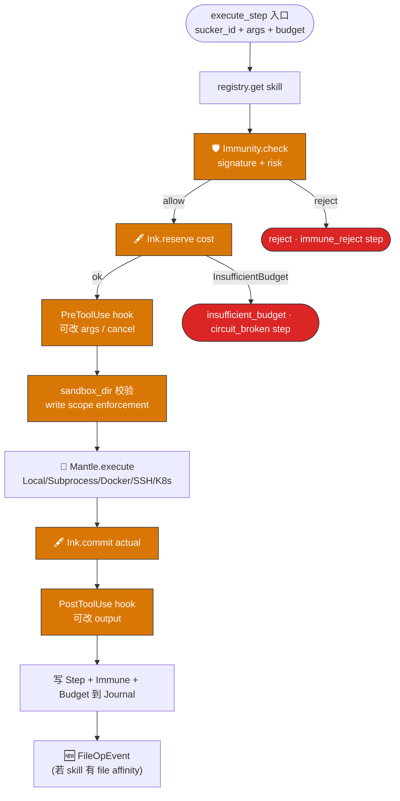

# 🦷 Beak · 角质喙

**生物原型**：章鱼是软体动物，全身只有一个硬质器官 —— 喙。用来咬碎贝壳、啃食猎物。

## 职责
工具执行引擎 —— 所有 Sucker 的实际"咬合"动作在此发生。

## 为什么独立于 Suckers
- Suckers 是**描述**（我能做什么）
- Beak 是**执行**（怎么咬下去）
- 便于复用：`core/` 直接承接 BaseTool / ToolRuntime / Message 类型

## 子目录
```
beak/
└── core/        [internal — BaseTool / ToolRuntime / Message]
```

## 核心接口
```python
class Beak:
    def bite(self, sucker: Sucker, args: dict, mantle: Mantle) -> BiteResult: ...
```

## 必经 Mantle
Beak 的每一次 bite 必须在某个 Mantle（沙箱）内进行，不允许裸执行。

## 结构图


