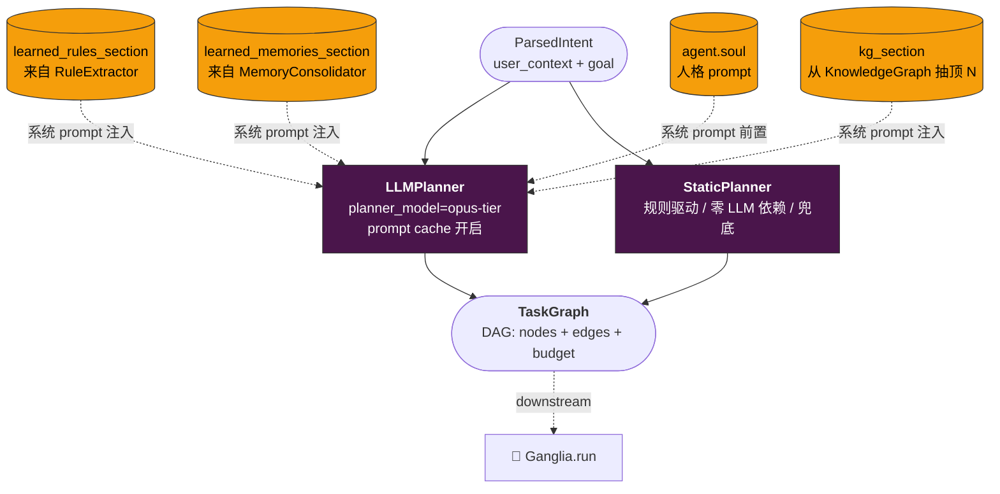

# 🧠 Cerebrum · 中枢脑

**生物原型**：章鱼的中枢脑，只占全部神经元的 1/3，专注总体规划。

## 职责
- 把用户目标分解成 `ArmTask` 序列
- 路由决策：哪条 Arm 最合适、预算分配
- 仲裁：Arm 间冲突由此裁决

## 不做
- 不直接调工具（那是 Beak 的活）
- 不读具体文件（那是 Arm 的活）

## 输入输出
- **输入**：Eyes（用户意图）+ Skin（环境信号）+ Genome（历史记忆）→ Hemolymph 打包
- **输出**：`TaskGraph`（nerves/graph 格式）+ 路由表

## 接口（草案）
```python
class Cerebrum:
    def plan(self, goal: Goal, context: ContextPacket) -> TaskGraph: ...
    def arbitrate(self, conflict: ArmConflict) -> Decision: ...
```

## 进化关联
承载 **① 长任务引擎** 的规划层（与 Ganglia、Genome/Checkpoint 协作）。

## 模型策略
用最强模型（opus-tier）— 这是省钱的"不能省"位。

## 结构图


