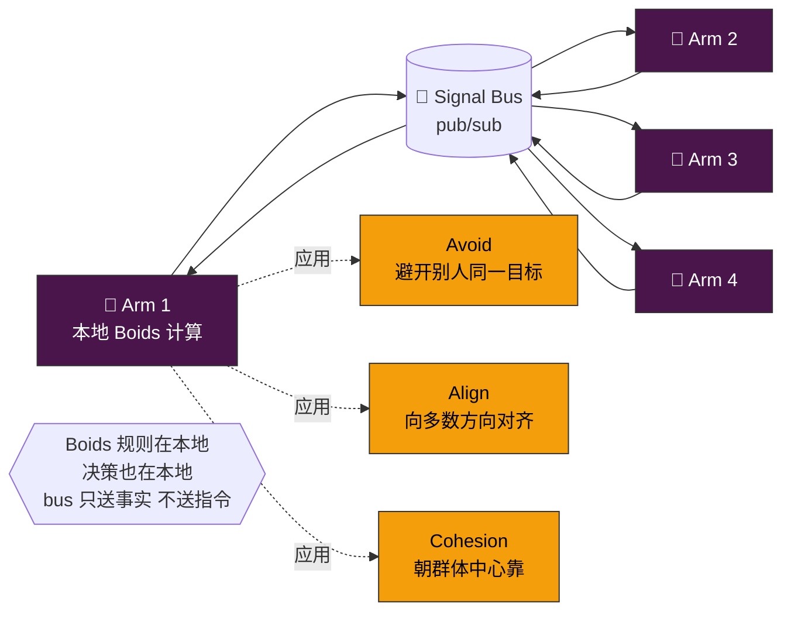

# 🎨 Chromatophores · 色素细胞（双重身份）

**生物原型**：章鱼皮肤上数百万色素细胞，每个细胞下有微型肌肉 —— 既是**信号发射器**（变色传达状态）又是**并行效应器**（毫秒级同步收缩/扩张）。
**抽象对应**：一个模块承担两个职能 —— **腕间通信** + **并行动作编排**。

## 双重职责

### 职责 A：状态广播（Pub/Sub）
轻量消息总线，**只传状态变更**，不传数据。

| 话题 | 发布者 | 订阅者 | 用途 |
|---|---|---|---|
| `arm.busy` / `arm.idle` | Arm | Cerebrum, 其他 Arm | 避免重复派活 |
| `sucker.grabbed` | Arm | 其他 Arm | 资源宣称（分布式锁替代）|
| `alert.budget` | Ink | 全体 | 预算告急 |
| `alert.loop` | Ink | Cerebrum | 死循环检测 |
| `alert.immune` | Immunity | Cerebrum, Arms | 攻击模式命中 |

### 职责 B：并行效应器（Effector Cluster）
对应生物色素细胞的**肌肉同步收缩** —— 当一个 Arm 决定执行一组动作时：

```
Arm 决策 "fetch + parse + diff 三步并行"
    ↓
Chromatophores.fire_pattern([
    {sucker: fetch, args: ...},
    {sucker: parse, args: ...},
    {sucker: diff,  args: ...},
])
    ↓
三个 Beak 咬合在同一 tick 内并行触发（非串行）
```

这是 Arm 内部 / Arm 之间**编排多 Sucker 并行执行**的协议层，不是单调用。

## 核心：鱼群三原则（Boids Protocol）

腕间协作的**具体算法**，写入 bus 的默认消息处理规则：

| 规则 | 触发条件 | 动作 |
|---|---|---|
| **避撞 Separation** | 同一资源被多 Arm 宣称 | 优先级低的退让 + 本地回滚 |
| **对齐 Alignment** | 多 Arm 收到相同目标广播 | 按 affinity 分片，统一 tick 内启动 |
| **聚合 Cohesion** | Arm 连续 idle 超过 N tick | 向当前最忙的任务簇靠拢（帮忙或学习）|

这是从 **Reynolds 1986 Boids 算法**直接借过来的，用于大量简单体涌现全局秩序。

## 接口
```python
class Chromatophores:
    # Signal side
    def publish(self, topic: str, payload: dict): ...
    def subscribe(self, topic: str, handler): ...

    # Effector side
    def fire_pattern(self, actions: list[Action]) -> list[Future]: ...

    # Boids protocol
    def resolve(self, claim: ResourceClaim) -> Verdict: ...  # Separation
    def align(self, broadcast_goal) -> Assignment: ...        # Alignment
    def cohere(self, idle_arm: Arm) -> TaskPointer: ...      # Cohesion
```

## 为什么不走 Cerebrum 转发
中枢脑一旦成为通信中心就变成瓶颈。真章鱼的腕间也有直接神经通路，不必经过大脑。
加上 Boids 三原则后，**全局秩序可以由局部规则涌现**，不需要中枢仲裁每一次冲突。

## 实现选型
- Pub/Sub：Redis Pub/Sub 或 NATS subject
- Effector 并行：asyncio.gather / task pool
- Boids 规则：纯函数，跑在每个 Arm 本地（不集中）

## 进化关联
- **② Swarm + Blackboard** 的 Swarm 部分（Blackboard 在 Hemolymph）
- 与 Nerves/bus 共用传输层，语义上是更高层的"社交协议"

## 结构图


