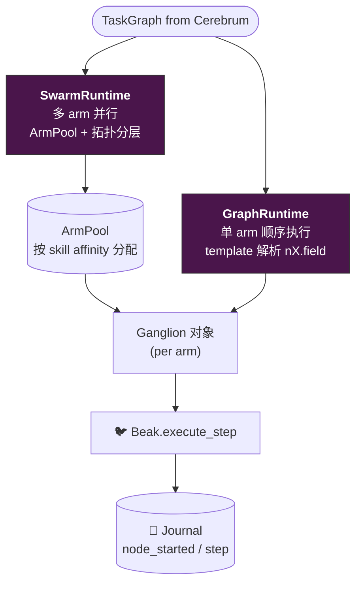

# 🕸️ Ganglia · 神经节

> ⚠️ **状态：部分实装** — DAG 执行引擎已实装于 `runtime/core/graph_runtime/runtime.py`（`GraphRuntime` / `SwarmRuntime`，拓扑分层并行执行）。**未实装的是"独立 Ganglion 自治层 / 断联自治"**——每条 Arm 配一个本地 Ganglion 在 Cerebrum 断联时自治决策的能力。本文档描述的是该未实装部分的设计愿景。

**生物原型**：章鱼每条腕根部的神经节，是腕的"小脑"，能独立完成抓取动作。

## 职责
- 每条 Arm 配一个 Ganglion
- 把 Cerebrum 下发的 `ArmTask` 翻译成 Sucker 调用序列
- 本地 Checkpointer（指向 Genome）+ 本地预算护栏（指向 Ink）
- **断联自治**：Cerebrum 不可达时照常跑已接手任务

## 为什么独立于 Arm
Arm 是"业务人格"，Ganglion 是"执行内核"。换人格（换 prompt）不换内核。

## 接口（草案）
```python
class Ganglion:
    arm_id: str
    def accept(self, task: ArmTask) -> None: ...
    def tick(self) -> ArmTickResult: ...     # Heart 心跳驱动
    def checkpoint(self) -> None: ...
```

## 进化关联
**① 长任务引擎** 的分布式执行层。

## 部署
独立进程 / 独立容器。Hearts 的节律 tick 驱动每个 Ganglion。

## 结构图


