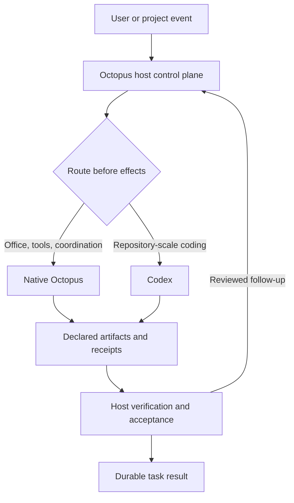

# Unified execution runtime

Status: implemented on `codex/unified-execution-runtime` and validated with
controlled regression suites plus one live coding task and one live document task.
The production limits recorded below still apply.

## Target

Octopus owns projects, identity, permission policy, task lifecycle, budgets,
context and durable results. Native Octopus and Codex are execution backends.
Engine selection, model selection and persona selection are separate decisions.
An engine's internal planning loop remains its own responsibility.

Biomimetic concepts retain their engineering purpose: reflexes are deterministic
fast paths, arms are scoped workers, hearts supervise liveness and isolate
dependencies, immunity constrains effects, and regeneration proposes evaluated
changes. Organ counts do not set process counts or require extra planning layers.

The recommended three-heart interpretation is operational rather than anatomical:

1. The **control heart** is the Octopus host. It owns identity, permissions,
   deadlines, cancellation, engine binding, audit, artifact acceptance and final
   task state.
2. The **operations heart** is native Octopus. It runs business tools, office
   artifacts, deterministic workflows and project/team coordination.
3. The **engineering heart** is Codex. It performs repository inspection, coding,
   testing, repair and patch production inside the host's approved workspace.

Only the control heart is authoritative. The two execution hearts never maintain
competing project truth or silently take over a task from one another. When work
must cross engines, the host transfers a declared artifact or reviewed candidate
patch with hashes, ownership and a durable receipt.

## Migration and acceptance

### 1. Shared execution ownership

- [x] Resolve the primary execution route once, before invoking an engine.
- [x] Use the same engine for steering, verification and repair in that turn.
- [x] Reject overlapping engine calls and stop admitting calls after cancellation.
- [x] Persist the actual engine and invocation phase before execution; preserve
      this information on replay and expose it to the frontend.
- [x] Retain existing permission brokers, workspace authority, outcome checks
      and cancellation propagation. Do not recreate these inside a new engine loop.
- [x] Verify native and Codex routing, errors, interruptions, late steering and
      code-verification continuations using the real gateway and controlled drivers.

### 2. Explicit engine policy and usable controls

- [x] Decouple a role's identity from its preferred execution backend.
- [x] Support explicit per-task engine selection and a conservative default:
      coding tasks prefer Codex; business tools and fixed workflows prefer native.
      Engine availability and required capabilities must be checked before execution.
- [x] Present the actual engine and unavailable capabilities without asking users
      to select an engine for every ordinary task.
- [x] Never transfer a task with possible side effects to a different engine
      without reconciling its execution record and an explicit handoff decision.

### 3. Shared context and scoped workers

- [x] Pass task goals, approved project context, permissions and budgets through
      an engine-neutral request. Keep engine-private state opaque and scoped.
- [x] Give child tasks explicit inputs, outputs, ownership and cancellation.
      Isolate concurrent writers with existing worktrees or write leases.
- [x] Validate a sequential native -> Codex -> native artifact handoff before
      enabling automatic parallel engine cooperation.

### 4. Focused delivery and evaluated learning

- [x] Establish one coding scenario and one office/tool scenario with recorded
      success, latency, cost and human intervention. Controlled tests establish
      contracts; they do not count as live model performance evidence.
- [x] Separate factual execution records, project knowledge, user preferences
      and unverified model summaries at the memory boundary.
- [x] Load optional business plugins only when needed while keeping the local
      desktop installation reproducible.
- [x] Keep shadow review and learning opt-in; changes require validation,
      versioning and rollback before promotion. No autonomous permission expansion.

## Ownership rules

The existing turn lifecycle remains the authority for status and finalization.
The execution supervisor owns only admission and engine binding for its calls;
it has no independent task database or second outcome state machine. The event
log remains authoritative for observable execution records. Model requests do
not carry credentials or unvalidated workspace grants between engines.

The first migration extracts route selection and engine dispatch from the
realtime gateway, retaining the current project/group/topology precedence.
Existing engine-specific security boundaries remain active. Subsequent changes
can replace adapters without changing the task lifecycle or public result model.

## Foundation acceptance evidence

Implemented on `codex/unified-execution-runtime`:

- `runtime/execution/engines.py` binds a single adapter and guards invocation
  admission. The realtime host retains authoritative status and finalization.
- `runtime/sensing/gateway/realtime_execution.py` adapts the existing native
  drivers and Codex App Server. Every invocation is journaled durably before
  dispatch; a failed journal write prevents effects.
- `turn/execution/updated` and the persisted `turn_updated.execution` field
  carry actual engine/phase evidence through Python replay, client replay and
  message metadata. Old turns remain readable without inferred engine evidence.
- Existing verification continuations now use their turn's bound engine.
  No secondary planner or automatic cross-engine recovery was introduced.
- Real Windows cancellation testing exposed an existing claim-reader defect:
  reading the mandatory-locked sentinel byte concealed the active turn id and
  made Stop return false. Metadata reads now begin after that byte, preserving
  lock authority. The existing real subprocess interrupt test passes, along
  with the cross-worker interrupt and process-claim tests.

Contract coverage lives in `tests/test_execution_engines.py`,
`tests/test_realtime_execution.py`, the Codex lifecycle cases in
`tests/test_realtime_cerebrum.py`, and
`frontend/src/core/realtime/execution.test.ts`. These use controlled engine
responses and real local persistence/gateway code; they do not establish live
model quality, latency or cost. Project/team orchestration still belongs to the
host; phase 2 adds an independent preference for its individual tasks.

Local validation on Windows (2026-09-05): 199 backend tests passed across
execution admission, gateway lifecycle, Codex adapter/approvals, durable event
logs, process claims and cross-worker interruption. The four affected frontend
test files passed all 154 tests; TypeScript and the production Vite build passed.
Ruff, invariant lint, protocol-method parity and generated-enum parity passed;
the two new runtime modules also passed mypy. No live model call was made.

## Engine policy and controls

`turn/start.executionEngine` accepts `auto`, `octopus`, or `codex`. The server
validates it independently of display metadata and a role's preferred backend.
The composer remembers the choice per principal and task, including the id
assigned to a newly created task. Roles retain their persona and allowed skills.
Codex model selection uses its principal-scoped profile or a trusted server
override, not a native persona's model hint.

Automatic selection supports the upstream unified General/Design modes. Their
labels and directory scope do not imply a coding task: parsed debug/refactor
intent and deterministic coding-purpose signals prefer Codex, while ambiguous
and office requests default to Native. Old build/general/research payloads remain
compatible. This policy adds no model call. A configured Codex role retains its
existing default; explicit task selection overrides that preference.
Project/team coordination remains native, with Codex available to member tasks.
The upstream focused/fanout/presence strategy stays authoritative; coordinated
delivery repair also passes through the bound supervisor and its durable receipt.

Before dispatch, Codex checks configuration enablement, executable availability,
the trusted workspace/principal, model compatibility, shared tool readiness and
the required local auth source. These checks do not refresh credentials or call
a model. Runtime permission, sandbox, provider and account validation still apply.
An automatically routed coding task may choose native before any effects when
Codex is unavailable; the receipt records the reason. An explicit Codex choice
or configured Codex role instead returns `execution_unavailable` before an engine
receipt is created. After execution starts, no automatic engine transfer exists.

The model-profile API exposes configuration availability and a reason code. The
composer explains unavailable options, and history badges read actual engine
receipts. Old history without receipts receives no inferred engine badge.

Validation on Windows (2026-09-05): the engine/gateway/role/account/approval batch
passed 243 tests; the WebSocket and cross-surface role batch passed 50 tests
(these batches share some role cases). All 366 tests in 12 affected frontend
files passed. The regenerated OpenAPI snapshot passed all three checks and its
TypeScript diff contains only the two added availability fields. Ruff, mypy,
invariant lint and protocol parity checks passed. Browser checks at 1360px and
390px verified preference persistence, a real `model_incompatible` response and
no horizontal overflow or page errors. No live model call was made.

The final native-fast-path regression batch passed 160 tests. TypeScript and
the production Vite build passed (26.06s). Real authenticated WebSocket probes
passed all three transports: direct Bearer header, direct browser subprotocol,
and browser subprotocol through the Vite proxy. The real UI model-profile and
account endpoints returned 200; configuration availability correctly remains
false for the current incompatible system-model profile.

Two local-runtime defects were also exposed by exercising the real installation:
Windows long-path support was disabled (now enabled and documented in
`LOCAL-RUN.md`), and Uvicorn SansIO coalesces WebSocket protocol header entries.
Auth parsing now accepts both coalesced and split representations while still
validating the credential and echoing only the non-secret protocol marker.

## Shared task context and child boundaries

The realtime adapters now install an engine-neutral `ExecutionRequest` with a
frozen host task identity, original goal, approved filesystem scope and resource
policy. Continuations supply a new instruction while retaining the same task.
The request is a Python object, outside transport JSON and engine-private
conversation state. The host builds it from the authenticated turn and the
gateway's flat, validated context; nested client metadata cannot override those
grants. Codex materialization carries the same request and the native producer
uses its token/USD targets.

The host enforces one absolute deadline across primary execution, steering,
verification and repair. Existing native wall-time settings and Codex's operator
timeout remain in effect; continuation does not renew them. Token and dollar
targets preserve existing elastic-budget semantics. This implementation does
not claim a hard cross-engine spending cap or turn unknown Codex account cost
into zero cost.

`ExecutionScope` remains the filesystem authority. A Python-only ceiling is
intersected with each tool Session's current scope, including the legacy write
scope resolver. Nested requests can narrow the ceiling; reads remain available
when writes are denied. Codex built-ins use a read-only sandbox when the whole
resolved workspace is not writable; Octopus tools retain their own narrower
write scope and existing approval checks.

The existing subagent bridge now gives each scoped child a distinct execution
identity, parent coordinate and inherited deadline. Its existing cancellation
monitor enforces the remaining parent time. Codex's synchronous adapter retains
ContextVars when it needs a helper thread, and delegated Codex calls observe the
parent cancellation token. Private Codex child thread/turn coordinates are
separate even when public events share the parent's workbench lane.

Write lease and read-snapshot tables persist across native continuation threads
and child Session copies. Lease ownership identifies the task, not the shared
user account. This detects conflicting writes through the Octopus executor;
it is not an OS sandbox for arbitrary shell or built-in Codex writes. The
explicit artifact handoff section below records subsequent implementation of
manifests and verified ownership transfer. The isolated-worker section records
the worktree integration. The later host-boundary and candidate-application
sections record completion across the remaining orchestration surfaces.

Validation on Windows: 287 tests passed across request/scope contracts, the
gateway, Codex routing, stack workers, child timeout/threading/schema/slot
isolation and real subprocess cancellation. The new gateway deadline test runs
a real Python subprocess and verifies it is cancelled before it can complete.
Child bridge tests use real worker threads to check distinct ownership, retained
scope and parent cancellation. Ruff, mypy for the three new runtime modules and
invariant lint passed. These are controlled driver tests; the live evidence is
recorded in the final acceptance section.

The follow-up batch passed 89 tests for nested-metadata rejection, tool bridge
scope, Codex dynamic tools/role context and file leases (some request cases
overlap the earlier batch). The local backend was restarted with these changes;
backend health and Vite returned 200, and authenticated WebSocket probes passed
direct header, direct browser subprotocol and Vite-proxied subprotocol transport.

## Explicit artifact handoff

`call_agent` and `call_subagent` accept `input_files` and `output_files`. The
host resolves these files inside the parent task's approved read/write roots,
snapshots input SHA-256 hashes and output baselines, and places the resulting
immutable artifact contract on the child execution request. The contract is
bounded to 64 inputs and 64 outputs, each at most 32 MiB. Relative input/output
paths use the approved primary read/write root respectively.

Before the child starts, all output lease owners and file baselines must match.
The host writes an `execution_handoff` assignment record durably and transfers
the declared leases as one operation. Acceptance waits for a completed child,
checks the result schema when requested, verifies unchanged inputs (apart from
explicit input/output edits), hashes every required output, and rejects missing
or unstable files and undeclared writes observed by the file-tool executor.
Another durable record precedes returning ownership to the parent. These log
records survive event coalescing. The result exposes verified artifact paths,
hashes, sizes and producer task identity; model-authored hashes are not used.

Artifact handoffs disable transient, round-limit and schema auto-retries.
Cancellation, missing outputs, ownership conflicts and failed journal writes
cannot silently grant another worker access. Partial or failed outputs remain
unaccepted. Once the child runner has unwound, a failed handoff can return its
leases only if every declared file still matches its pre-dispatch baseline and
the child owns no undeclared file-tool leases. A durable `aborted` receipt with
reason `outputs_unchanged` precedes this atomic transfer. This cleanup can run
after the parent's deadline; it does not accept artifacts or enable an automatic
retry. Timed-out workers keep their leases until their future finishes. Changed
outputs and journal failures retain child ownership for explicit reconciliation.
Reviewed partial-output reconciliation and lifecycle-managed worktree cleanup
are completed by the host-owned candidate patch transaction described below.
Legacy callers without an artifact contract retain their existing interface.

`tests/test_artifact_handoff.py` exercises native preparation, a dispatched
Codex-role child and native verification through the actual supervisor,
subagent bridge, tool executor, file leases and disk journal. The child produces
a Python function; the native step checks its result and creates a verification
artifact after ownership returns. This proves the sequential handoff contract
using a controlled Codex response. It does not establish live App Server/model
quality or filesystem isolation for arbitrary shell/built-in Codex writes.

The handoff/delegation/journal regression batch passed 93 tests on Windows.
It includes journal failures before assignment and acceptance, changing inputs,
edits during acceptance, required-output absence, schema failure, timeout/late
completion, existing-file updates, ownership conflicts, resource bounds and
prevention of a retry that would drop the artifact contract. Later batches add
concurrent writer isolation, host-bound orchestration and live acceptance.

The failure-reconciliation follow-up passed 265 tests on Windows, covering the
handoff and delegation batches above plus OpenAPI parity, the realtime gateway,
Codex dynamic tools, file leases and child threading. The 24 artifact tests
include unchanged existing/missing outputs after runner failure, recovery after
the parent deadline, failed cleanup journals, undeclared leases and a real worker
thread that remains active after timeout. That worker's leases become available
only after it unwinds; its late result is never accepted. Ruff, mypy for five
shared-context modules and invariant lint passed. This remains controlled-driver
evidence; it does not close the concurrent-isolation or live-model requirements.

## Scoped isolated workers

`call_subagent` and `call_agent` now accept `isolate=true`. The bridge owns the
worktree on the actual child worker thread, covering preparation, engine
execution, schema checks, durable export and cleanup. A caller timing out or
being cancelled cannot delete files underneath a still-running child. After
that child unwinds, its partial patch is exported with `contract_valid=false`;
its late model result never becomes a parent success. A failed export retains
the checkout, identified by its durable assignment record and, when the call
is still awaiting a result, `retained_workspace`.

The source directory comes from the host Session's approved project, not the
backend's current directory or model context. Worktrees are created beneath
an existing approved output root. Child requests retain identity lineage,
deadline and policy while their write ceiling narrows to their own checkout.
The native and Codex role adapters receive that checkout as their workspace.
This is Git checkout isolation with the existing engine permission mechanisms;
it does not turn unrestricted native shell execution into an OS sandbox.

Preparation uses a private Git index to snapshot current working files,
including staged/unstaged edits, deletions and non-ignored untracked files.
The source HEAD and index stay unchanged. Two matching tree snapshots and an
unchanged HEAD are required before dispatch. Runtime storage is excluded from
the snapshot; ignored dependencies are not copied. Git hooks and fsmonitor are
disabled for host bookkeeping and Windows long paths are enabled per command.

The host exports a complete binary-capable `changes.patch`, bounded by the
existing 32 MiB artifact limit, and returns its SHA-256/size/producer coordinate
plus a bounded preview. The base snapshot remains reachable through a
`refs/octopus/execution-snapshots/...` reference after the temporary worktree
branch is removed. The receipt explicitly says `applied=false`. Declared input
versions and required outputs are checked; when an output list was supplied,
undeclared changed files make the candidate invalid. This checks the artifact
contract, not task quality. Failed candidates retain their patch for review.
Export pins the exact original worktree gitdir: a rewritten `.git` pointer,
including one aimed at the main repository index, cannot redirect host staging.

The parallel, graph and pipeline delegation surfaces forward isolation and file
contracts and retain artifact/patch records in their result projections. Parallel
fan-out copies the parent's cancellation context, and file-contract/isolated
attempts disable transient retries. Graph resume does not replay file ownership
from cached prose. Reviewed application, reconciliation and the remaining
project/team entrypoints are covered by the later host-boundary implementation.

Validation on Windows: 287 tests passed in 81.83s across isolated workers,
worktree lifecycle, graph/pipeline/parallel delegation, contracts, budgets,
timeouts, tool bridges, orchestration, stack workers, realtime execution and
OpenAPI parity. The 12 isolated-worker cases use real Git repositories, real
worker threads and disk journals, including concurrent edits to the same file,
parent cancellation reaching both children, retained partial patches, dirty
starting states, binary patch application checks, invalid output contracts,
failed journals, scope rejection and a tampered gitdir aimed at the parent
index. Codex role responses remain controlled; these are not live model metrics.
Ruff, mypy for the two worktree modules and invariant lint passed. The local
backend was restarted with these changes; backend health and Vite returned 200,
and all three authenticated WebSocket connection probes passed (direct header,
direct browser subprotocol and Vite-proxied browser subprotocol).

## Tournament integration checkpoint

The host-facing tournament now uses the existing parallel subagent bridge for
its producers. It requires an authenticated host task and journal; an optional
`repo_root` must match the approved project. It forwards the file contract and
isolates each producer's working files. Producer and reviewer spawns share one
bounded budget, including an already active enclosing orchestration budget.
The parallel bridge honors a bounded worker count and accounts for queued
waves in its batch timeout; the original parent deadline is still authoritative.

Voting narrows a host task's filesystem write ceiling to empty while retaining
its identity, approved reads and resource policy. A legacy workspace coordinate
cannot restore reviewer write permissions. Candidate selection checks the
host-exported patch's size and SHA-256 before review and before returning the
winner, and appends a durable `worktree_selected` receipt with `applied=false`.
Cancellation, changed patch contents and failed selection journals preserve
candidate coordinates without returning a winner. The reported judgment
remains distinguishable from a single surviving candidate or an abstaining
panel; selection alone is not verification or permission to apply a patch.

An explicit `asyncio.CancelledError` from an isolated runner now exports its
partial changes as an invalid candidate before removing the temporary checkout.
This complements linked cancellation and timeout handling; interrupted work is
never promoted into a successful artifact contract.

Before the concurrent upstream merge began, the tournament, vote, isolated
worker and child-context batch passed 51 tests in 56.43s. It exercised real Git,
worker threads, the bridge, builtin reviewer dispatch and disk journals with
controlled model responses. The tested changes were captured in local checkpoint
`a4f1c931`. The merge was subsequently resolved in `8ac947dd`; the post-merge
host-boundary, candidate, memory, plugin and live acceptance work below supersedes
that checkpoint's pending status.

## Host boundary and reviewed candidate application

`runtime/execution/host_boundary.py` creates the same immutable task boundary for
HTTP dispatchers and durable background orchestration that realtime turns already
use. Direct subagent HTTP, ProjectOS, cowork, ReAct parallel work, TeamRunner,
realtime team topology and the persistent team router now carry a server-owned
task identity, principal, permission ceiling, deadline, cancellation state and
handoff journal. JSON or model metadata cannot replace the private coordination
objects.

`runtime/execution/subagents/candidate_patch.py` closes the worktree lifecycle.
The host resolves a candidate only from its append-only handoff records, checks
the patch hash, pinned baseline and complete bounded file set, then creates
byte-for-byte backups before applying it. Cross-process locking, file leases and
a write-ahead journal serialize application. Exact post-write verification either
records `patch_applied` or restores the backups and records rollback. Interrupted
or ambiguous operations remain reconcilable; the engine cannot declare its own
patch accepted. Candidate inspection and application are separate operator actions.

## Memory, plugins and governed learning

`runtime/memory/semantics.py` labels durable entries by kind, author and
verification state. Execution evidence, project facts, user-stated preferences
and model inferences therefore remain distinguishable when normalized, distilled
or returned through memory APIs. An unverified inference cannot silently become a
fact or a user preference.

Optional office plugins declare `activation: on_demand`. Discovery exposes their
metadata without importing executable code; a selected capability activates one
plugin transactionally, and failed startup removes partial registrations. Prompt
packs with the same identifier no longer shadow executable modules, and the ReAct
loop refreshes its native tool view immediately after activation. Install history
records a content digest so the local installation remains reproducible.

Regeneration and shadow review produce governed candidates. Promotion requires a
validated, versioned operation with a rollback path and durable state. Tenant
requests do not expand their own permissions, and model-authored summaries remain
unverified until the host's acceptance path records evidence.

## Live two-engine acceptance

The reusable runner is `benchmarks/run_unified_runtime_acceptance.py`; the compact
evidence is
`docs/architecture/unified-runtime-acceptance-2026-09-05.json`.
Credentials remained in memory and raw trajectories stayed in the ignored local
run directory.

On Windows on 2026-09-05:

- Codex completed a scoped repair of `calculator.py` in 39.523 seconds through
  `codex_app_server`. The host saw one Codex binding and no engine transfer. The
  verifier checked five boundary values plus the original `ValueError` behavior;
  only `calculator.py` existed in the fixture. Four approval requests occurred:
  the exact edit was accepted and broader shell/VCS actions were declined. The
  provider reported 125,377 cumulative tokens, including 102,144 cached input
  tokens and 941 output tokens.
- Native Octopus completed `documents.create_docx` in 23.016 seconds through the
  ReAct driver with an explicit Octopus binding. The optional `documents` plugin
  changed from `on_demand/unloaded/stopped` to `loaded/started` during that turn.
  A host-side DOCX reader verified the exact title and paragraph, and only the
  requested file existed in the fixture. The workspace-scoped create required no
  interactive approval under the active policy.
- Both providers omitted monetary cost, so evidence records `cost_usd: null` and
  `cost_source: not_reported`; missing cost is never treated as zero. The native
  route emitted character-throughput telemetry but no token count, which is also
  recorded as unavailable rather than inferred.

## Final validation

The final Windows validation on 2026-09-05 completed with the following results:

- The focused execution, security, memory, plugin and routing batch passed 322
  tests with one POSIX-only case skipped.
- A clean run of all 35 modified or newly added backend test files passed 1,071
  tests with six documented POSIX-only cases skipped.
- OpenAPI generation, generated-wiki drift checks and the realtime evaluation
  runner passed 25 tests. The generated wiki check and protocol-enum check also
  reported no drift.
- The frontend suite passed 2,863 tests with two skipped across 386 files. The
  affected engine-control suite passed all 15 cases; TypeScript checking and the
  production Vite build passed.
- Ruff checks, formatting checks for all changed Python files, selected strict
  mypy checks, the repository mypy ratchet, execution invariants, fixture
  visibility and `git diff --check` passed.
- The retained backend and frontend services responded successfully on ports
  8000 and 3000 after validation. The isolated port-8001 acceptance service was
  stopped cleanly after its evidence was captured.

## Production limits

Windows currently has no kernel-level process sandbox backend in this project;
the local run used the documented soft process constraints plus host path scopes,
tool policy and network denial. File leases cover Octopus tools and candidate
transactions, while unrestricted external processes require a hard sandbox on a
supported deployment. Automatic cross-engine continuation after possible effects
remains prohibited. A future policy may permit it only after durable reconciliation
and explicit handoff, using the same artifact boundary described here.
