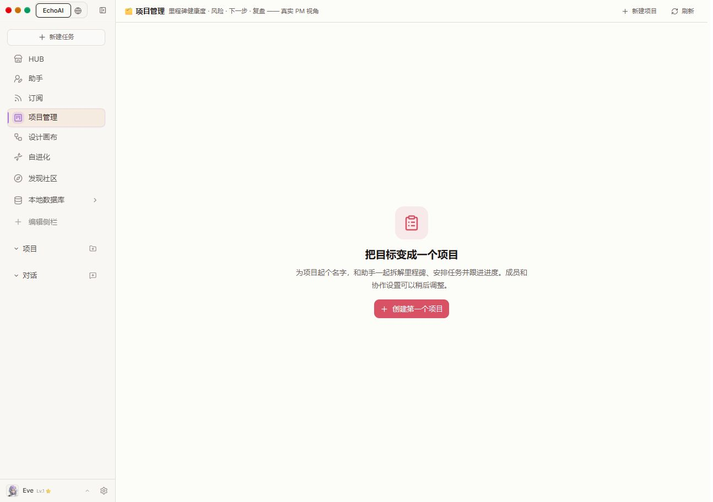
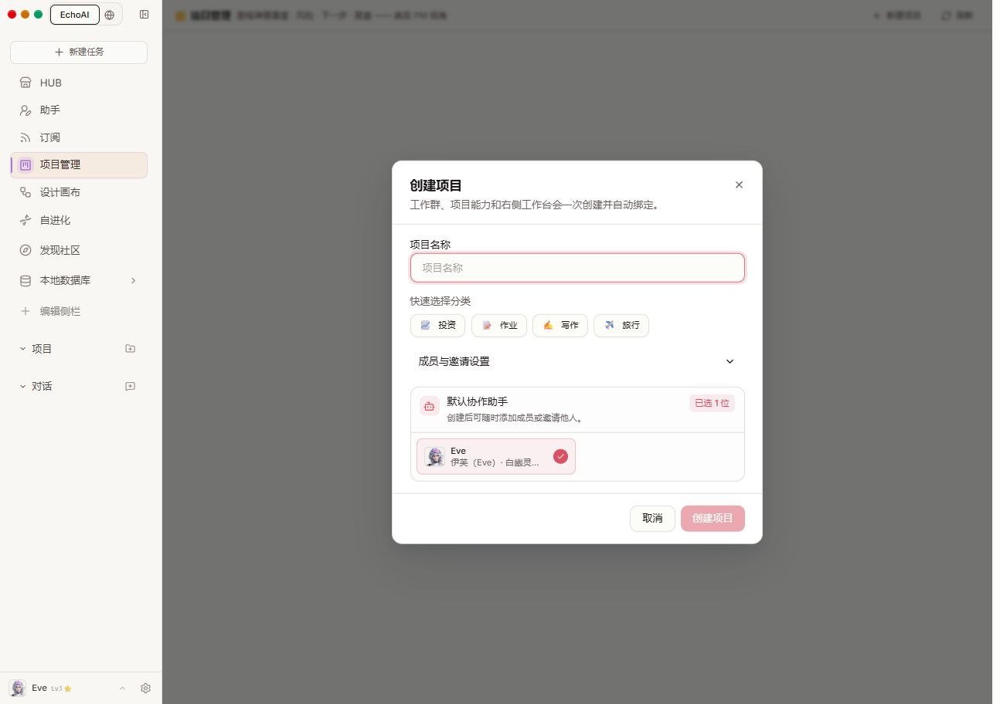
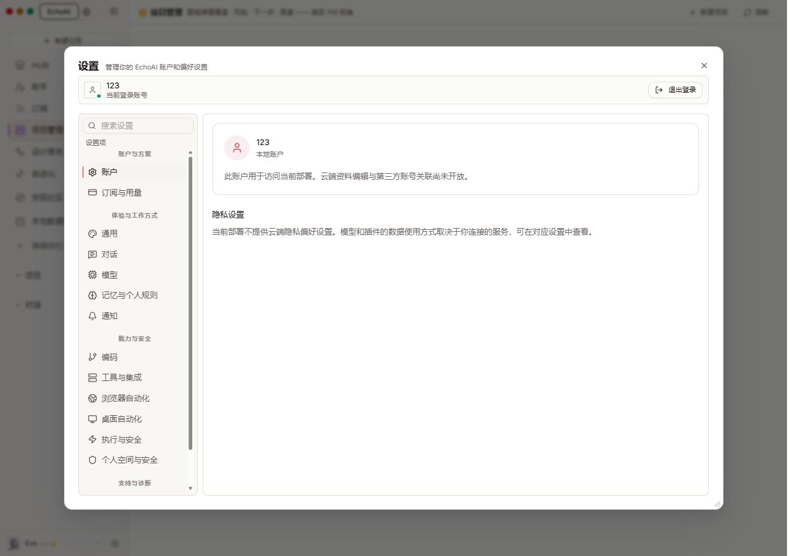
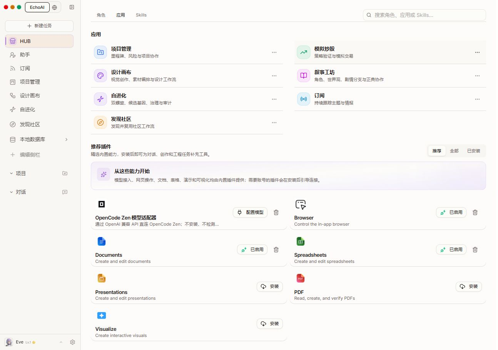
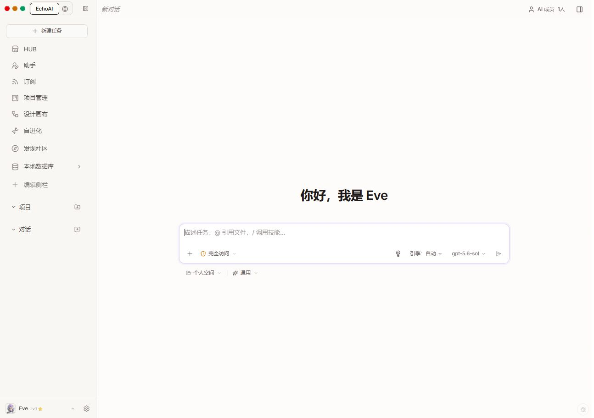

# 前端优化落地 · 2026-09-05

落实前一轮走查中影响首次使用和状态判断的五组问题，沿用现有布局与主题。

- 项目空状态中央提供“创建第一个项目”，直接打开创建表单。
- 项目名称添加持久标签；默认助手首屏可见，成员与邀请按需展开。成员按稳定 ID 去重、已选置前，支持名称、ID 和能力搜索，同名角色显示各自 ID。
- 本地账户不请求不支持的云端 profile/privacy 接口，明确展示账户范围；独立的官方积分卡仍保留。云账户读取失败时禁止编辑资料，隐私设置未成功读取时不展示猜测的开关值。
- 无需账号的插件隐藏连接操作，“启用中”改为“已启用”；未配置模型的插件提供“配置模型”入口，保留签名权限确认和凭据验证流程。
- 宿主按工作台目录更新插件页面标题，HUB 显示自己的标题；会话继续管理动态标题。新任务页显示“引擎：自动”。

## 验证

- 5 个测试文件、51 项测试通过：项目页、创建弹窗、账户设置、插件市场和执行引擎选择器。
- TypeScript 检查、前端生产构建、项目插件构建通过。
- 项目插件在本地重新安装成功，浏览器刷新后确认使用新界面。
- 浏览器验证：中央创建入口、折叠表单、Codex 同名角色搜索、账户设置、插件市场、模型配置弹窗、新任务页及项目/HUB/会话标题切换。
- 浏览器中未创建项目、发送任务、提交密钥或改变插件启用状态；提交参数与权限流程通过组件测试验证。其他应用页面、移动端和深色模式不在这轮验收范围内。

## 实机截图

