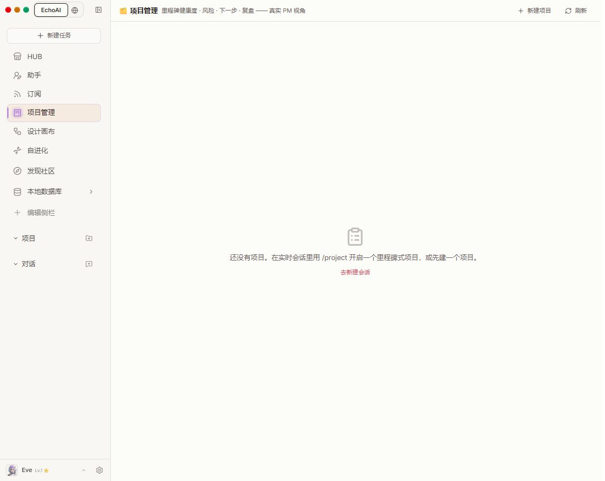
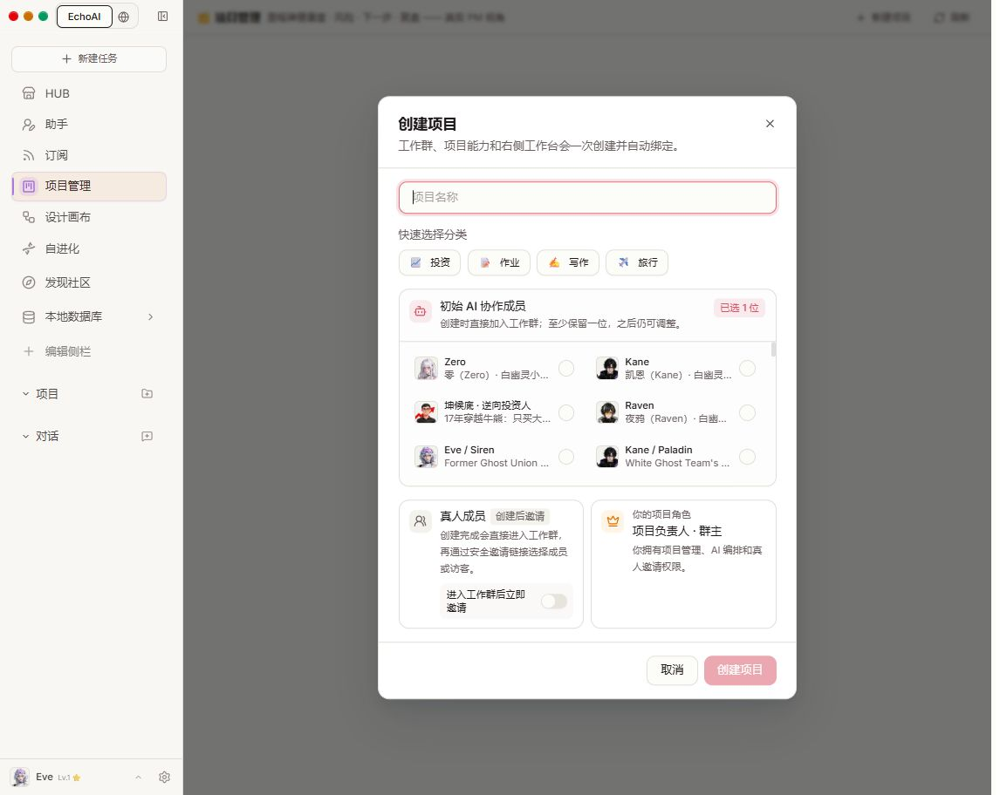
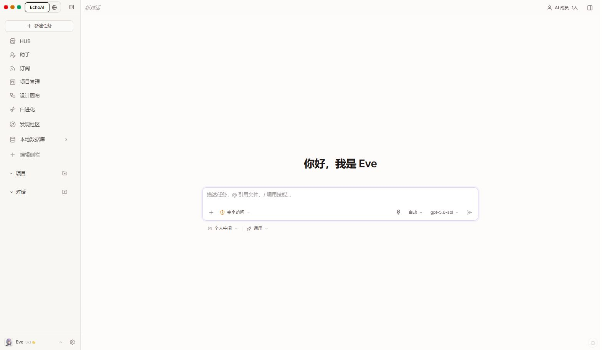
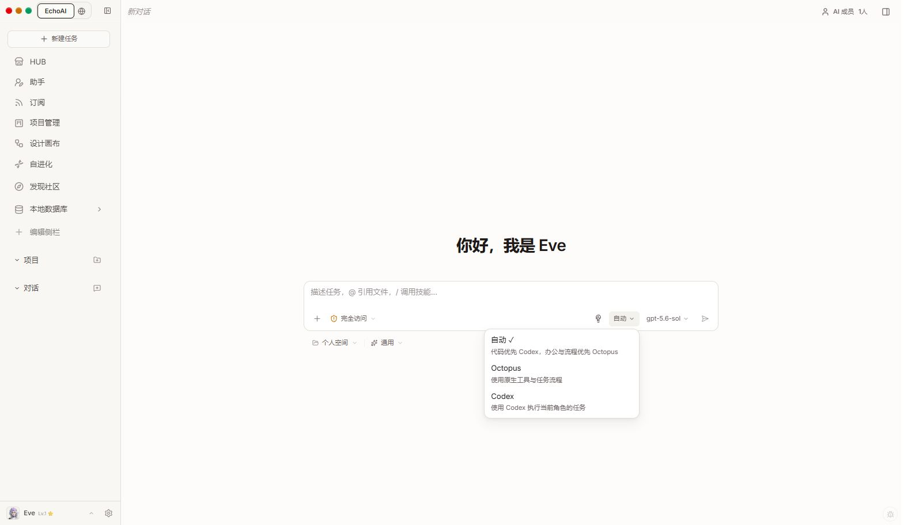
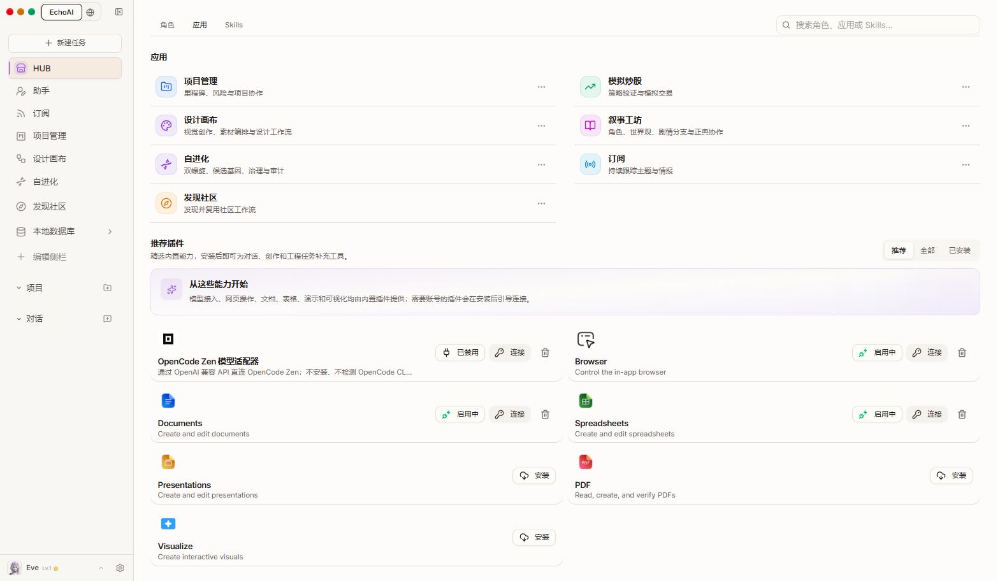
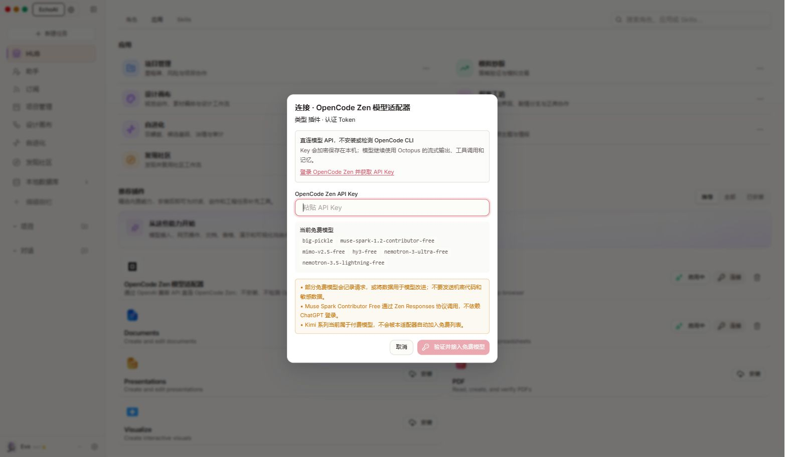
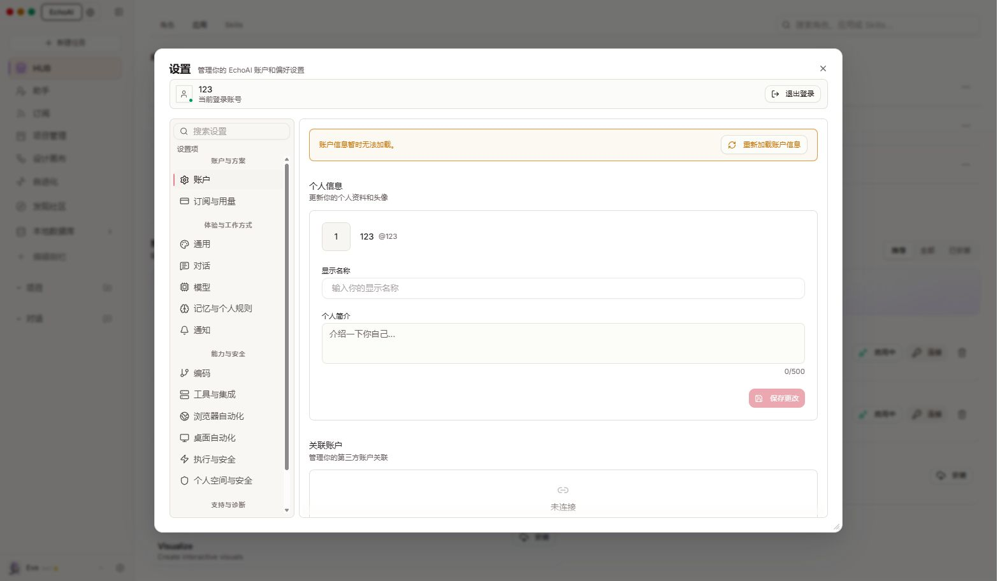

# 前端走查 · 2026-09-05

本次仅走查与记录，没有修改产品代码、安装插件、创建项目、提交任务或填写密钥。
目标：从项目页启动工作、理解角色与引擎、找到插件并理解连接状态。
使用本机当前已登录的 Codex 内置浏览器。证据仅来自本轮截图、可访问性树和对应代码/请求核对。
截图 01–02 为 1146×912，03–08 为 1569×912（走查过程中窗口宽度改变）；未将不同宽度的截图用于像素级比较。

## 结论

基础布局、导航和品牌色已经统一，项目到新会话的跳转可用，双引擎菜单对职责的说明清楚。
最值得优化的是状态准确性和第一次使用时的决策负担；不需要先做一次大规模视觉重做。

## 按优先级排序

| 优先级 | 问题及证据 | 建议与验收方式 |
| --- | --- | --- |
| P1 | 本地账户页持续显示“账户信息暂时无法加载”，重试仍失败。资料和隐私控件仍呈现，无法判断哪些值真实保存。步骤 08；本轮 profile/privacy 请求均为 404。 | 根据本地/云账户能力展示设置。不支持的设置明确标识，不渲染成可操作表单；读取失败的隐私值显示“无法读取”，不拿默认值冒充当前设置。验收：本地账号打开账户页无常驻错误，不支持的功能有解释。 |
| P1 | 创建项目先暴露成员编排和邀请，成员列表无搜索，出现 Eve 与 Eve / Siren、两项 Codex CLI 伙伴等重名或近似项，默认已选成员不在列表首屏。步骤 02。 | 首步只填写项目名称/目标，默认沿用当前助手；成员配置折叠到高级项。已选成员置顶，按稳定身份去重并注明来源；添加搜索。验收：不滚动成员列表即可创建普通项目；重名来源可区分。 |
| P1 | 项目名称输入框仅有 placeholder，没有持久可见标签；本轮 AX 文本框无可访问名称，源码 Input 也未提供 label/aria-label。步骤 02。 | 添加关联 label、必填说明与字段内错误。验收：输入后名称标签仍可见，辅助技术可读取“项目名称”。 |
| P2 | Browser/Documents/Spreadsheets 显示“启用中”，旁边又显示“连接”；OpenCode Zen 尚未接入却显示“已禁用”。步骤 06–07。 | 分别展示已安装、待授权、待配置、可用、已停用、不可用；一个主按钮对应下一步。无需登录的插件不显示泛化“连接”。“启用中”改为“已启用”或“可用”，保留异步加载态用于真实进行中的操作。 |
| P2 | 项目空状态中央只有命令说明和“去新建会话”，真正的新建项目按钮在右上角。步骤 01。进入新任务后没有承接“创建项目”的预置目标。步骤 03。 | 中央主按钮改为“创建第一个项目”，次按钮为“从已有目录开始”或“在对话中规划”；命令放到帮助中。若跳转对话，带上项目规划上下文。 |
| P2 | 当前项目、任务、HUB 三个页面的浏览器标题仍为“新对话 - EchoAI”。步骤 01、05、06 的 AX 元信息。 | 宿主在路由切换时统一设置标题，插件提供页面标题；验收：标签页与当前页面一致。 |
| P2 | 新任务首屏同时展示权限、引擎、模型、个人空间、通用模式、成员入口，缺少具体任务示例。步骤 03–04。 | 保留输入框主导，增加 3 个可直接填入的任务示例。将“自动”写成“引擎：自动”，明确模型是另一个选择；保留已有分工说明。 |
| P3 | HUB 场景用“选择即组队”，下方远端角色用“安装”，对普通用户而言任务、角色、能力包的动词与概念跳变较多。步骤 05–06。 | 使用面向用户目标的动词，例如“使用团队”“添加角色”“安装工具”，必要时再展开技术来源。 |
| P3 | 次要说明、图标按钮与长角色名在截图中较小或被截断；项目空态页面存在大量空白。步骤 01–07。 | 把关键操作和说明提升一个视觉层级；重要按钮增加点击区域；长名字提供完整名称及来源。颜色对比和目标尺寸需另做量化验证，不能仅凭截图判定合规。 |

## 走查步骤与截图

### 01 项目管理空状态 · 可用但引导偏弱

入口清楚、空状态有说明；主操作与中央引导不一致。此页浏览器标题仍是“新对话”。

### 02 打开创建项目 · 表单可达，初次决策负担较重

未填写和提交表单。取消可正常关闭。默认成员有保障，邀请默认关闭；但成员列表过长且有重复名称，项目名称没有持久标签。

### 03 从空状态跳到新任务 · 跳转正常，项目意图未承接

“去新建会话”成功跳转宿主路由，没有形成嵌套整页。未发送任务。

### 04 打开执行引擎菜单 · 分工说明清楚

自动、Octopus、Codex 的文字解释可见，Escape 能关闭菜单。未改变引擎或模型设置，也未验证实际模型可用性。

### 05 HUB 角色目录 · 本轮加载正常

场景卡片、分类与搜索入口均存在。本轮展示了远端目录，未复现之前的云目录错误。没有安装或启动团队。

### 06 应用及推荐插件 · 可浏览，状态语义需要统一

工作台与工具插件分区明确；已启用与连接按钮并列，普通用户难以判断当前是否可用。未改变安装状态。

### 07 OpenCode Zen 连接表单 · 引导可达

有明确 API Key 标签、获取入口、保存方式与提交按钮，空输入下提交禁用。协议和模型细节较多，可以折叠为高级说明；保留关键数据用途提示。未输入密钥、未验证服务或免费模型的实时价格/可用性。

### 08 本地账户页 · 读取被阻断

账户信息加载失败；点击一次重试后仍失败。作为阻断证据保留截图，不能据此声称资料编辑、隐私保存或第三方关联已完成验证。

## 范围与限制

仅验证桌面浅色模式下的上述八个状态。没有创建/删除数据，没有改偏好或权限，没有访问外部账户，没有进行插件安装或模型调用。
未测真实任务执行、流式中断、上传、安装失败恢复、移动端、深色模式、200% 缩放及完整键盘/读屏流程。
现有截图不构成 WCAG 合规认证；项目名称缺少可访问标签有 AX 与源码共同支持，其余对比度、尺寸问题为需测量的风险。

建议下一轮先完成账户能力适配、项目创建简化和插件状态统一，再做响应式与字号间距整理。
