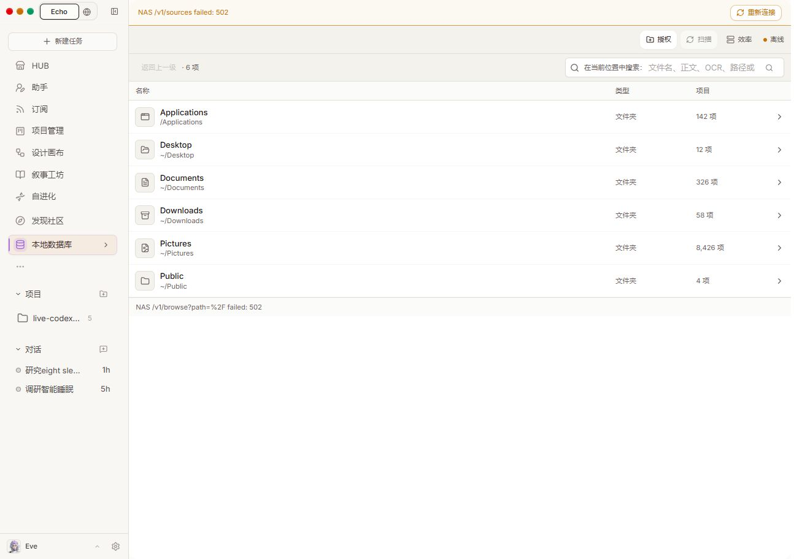
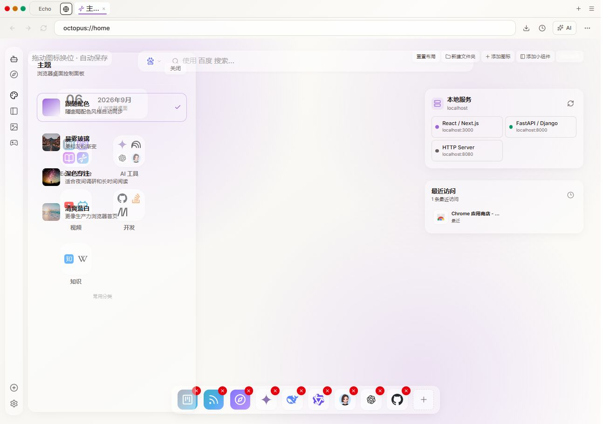
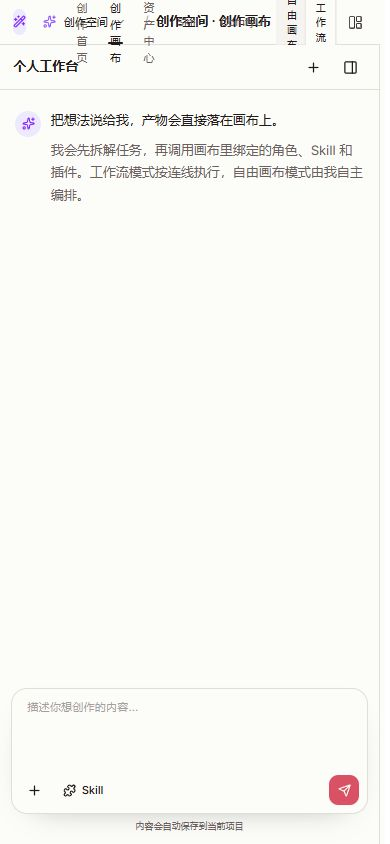

# Echo 前端全量走查记录

本轮保存 326 条编号截图记录，对照 80 个窗口相关源码文件，整理 24 项整改。截图数量包含重复复核、错误态和响应式变体，不是独立窗口数，也不是通过数。

结论：优先修复数据真实性、故障恢复、任务状态和导航闭环，再收敛界面。现有聊天/设置的基础排版、空值禁用、删除确认和移动适配有可复用的基础。

## 范围与证据边界

- 时间：2026-09-06，Asia/Shanghai；代码库 D:/echo agent。收尾时 HEAD 为 99c9abee33a3af9159b2bed66187d4e62bdb6bef，工作区有其他任务在修改，不能将该 SHA 当成无修改的构建指纹。
- 主前端：独立 3310 固定构建 .codex-run/ui-audit-preview-20260906，构建日志 .codex-run/ui-audit-build.log；未用持续变化的3000开发页面作为全部证据基线。部分最早记录后来被稳定复核替代。
- 后端：共用8000；账号 local。远端插件 iframe 资源由后端提供，未冻结。其他任务在走查中改变了角色、会话、模型和插件状态，截图中的时间/数量可能不同。
- 视口：桌面1294×912、窄窗900×700、手机390×844；深色抽查设置、HUB、Design后恢复跟随系统。
- 采用页面截图、DOM/可访问树及源码入口交叉核对。错误态只证明错误呈现，不代表其背后的功能通过。没有通过注入数据或绕过权限制造成功截图。
- 未提交任务、公开分享、发布帖子、安装插件、创建订单、改权限或删除用户数据；草稿关闭。浏览器内为检查创建的空小组件已删除，只清理该自建条目。早期邀请入口曾自动准备群组房间，未生成或发送邀请。
- 原生系统窗口无法由当前浏览器工具观察；屏幕阅读器、真实触屏/软键盘、精确对比度、所有语言和所有提交后状态未验证。

截图状态统计：已替代 10；已取证 258；部分取证 15；作废 2；受阻或条件未验证 41。已取证只表示当前状态有证据，不表示功能验收通过。

## 按入口走查结果

|序号|区域|实际检查|证据编号|边界|
|---|---|---|---|---|
|1|对话、新任务、常驻助手 · realtime/new、realtime/:id、realtime/octopus-assistant|菜单、权限、引擎、协作、分享、重命名、删除、工作台、回放、助手自动化|2–13、256–288、304–310、318–319、325–326|邀请与原生选择受阻；未发送新任务、再生成或分享快照。|
|2|HUB · agents：角色/应用/Skills|推荐、全部、已安装、远程Agent、权限预检、添加角色、组队、角色详情、搜索、分页|51–62、299–303、311|角色421条和插件列表复用组件；未逐条安装，未将记录数量当窗口数量。|
|3|设置 · settings及全局设置弹窗|15个设置分类、模型接入、请求头、兼容矩阵、隐私高级、沙箱、危险确认、各下拉|14–48、289–294、306–307、320|订阅付费、第三方账号、成功原生选择器不可达；未改变业务配置。|
|4|项目管理 · projects|列表空态、创建、成员设置|63–65|协作项目为空，任务详情/项目删除/成员邀请等数据后续流程未创建测试项目验证。|
|5|设计画布 · design iframe|首页、图像/视频/音频模型、项目、资产、Skill、ComfyUI、已有画布、节点/布局/帮助/反馈窗口|66–98、313–317、322|未新增或运行节点；节点类型对应专用编辑器、导入文件和运行后产物受数据/原生边界限制。|
|6|叙事工坊 · narrative iframe|项目空态、创建、MCP/Skill说明|99–101|没有现有叙事项目；章节、正典、分支与协同细节未通过创建数据进入。|
|7|订阅 · intelligence iframe|模板、创建、频率/每周、已配置、历史、面板|102–108|未创建计划；编辑/暂停/删除/执行详情需要计划及运行数据。|
|8|自进化 · evolution iframe|概览、实验、候选、部署、安全、预算/技能/模型/MCP/课程/框架/漂移/AB、规则及运行设置|109–122、295|权限/服务拒绝阻断有效数据；晋升、回滚、门禁覆盖未验证。|
|9|发现社区及市场 · community iframe|社区、帖子、作者、发帖草稿、市场、商品详情、上架草稿|123–129|未发布、购买、点赞或评论；交易成功流程未验证。|
|10|模拟炒股 · paper-trading iframe|应用入口、监控入口的禁用状态|130–131|安全配置禁用；交易、订单、持仓窗口未验证。|
|11|本地数据库 · storage：computer/apps/docs/images/videos|本机、源目录、授权、文档、图片、人物、标签、最近、策略|132–141、296|NAS 502，人物页崩溃；文件详情/编辑/移动/删除/模型下载、成功扫描流程未验证。|
|12|知识库 · knowledge|图谱、记忆资产、Wiki|142–144|图谱权限拒绝、记忆为空、Wiki未选项目；详情与编辑依赖数据。|
|13|可观测性 · observability及diagnostics别名|总览、事件流、资源成本、系统；流式、开关、建议、远程、不变量、诊断；发布者轮换表单|145–154、297–298、323–324|管理员数据不可用；恢复/应用/重放会产生任务或变更，未触发；吊销需已注册密钥。|
|14|架构与规则 · architecture、reflex、reflex/edit|架构13个文档入口、规则列表与编辑错误态|155–169|ReAct文档404；规则崩溃/编辑403，规则表单后续未验证。|
|15|渠道 · channels|全部26种渠道的配置窗口、AI分配选择、微信二维码错误态|170–198|没有已连接渠道；配对列表和成功连接回执需真实账号。|
|16|电脑与独立应用 · computer、desktop-organizer、desktop、apps/photos、apps/media、web-app|电脑动作菜单、整理器、桌面入口、媒体/照片错误态、Web应用缺URL状态|199–205|网页原生能力和依赖服务受限；未启动桌面任务。|
|17|AI浏览器 · browser|主页、更多、隐私、历史、下载、书签、助手、角色、编辑/文件夹/图标/小组件、主题/壁纸/娱乐/应用/设置、搜索引擎、标签抽屉|206–233|站点信息、页内查找、网页设备权限、密码管理需要真实webview；清数据/重置布局未确认，未审查所有外部网站。|
|18|公开页面 · about、terms、privacy、share、login、register、team/join|关于、条款、隐私、无效分享、缺邀请令牌、本地认证重定向|234–240|本地模式无云登录/注册表单；有效邀请/分享及账单未生成。|
|19|导航与角色 · 侧栏、账户角色菜单、HUD、快捷键|模块编辑、个人菜单、档案/成长/雷达/技能树、ARM/技能/权限/预算、基础编辑、积分、命令面板、移动两套抽屉|241–255、309–312|未签到或改角色配置；积分兑换与账户绑定需服务和正式账号。|
|20|响应式与主题 · 1294×912、900×700、390×844|聊天/工作台恢复、设置、移动历史、HUB、设计画布、系统/深色主题|304–322|桌面浏览器模拟视口，未测真实触屏、软键盘、所有缩放和颜色组合。|

公开/旧入口的路由别名按源码归并：workspace/browser→browser，mobile→computer，mcp→工具设置，skills/plugins/store/workflows→HUB对应页，nas/database→storage，replay→observability。别名不是额外的独立窗口。根路径和未知路由属于重定向分支，仅源码归并，未逐个新增截图。

## 优先整改

### F01 · P1 · 服务异常升级为整页崩溃

**证据**：[138 storage-video-people](138-storage-video-people.png)、[168 reflex-rules](168-reflex-rules.png)。

视频人物页报 undefined.length，规则页报 undefined.active，内容区被通用错误卡替代。

影响：用户无法继续浏览，也不知道是没有数据还是服务故障。

建议：对空响应和失败响应分别处理；局部错误边界保留导航与已加载内容，提供重试和诊断入口。

验收：断开依赖、返回空对象或空集合时页面均不崩溃；错误说明包含受影响功能。

### F02 · P1 · 数据加载失败时展示硬编码文件数量

**证据**：[132 storage-center](132-storage-center.png)、[134 storage-apps](134-storage-apps.png)、[135 storage-documents](135-storage-documents.png)、[141 storage-sources](141-storage-sources.png)。

NAS 返回 502，本机页仍出现 Applications 142、Documents 326、Pictures 8426 等目录计数；源码 fallbackFolders 确认这些是静态回退数据。

影响：用户可能把示例数字当成本机扫描结果，直接损害对数据的信任。

建议：移除生产错误路径中的示例数据；未知计数显示“未读取”，成功扫描后才显示数字及时间。

验收：NAS 断开后不出现伪造计数、不声称文件已入索引；恢复后显示真实统计。

### F03 · P1 · 读取失败、空数据和健康状态混在一起

**证据**：[041 local-model-recommendations](041-local-model-recommendations.png)、[146 observability-summary](146-observability-summary.png)、[147 observability-resources](147-observability-resources.png)、[295 evolution-runtime-settings](295-evolution-runtime-settings.png)、[298 diagnostics-runtime-checks-bottom](298-diagnostics-runtime-checks-bottom.png)、[323 observability-overview-bottom](323-observability-overview-bottom.png)。

运营接口 403 后仍显示 0、无差距、链正常和插件通过；CPU 内存检测显示 0GB；检查结果旁同时出现“通过”和 error/warn。

影响：用户无法判断系统是否可用，管理员也难以定位故障。

建议：统一 loading / ready / empty / unavailable / denied 状态；指标未知用破折号；检查严重级别与结果分栏标注。

验收：任何失败请求都不能产生“全部正常”结论；每条状态明确作用对象和数据时间。

### F04 · P1 · 一个来源失败被呈现为整个任务异常

**证据**：[256 conversation-current-result](256-conversation-current-result.png)、[268 host-status-popup](268-host-status-popup.png)、[305 conversation-900-restored](305-conversation-900-restored.png)。

对话已有最终研究结果，侧栏仍标异常待处理；回执只突出一个抓取失败的网址，没有总结已完成结果。

影响：用户可能重复运行任务，或误以为已有成果无效。

建议：分开运行结果与步骤警告；采用“完成，1 项来源未获取”，列出成果和只重试失败步骤的动作。

验收：成功交付且非关键步骤失败时显示部分完成或完成含警告；聊天、侧栏、回执口径一致。

### F05 · P1 · 目录可安装与当前账号可安装没有统一判断

**证据**：[053 cloud-plugin-permission-review](053-cloud-plugin-permission-review.png)、[081 comfyui-environment](081-comfyui-environment.png)、[082 comfyui-workflow-detail](082-comfyui-workflow-detail.png)、[130 paper-trading](130-paper-trading.png)、[184 channel-wechat-qr](184-channel-wechat-qr.png)。

云插件预检返回 403；多个能力入口可点击后才说明管理员权限或运行环境不足；ComfyUI 离线状态与已核对文案并存。

影响：用户不断尝试同一个不可执行动作，容易把部署权限问题当成操作错误。

建议：在卡片阶段显示可用性、缺少的权限或依赖；错误提示给出具体修复入口，区分安装、连接、启用、运行。

验收：无权限/未就绪的卡片给出明确原因和下一步；不再只返回英文 HTTP 错误。

### F06 · P1 · 导航后旧弹层仍遮住目标页面

**证据**：[037 zen-navigation-overlay](037-zen-navigation-overlay.png)、[258 invite-dialog-final](258-invite-dialog-final.png)、[313 design-390](313-design-390.png)。

设置内 OpenCode Zen 已改变路由但设置未关闭；移动侧栏跳转仍覆盖目标页；邀请真人入口复核未稳定出现表单。

影响：用户认为点击无效，重复点击可能重复触发准备动作。

建议：统一导航与弹层关闭协议；邀请流程显示准备中、超时及可重试错误，避免无反馈。

验收：导航成功后遮挡层关闭；邀请准备失败在原入口就近显示原因，不静默消失。

### F07 · P1 · 主页面板背景透明，键盘关闭层级不正确

**证据**：[215 browser-desktop-editor](215-browser-desktop-editor.png)、[221 browser-widget-escape](221-browser-widget-escape.png)、[224 browser-theme](224-browser-theme.png)、[225 browser-widget-catalog](225-browser-widget-catalog.png)、[226 browser-wallpaper](226-browser-wallpaper.png)。

主题等面板与背后桌面内容透叠；小组件编辑时 Escape 退出背后的桌面编辑状态而未关闭顶层窗口。

影响：文字难以阅读，键盘用户无法预测 Escape 的作用。

建议：为浮层提供可靠背景与边界；统一弹层栈，Escape 只处理最顶层并恢复焦点。

验收：浅深主题均不透出干扰正文；连续 Escape 按从内到外顺序关闭且不改变后台状态。

### F08 · P1 · 画布导航挤叠，宿主返回入口消失

**证据**：[314 design-390-visible](314-design-390-visible.png)、[315 canvas-390](315-canvas-390.png)、[316 canvas-settings-390](316-canvas-settings-390.png)、[317 canvas-390-collapsed-chat](317-canvas-390-collapsed-chat.png)。

390px 下顶栏多组文字纵向挤叠；对话栏占满宽度，画布工具在视口外；关闭宿主侧栏后没有返回 HUB 的页面入口。

影响：手机用户进入工作台后难以切换视图或离开。

建议：保留宿主导航按钮；手机采用对话/画布显式页签，工具条溢出收纳，设置改底部抽屉。

验收：390px 无非画布内容横向溢出，返回和当前主操作始终可见。

### F09 · P1 · 模拟预览被标成会话正常

**证据**：[199 computer-control](199-computer-control.png)、[202 desktop-surface](202-desktop-surface.png)、[261 chat-preview-panel](261-chat-preview-panel.png)、[265 preview-options](265-preview-options.png)、[283 octopus-assistant-home](283-octopus-assistant-home.png)。

预览显示空白和 mock，却写会话运行正常；电脑页同时出现 Forbidden、检查中和降级可用；助手空态也出现主电脑已完成。

影响：用户无法区分真实设备连接与占位界面。

建议：真实连接、演示、未启动、离线分开呈现；无网址/产物时给开始动作；未就绪时限制运行。

验收：模拟状态不显示真实运行成功；每个设备状态都有明确主机对象和恢复动作。

### F10 · P2 · 账号、角色、工作区和项目层级混杂

**证据**：[063 projects-app](063-projects-app.png)、[065 project-members-settings](065-project-members-settings.png)、[099 narrative-studio](099-narrative-studio.png)、[242 agent-user-menu](242-agent-user-menu.png)、[254 command-palette](254-command-palette.png)、[309 mobile-chats-drawer](309-mobile-chats-drawer.png)、[312 mobile-global-sidebar](312-mobile-global-sidebar.png)。

侧栏本地项目与项目管理数据不同；用户菜单同时切换角色；两套移动导航入口集合不同，命令面板缺少新应用。

影响：相同名词指向不同对象，用户很难建立稳定的位置感。

建议：明确个人空间、文件夹项目、协作项目的关系；一个导航注册表驱动侧栏、命令面板和移动抽屉；账号与当前角色分区。

验收：每个顶层应用在桌面和移动导航均可到达；项目来源和作用范围有明确标识。

### F11 · P2 · 主流程暴露过多配置概念

**证据**：[003 engine-menu](003-engine-menu.png)、[004 model-menu](004-model-menu.png)、[018 settings-models](018-settings-models.png)、[038 coder-configuration-details](038-coder-configuration-details.png)、[039 configured-model-list](039-configured-model-list.png)、[040 model-gateway-diagnostics](040-model-gateway-diagnostics.png)、[294 multi-model-config-body](294-multi-model-config-body.png)、[325 team-response-mode-menu](325-team-response-mode-menu.png)。

输入区同时呈现权限、引擎、模型、模式、协作方式；高级区出现 proposer/aggregator、fallback 和内部模型 ID。

影响：开始任务前需要理解系统实现，双引擎增加了选择负担。

建议：默认呈现任务模式和当前可用模型；引擎选择放入运行设置，自动路由旁用一句话解释实际选择；保留专家入口。

验收：默认首屏能直接提交任务；展开详情可核对实际引擎、模型、权限与选择原因，显示名称与真实状态一致。

### F12 · P2 · 搜索范围和空结果文案不一致，目录有同名重复项

**证据**：[057 hub-skills](057-hub-skills.png)、[299 plugin-load-more](299-plugin-load-more.png)、[300 plugin-catalog-last-page](300-plugin-catalog-last-page.png)、[301 hub-search-empty](301-hub-search-empty.png)、[302 hub-role-pagination-48](302-hub-role-pagination-48.png)、[303 hub-role-category](303-hub-role-category.png)。

不存在的搜索词不影响上方应用卡片，下方显示暂无精选应用；插件分页后出现多个同名卡片；Skill 描述有 | 或 >。

影响：难以找到能力，也无法判断同名项是否来自不同发布者。

建议：统一搜索应用/插件/角色的范围；空结果写明查询词和清除动作；按稳定 ID 去重并显示发布者；正确解析描述。

验收：无匹配查询不保留未解释的结果；不同来源同名项可区分，同 ID 不重复。

### F13 · P2 · 安装、启用、授权的作用范围不清

**证据**：[051 hub-featured-unfiltered](051-hub-featured-unfiltered.png)、[054 plugins-installed](054-plugins-installed.png)、[079 design-my-skills](079-design-my-skills.png)、[247 hud-arm-config](247-hud-arm-config.png)、[248 arm-skills](248-arm-skills.png)、[249 arm-permissions](249-arm-permissions.png)、[277 composer-plugin-menu](277-composer-plugin-menu.png)。

宿主插件菜单与 HUB 数量不同；ARM 技能开关关着但显示已启用；未授权与可用标记同时出现。

影响：用户不知道某个能力最终能否被当前任务使用。

建议：统一展示来源、安装位置、连接、全局启用、角色授权、当前任务有效状态；只突出最终可用状态。

验收：任意能力都能回答当前角色能否使用及原因；同一来源计数跨页面一致。

### F14 · P2 · 多个空页面没有可执行的下一步

**证据**：[108 intelligence-dashboard](108-intelligence-dashboard.png)、[141 storage-sources](141-storage-sources.png)、[144 knowledge-wiki](144-knowledge-wiki.png)、[244 hud-growth](244-hud-growth.png)、[245 hud-capability-radar](245-hud-capability-radar.png)、[246 hud-skill-tree](246-hud-skill-tree.png)、[260 chat-dev-workbench](260-chat-dev-workbench.png)、[262 chat-artifacts-panel](262-chat-artifacts-panel.png)、[274 composer-project-files](274-composer-project-files.png)。

开发工作台缺工作区选择动作，产物只提示生成代码，成长页无获取数据指引；情报面板露出内部占位字段。

影响：用户到达页面后停住，不知道如何获得首个有效结果。

建议：按无数据、未选择项目、缺服务分别设计空态；保留一个直接动作；隐藏未实现面板。

验收：每个可恢复空态提供就近动作，不要求用户自行寻找设置。

### F15 · P2 · Windows 场景出现 macOS 权限和快捷键提示

**证据**：[026 settings-desktop-automation](026-settings-desktop-automation.png)、[089 canvas-shortcuts](089-canvas-shortcuts.png)、[201 desktop-organizer](201-desktop-organizer.png)、[253 sidebar-project-picker](253-sidebar-project-picker.png)、[255 global-keyboard-shortcuts](255-global-keyboard-shortcuts.png)、[275 composer-window-reference](275-composer-window-reference.png)、[319 workspace-picker-390](319-workspace-picker-390.png)。

桌面自动化指向 macOS 权限；侧栏和画布写 ⌘，快捷键面板写 Ctrl；原生选择器和窗口发现缺清楚等待说明。

影响：用户会按错误的平台指引排障。

建议：按前端宿主和目标执行主机分别展示环境；原生调用增加等待、取消和备用路径说明；快捷键随平台切换。

验收：Windows 网页与桌面版都有对应指引；原生能力不可用时网页可继续选择最近路径或输入路径。

### F16 · P2 · 输入、图标按钮和开关缺少名称或关联标签

**证据**：[055 remote-agent-catalog](055-remote-agent-catalog.png)、[056 remote-agent-register](056-remote-agent-register.png)、[076 design-asset-create](076-design-asset-create.png)、[103 automation-create](103-automation-create.png)、[170 channels](170-channels.png)、[181 channel-credentials-irc](181-channel-credentials-irc.png)、[190 channel-credentials-email](190-channel-credentials-email.png)、[197 channel-credentials-google-chat](197-channel-credentials-google-chat.png)、[247 hud-arm-config](247-hud-arm-config.png)、[281 chat-rename-dialog](281-chat-rename-dialog.png)、[324 publisher-key-rotate-dialog](324-publisher-key-rotate-dialog.png)。

多个图标/开关在可访问树中无名称；表单仅使用 placeholder；IRC 布尔选项使用文本框，JSON 凭据使用狭窄输入。

影响：键盘和屏幕阅读器用户难以识别操作，填长凭据也容易出错。

建议：统一字段 Label、说明、校验及 aria 关联；布尔用开关、长 JSON 用多行编辑；图标按钮补对象名称。

验收：可访问树中交互控件都有明确名称；键盘可完成未提交的表单导航，错误与字段关联。

### F17 · P2 · 角色编辑首屏看不到保存和取消

**证据**：[251 agent-edit-base](251-agent-edit-base.png)、[306 settings-900](306-settings-900.png)、[307 settings-390](307-settings-390.png)。

912px 高桌面视口里长 Prompt 将角色编辑操作区推到不可见区域；设置弹窗的独立滚动方案更成熟。

影响：用户输入后难以确认如何保存或退出。

建议：复用设置弹窗的最大高度、内容滚动和固定底部按钮；文本编辑区限制高度。

验收：900×700 和 390×844 下退出/保存始终可发现，不依赖外层页面滚动。

### F18 · P2 · 计划创建缺少执行时区和结果去向

**证据**：[103 automation-create](103-automation-create.png)、[105 automation-weekly-options](105-automation-weekly-options.png)、[288 assistant-template-create](288-assistant-template-create.png)。

频率和时间可设置，但看不到时区、下次运行时间、输出位置和离线行为。

影响：容易在错误时间运行，用户不知道到哪里看结果。

建议：保存前提供自然语言计划预览，显示时区、下一次执行、目标会话和离线处理；高级区配置预算。

验收：用户保存前可准确复述何时、在哪里、用什么执行，输出到哪里。

### F19 · P2 · 预览和内容资源质量不稳定

**证据**：[074 design-template-preview](074-design-template-preview.png)、[078 design-skill-detail](078-design-skill-detail.png)、[081 comfyui-environment](081-comfyui-environment.png)、[082 comfyui-workflow-detail](082-comfyui-workflow-detail.png)、[123 community](123-community.png)、[127 community-market](127-community-market.png)、[129 market-listing-form](129-market-listing-form.png)。

模板卡有视频时长但预览只显示静态图；社区/商品封面破图；Skill 详情优先展示 YAML 源码。

影响：用户难以判断模板和内容是否可用，影响选择信心。

建议：准确标注示例图或可播放视频；图片失败用明确替代态；详情先用途、输入、输出、依赖，再折叠源码。

验收：时长标记与实际媒体类型一致；破图不露出损坏图片图标；主要内容无需读源码。

### F20 · P2 · 中文界面混入内部术语和未完成文案

**证据**：[061 create-agent](061-create-agent.png)、[101 narrative-mcp-skills](101-narrative-mcp-skills.png)、[108 intelligence-dashboard](108-intelligence-dashboard.png)、[158 architecture-doc-3](158-architecture-doc-3.png)、[160 architecture-react](160-architecture-react.png)、[236 public-about](236-public-about.png)、[237 public-terms](237-public-terms.png)、[238 public-privacy](238-public-privacy.png)、[276 composer-command-menu](276-composer-command-menu.png)、[295 evolution-runtime-settings](295-evolution-runtime-settings.png)。

界面混用 Echo/Octopus、0.2.0/2.0、原始对象和英文状态；部分公开页面含开发待办，ReAct 文档返回 404。

影响：产品像多个模块拼接，用户难以区分产品版本、引擎版本与实现细节。

建议：建立统一名称和状态词表；品牌/构建/引擎版本分开标注；移除待办、修复文档链接、正确渲染结构化对象。

验收：普通模式不显示 [object Object]、开发待办或原始状态键；帮助入口可打开有效内容。

### F21 · P2 · 研究成果和工程工作台争夺主界面

**证据**：[256 conversation-current-result](256-conversation-current-result.png)、[260 chat-dev-workbench](260-chat-dev-workbench.png)、[262 chat-artifacts-panel](262-chat-artifacts-panel.png)、[268 host-status-popup](268-host-status-popup.png)、[269 conversation-replay](269-conversation-replay.png)、[270 tool-call-details](270-tool-call-details.png)、[271 tool-call-payload](271-tool-call-payload.png)。

研究任务右侧长期显示失败终端；通用产物面板仍以代码预览为中心；回放需要多层展开才能接近工具结果。

影响：完成任务后的阅读、保存、核对来源流程不顺畅。

建议：按任务类型展示成果工作台：报告、来源、文件、运行过程；终端仅在工程任务或主动打开时显示。

验收：研究任务完成后默认可直接找到报告与来源；单步工具输入输出一次展开可看。

### F22 · P2 · 删除、安装和标注提交的交互规范不一致

**证据**：[031 factory-reset-confirm](031-factory-reset-confirm.png)、[054 plugins-installed](054-plugins-installed.png)、[222 browser-widget-menu](222-browser-widget-menu.png)、[223 browser-widget-delete-confirm](223-browser-widget-delete-confirm.png)、[266 preview-annotation](266-preview-annotation.png)、[282 chat-delete-confirm](282-chat-delete-confirm.png)。

聊天删除有明确目标确认；插件卸载源码为直接 API 调用；小组件确认未显著命名目标；空标注仍可发送。

影响：相似动作的后果和保护程度难以预测。

建议：有副作用的操作统一说明目标与影响；支持撤销的操作优先撤销提示；空提交禁用并说明缺少什么。

验收：用户能在动作前或可撤销期限内明确知道影响对象；不发送空标注。

### F23 · P2 · 兼容矩阵只展示前八项

**证据**：[043 provider-matrix](043-provider-matrix.png)。

界面声明 14 个配置，源码仅 slice(0, 8)，未提供剩余项目展开入口。

影响：用户无法查看完整的兼容配置，数量与可见内容不符。

建议：加查看全部/分页和查询，或明确标注仅展示前八项。

验收：声明的全部项目都可通过 UI 查阅。

### F24 · P3 · 少数模块保留独立视觉语言和误导图标

**证据**：[061 create-agent](061-create-agent.png)、[243 agent-hud](243-agent-hud.png)、[252 credits-center](252-credits-center.png)、[320 settings-dark](320-settings-dark.png)、[321 hub-dark](321-hub-dark.png)、[322 design-dark](322-design-dark.png)。

新建角色和 HUD 强制另一套深色风格；积分中心关闭使用魔法棒；其余 HUB/设置/Design 深色衔接良好。

影响：局部破坏连续性，增加图标含义的学习成本。

建议：业务表单复用统一主题令牌；角色展示可保留个性但操作区统一；关闭使用标准关闭图标。

验收：浅深主题下表单和主要按钮一致；关闭无需猜测。

## 三个代表现场

### 132 · 本地数据库

NAS读取502，根目录回退硬编码Applications142项/Pictures8426项等，没有示例标识；与Windows本机不符。源码storage/page.tsx:2629确认。

### 224 · AI浏览器

主题面板背景透明，桌面日期和图标直接穿透叠字，多个选项无法清楚阅读；等待后仍存在。

### 315 · 设计画布

手机创作画布标题与导航纵向挤叠；对话栏占满宽度，画布/工具区在可视范围外。

## 建议实施顺序

1. 修复 F01–F09：先让数据、状态、导航和错误恢复可信；用断网、403、502、空响应和部分步骤失败来验收。
2. 收敛任务主流程：以对话、项目、产物、运行状态为主线；双引擎通过自动路由和可展开详情呈现，避免前置多个配置决定。
3. 统一组件和词表：应用目录、能力状态、表单、弹层、空态、移动导航复用同一规范；保持已成熟的设置响应式方案。
4. 补数据条件覆盖：使用独立测试账号和专用测试项目补查下表条件窗口，再开展真实桌面与屏幕阅读器验收。

## 可以保留的设计

- 分享前明确公开只读范围（259）；聊天删除确认包含目标名、默认焦点落在取消（282）。
- 空设置搜索给出关键词建议（48），手机历史搜索有明确零结果（310）。
- 项目计划和密钥轮换在必填为空时禁用提交（279、324）。
- 900px 工作台转为抽屉，关闭恢复聊天；390px 设置改横向导航和单列正文（304–307）。
- HUB分类/角色分页正常，深色主题在宿主与Design首页衔接（302–303、320–322）。

## 源码窗口清单闭合情况

下面逐个列出发现的窗口相关文件。源码未挂载和条件未验证都不计通过；基础组件采用代表调用验证，不声称穷尽所有调用状态。

|文件|状态|依据与限制|证据|
|---|---|---|---|
|frontend/src/components/browser/url-bar.tsx|部分已查|更多/隐私/历史/下载已查；站点信息、查找、设备权限与密码需真实桌面webview；清数据确认未触发。|207–212|
|frontend/src/app/workspace/channels/page.tsx|部分已查|26种凭据窗口均打开；真实连接/配对依赖账号。|170–198|
|frontend/src/components/browser/browser-home.tsx|部分已查|所有主面板和草稿编辑已查；重置布局/删除用户条目未执行；设置底层复用聚焦搜索、编辑、回主页、重置四个动作。|206,215–233|
|frontend/src/components/store/workbuddy-cloud-store-panel.tsx|部分已查|云目录与权限预检已查；真实安装/授权/连接完成态未执行。|52,53,299,300|
|frontend/src/app/workspace/storage/page.tsx|受阻/部分已查|全部库入口和失败态已查；真实文件/模型/扫描详情受NAS502限制。|132–141,296|
|frontend/src/components/store/capability-market-panel.tsx|部分已查|推荐/全部/已安装/远程目录已查；卸载源码直调API，未卸载用户插件。|51–56,299–301|
|frontend/src/app/workspace/agents/new/page.tsx|部分已查|新建角色页面已查；没有生成或保存角色。|61|
|frontend/src/app/apps/media/page.tsx|受阻|媒体后端权限拒绝，数据后续窗口未验证。|204|
|frontend/src/components/ui/confirm-dialog.tsx|复用组件已查|通过聊天删除、重置、组件删除的取消流程检查；非所有业务提交变体。|31,223,282|
|frontend/src/components/ui/command.tsx|复用组件已查|命令面板/搜索；未执行命令。|254|
|frontend/src/components/ui/dialog.tsx|复用组件已查|多个对话框及移动/深色代表状态；不等同每个调用者全状态通过。|21,31,307,324|
|frontend/src/app/workspace/observability/page.tsx|部分已查|全页签与底部卡片已查；请求拒绝及空数据限制后续窗口。|145–154,297–298,323–324|
|frontend/src/components/ui/prompt-dialog.tsx|复用组件已查|通过文件夹/图标输入检查并取消。|216–218|
|frontend/src/components/workspace/api-publish-panel.tsx|源码存在，未挂载|未找到运行时调用者，不能从当前导航进入 API 发布窗口。|源码检索|
|frontend/src/components/ui/sidebar.tsx|复用组件已查|桌面和移动导航开关、折叠。|241,312,313|
|frontend/src/components/workspace/chat-input-box/ChatComposer.tsx|部分已查|主要菜单、空输入、现有任务显示；未发送/再生成/触发原生上传。|273–279,308,318|
|frontend/src/components/workspace/chat-input-box/AutomationTargetControl.tsx|受阻|窗口发现持续等待，未取得宿主窗口列表。|275|
|frontend/src/components/workspace/command-palette.tsx|已查当前窗口|命令菜单、快捷键和缺少入口核对。|254,255|
|frontend/src/components/workspace/channel-pairings-sheet.tsx|条件未验证|只有已连接渠道才暴露配对管理；26种渠道都未连接。|170–198|
|frontend/src/components/workspace/agents/smart-team-dialog.tsx|已查未提交|空目标时按钮禁用；未创建协作任务。|59|
|frontend/src/components/workspace/channel-credential-dialog.tsx|部分已查|26种动态表单已打开并关闭，没有写入凭据。|171–198|
|frontend/src/components/workspace/agent-operator/dialogs/ReplayGateOverrideDialog.tsx|条件未验证|需尝试应用晋升项并触发门禁；当前数据/权限不可用，未执行变更。|146,323|
|frontend/src/app/workspace/design/page.tsx|部分已查|宿主入口及远端工作台已查；专用节点/运行产物取决于数据。|66–98,313–317,322|
|frontend/src/components/workspace/browser-preview-panel.tsx|部分已查|预览/选项/标注/日志已查；真实浏览器及发布未验证。|261,265–267|
|frontend/src/components/workspace/agents/agent-world-unified.tsx|部分已查|角色HUD所有数据页签和配置入口；立绘生成、保存未执行。|243–251|
|frontend/src/components/workspace/agents/agent-role-profile-dialog.tsx|部分已查|角色档案、能力配置和编辑入口；未生成立绘。|243–251|
|frontend/src/components/workspace/credits-center.tsx|部分已查|积分中心已查；签到/购买/兑换未执行。|252|
|frontend/src/components/workspace/collab/team-members-dialog.tsx|源码存在，未挂载|仅定义/聚合导出，未找到页面调用。|源码检索|
|frontend/src/components/workspace/agents/agent-card.tsx|部分已查|卡片、目录筛选与详情代表；未逐条安装角色。|58,62,302,303|
|frontend/src/components/workspace/daily-claim-dialog.tsx|条件未验证|每日签到会写入积分；自动弹窗包装没有当前挂载入口，未执行签到。|252|
|frontend/src/components/workspace/agents/agent-arms-dialog.tsx|部分已查|ARM、Skill、权限、预算页；未保存/重置。|247–250|
|frontend/src/components/workspace/collab/invite-dialog.tsx|受阻|入口点击未稳定打开，未生成邀请；不把源码字段当已验证界面。|258|
|frontend/src/components/workspace/create-project-dialog.tsx|已查未提交|创建表单已查并取消。|64,73|
|frontend/src/components/workspace/collab/create-task-dialog.tsx|条件未验证|项目任务面板需要现有协作项目；当前项目列表为空。|63,64|
|frontend/src/components/workspace/collab/cowork-room-message-actions.tsx|部分已查|消息操作入口可见；编辑并重发/重试/派生会产生任务，未触发。|256,269|
|frontend/src/components/workspace/evolution-panel.tsx|受阻/部分已查|全页签错误态/运行设置已查，晋升回滚依赖管理员数据。|109–122,295|
|frontend/src/components/workspace/automation/automation-create-dialog.tsx|已查未提交|创建、模板预填、频率/每周均已查；未建立计划。|103–105,288|
|frontend/src/components/workspace/execution-engine-picker.tsx|已查当前窗口|自动/引擎菜单；未更改当前任务执行选择。|3|
|frontend/src/components/workspace/automation/automation-configured-tab.tsx|部分已查|配置列表为空；编辑、启停、删除依赖已有计划。|106,285|
|frontend/src/components/workspace/agent-operator/cards/PublisherTrustCard.tsx|部分已查|轮换窗口已查且取消；吊销/替换现有密钥需真实密钥数据。|323,324|
|frontend/src/components/workspace/assistant-settings-menu.tsx|已查当前窗口|助手新会话配置菜单，未修改。|284|
|frontend/src/components/workspace/coder-engine-control.tsx|部分已查|模型来源与运行详情、Connector；未改配置。|18,38,294|
|frontend/src/components/workspace/export-trigger.tsx|源码存在，未挂载|当前分享菜单提供HTML导出；旧导出窗口未找到运行时调用。|259|
|frontend/src/components/workspace/chats-drawer.tsx|已查当前窗口|手机历史、搜索空态、导航跳转。|309,310|
|frontend/src/components/workspace/agent-workbench-panel/workbench-tab-header.tsx|已查当前窗口|标签、隐藏标签列表、右侧窗口关闭恢复。|260–265,304,305|
|frontend/src/components/workspace/intelligence-panel.tsx|部分已查|订阅页签、创建和占位面板；执行后窗口无数据。|102–108|
|frontend/src/components/workspace/memory-assets-panel.tsx|部分已查|已查空态；资产详情/编辑依赖已有记忆。|143|
|frontend/src/components/workspace/model-picker.tsx|已查当前窗口|当前可用模型菜单；不同模型属性变体未逐个选用。|4|
|frontend/src/components/workspace/mount-point-dialog.tsx|条件未验证|WorkspaceSwitcher 需多于一个工作区；当前单工作区无挂载点配置入口。|6,253,319|
|frontend/src/components/workspace/module-editor-dialog.tsx|已查当前窗口|侧栏模块编辑草稿；未保存变更。|241|
|frontend/src/components/workspace/member-profile-popover.tsx|受阻|两次复核未取得稳定可见浮层。|326|
|frontend/src/components/workspace/paused-tasks-banner.tsx|源码存在，未挂载|PausedTasksBanner 没有运行时调用者。|源码检索|
|frontend/src/components/workspace/pay-order-dialog.tsx|条件未验证|计费服务不可用，套餐购买和订单窗口不可达；未创建订单。|16,292|
|frontend/src/components/workspace/onboarding/index.tsx|源码存在，未挂载|OnboardingGuide 当前没有运行时挂载。|源码检索|
|frontend/src/components/workspace/messages/message-list-item.tsx|部分已查|当前文本、工具组、错误恢复、操作入口；多媒体/审批/子任务变体无当前数据。|256,269–271,326|
|frontend/src/components/workspace/permission-indicator.tsx|已查当前窗口|权限分级及解释；未变更。|2|
|frontend/src/components/workspace/p2/message-feedback.tsx|源码存在，未挂载|旧反馈组件只有定义/导出；当前消息反馈按钮属于另一实现。|源码检索|
|frontend/src/components/workspace/messages/subagent-details-panel.tsx|条件未验证|仅并行子任务网格里有入口，当前对话无该类型执行记录。|269,270|
|frontend/src/components/workspace/realtime/project-group-header-badge.tsx|条件未验证|需要已提升的项目群组；当前会话只有提升项目的入口。|279|
|frontend/src/components/workspace/realtime/promote-group-to-project-dialog.tsx|已查未提交|目标空值禁用创建；未提交。|279|
|frontend/src/components/workspace/realtime/task-collaborator-control.tsx|部分已查|成员选择、来源与邀请入口；未增删成员。|257,258|
|frontend/src/components/workspace/recent-chat-list.tsx|已查当前窗口|会话菜单/重命名/删除确认，均取消。|280–282|
|frontend/src/components/workspace/reasoning-effort-picker.tsx|源码存在，未挂载|独立推理强度组件没有运行时调用；Coder设置有自己的配置控件。|38|
|frontend/src/components/workspace/scope-settings.tsx|源码存在，未挂载|ScopeSettingsButton 没有运行时调用者。|源码检索|
|frontend/src/components/workspace/share-menu.tsx|部分已查|公开只读范围及HTML导出入口；未生成公开链接、二维码或下载文件。|259|
|frontend/src/components/workspace/sidebar-footer.tsx|已查当前窗口|个人角色/积分/设置入口。|242,252|
|frontend/src/components/workspace/settings/subscription-settings-page.tsx|受阻|计费未连接，重试后仍失败。|16,292|
|frontend/src/components/workspace/settings/settings-dialog.tsx|部分已查|所有当前分类与桌面/窄窗/手机主题代表；数据后续表单分列。|14–48,289–294,306,307,320|
|frontend/src/components/workspace/settings/memory-settings-page.tsx|部分已查|记忆页和创建空表单；未新增记忆。|20,21|
|frontend/src/components/workspace/settings/privacy-settings-page.tsx|部分已查|高级配置、阻止路径、出厂重置确认均取消。|28–31|
|frontend/src/components/workspace/settings/mcp-settings-page.tsx|部分已查|MCP集成及空添加表单；未连服务。|24|
|frontend/src/components/workspace/settings/model-settings-page.tsx|部分已查|来源、接入表单、请求头、本地服务、网关、高级协同和矩阵；未测试或保存新模型。|18,19,35–43,294|
|frontend/src/components/workspace/settings/cron-settings-page.tsx|复用/条件未验证|设置自动化入口与订阅共用能力；成功执行、计划详情依赖数据。|102–107,285–288|
|frontend/src/components/workspace/settings/automation-settings-page.tsx|部分已查|浏览器/桌面自动化设置，网页环境原生动作受限。|25,26,289|
|frontend/src/components/workspace/team-mode-picker.tsx|已查当前窗口|按需回复/分工协作/并行共创说明，未修改。|325|
|frontend/src/components/workspace/user-menu.tsx|已查当前窗口|角色与账号菜单、积分入口。|242,252|
|frontend/src/components/workspace/settings/account-settings-page.tsx|部分已查|当前local认证账户说明；云端资料/验证窗口不可达。|15|
|frontend/src/components/workspace/workspace-members-panel.tsx|源码存在，未挂载|独立工作区成员面板未找到运行时调用；AI会话成员另有入口。|257|
|frontend/src/components/workspace/workspace-nav-chat-list.tsx|部分已查|导航列表与更多菜单；新增会话同步受共享后端变化影响。|280–282,309,312|
|frontend/src/components/workspace/workspace-sidebar.tsx|部分已查|编辑/折叠/移动菜单；原生项目选择未验证。|241,253,312,313|

补充条件：原生文件/文件夹选择、OAuth与云账号、付款成功、公开分享二维码、有效邀请接受、插件成功安装/升级/回滚、已有数据编辑删除、并行子任务详情、消息审批和多媒体预览均不在本轮成功流程证明范围内。设计工作台远端包的全部专用节点编辑器、叙事项目内部章节/分支，以及所有外部网站窗口没有伪造数据强行覆盖。

## 全部编号记录

1. **对话与工作台 / conversation-result** — 已替代（已替代）；以 256 为准。结果已输出，侧栏异常待处理；来源与保存入口不清楚。 [截图](001-conversation-result.png) · [DOM记录](001-conversation-result.json)

2. **对话与工作台 / permission-menu** — 已检查当前状态（已取证）。三种权限有解释；保持原选择。 [截图](002-permission-menu.png) · [DOM记录](002-permission-menu.json)

3. **对话与工作台 / engine-menu** — 需整改（已取证）。自动有分流解释，独立引擎可选。 [截图](003-engine-menu.png) · [DOM记录](003-engine-menu.json)

4. **对话与工作台 / model-menu** — 需整改（已取证）。长模型 ID 与可用性信息不足。 [截图](004-model-menu.png) · [DOM记录](004-model-menu.json)

5. **对话与工作台 / task-mode-menu** — 已检查当前状态（已取证）。当前角色提供通用与设计；底部说明出现英文，需统一语言。 [截图](005-task-mode-menu.png) · [DOM记录](005-task-mode-menu.json)

6. **对话与工作台 / workspace-menu** — 受限，未判定通过（部分取证）。当前对话绑定工作区，有最近路径与新任务入口，能解释切换影响。 [截图](006-workspace-menu.png) · [DOM记录](006-workspace-menu.json)

7. **对话与工作台 / insert-menu** — 作废（作废）。未获得目标稳定状态，保留审计轨迹，不纳入有效目标窗口证据。 [截图](007-insert-menu.png) · [DOM记录](007-insert-menu.json)

8. **对话与工作台 / members-popover** — 已替代（已替代）；以 257 为准。成员介绍过长；按需能力很多，搜索可见。 [截图](008-members-popover.png) · [DOM记录](008-members-popover.json)

9. **对话与工作台 / members-popover-verified** — 已替代（已替代）；以 257 为准。主身份与会话成员区分明确；长介绍被截断，查找效率偏低。 [截图](009-members-popover-verified.png) · [DOM记录](009-members-popover-verified.json)

10. **对话与工作台 / invite-dialog** — 已替代（已替代）；以 258 为准。首次邀请尝试未得到可作为稳定表单证据的截图；以258的复核阻断为准。未生成或发送邀请。 [截图](010-invite-dialog.png) · [DOM记录](010-invite-dialog.json)

11. **对话与工作台 / share-menu** — 已替代（已替代）；以 259 为准。分享会生成公开快照，说明可见；含导出可回放 HTML。未生成链接。 [截图](011-share-menu.png) · [DOM记录](011-share-menu.json)

12. **对话与工作台 / add-content-menu** — 已替代（已替代）；以 273 为准。包含图片、项目文件、窗口、命令、插件、技能和项目计划；仅检查入口，不上传。 [截图](012-add-content-menu.png) · [DOM记录](012-add-content-menu.json)

13. **对话与工作台 / new-task** — 已检查当前状态（已取证）。新任务问候与输入框清晰；首屏缺少示例任务，控制项较多。 [截图](013-new-task.png) · [DOM记录](013-new-task.json)

14. **设置与模型 / settings-appearance** — 已检查当前状态（已取证）。主题、配色、语言、圆角和密度集中；设置丰富但页面较长。 [截图](014-settings-appearance.png) · [DOM记录](014-settings-appearance.json)

15. **设置与模型 / settings-account** — 已检查当前状态（已取证）。本地账户说明清楚；云端资料与第三方关联未开放，当前部署没有账户编辑与二次验证窗口。 [截图](015-settings-account.png) · [DOM记录](015-settings-account.json)

16. **设置与模型 / settings-subscription** — 受限，未判定通过（受阻或条件未验证）。订阅信息无法加载，计费服务未连接；有重试入口。需区分本地部署不支持与暂时故障。 [截图](016-settings-subscription.png) · [DOM记录](016-settings-subscription.json)

17. **设置与模型 / settings-conversation** — 已检查当前状态（已取证）。对话内容密度与字号设置。 [截图](017-settings-conversation.png) · [DOM记录](017-settings-conversation.json)

18. **设置与模型 / settings-models** — 需整改（已取证）。模型设置总览。 [截图](018-settings-models.png) · [DOM记录](018-settings-models.json)

19. **设置与模型 / models-local-services** — 受限，未判定通过（部分取证）。本地模型服务可扫描；CLIP 显示当前账号无管理权限且重试禁用；官方模型数字 0.5 缺少单位。 [截图](019-api-model-form.png) · [DOM记录](019-api-model-form.json)

20. **设置与模型 / settings-memory** — 已检查当前状态（已取证）。固定构建：记忆与个人规则。 [截图](020-settings-memory.png) · [DOM记录](020-settings-memory.json)

21. **设置与模型 / memory-create-dialog** — 已检查当前状态（已取证）。内容为空时保存禁用；类别 context 和置信度 0.8 要求用户理解内部概念；关闭按钮英文。 [截图](021-memory-create-dialog.png) · [DOM记录](021-memory-create-dialog.json)

22. **设置与模型 / settings-notification** — 已检查当前状态（已取证）。通知与权限反馈。 [截图](022-settings-notification.png) · [DOM记录](022-settings-notification.json)

23. **设置与模型 / settings-coding** — 已检查当前状态（已取证）。编码工具箱与 Codex 状态。 [截图](023-settings-coding.png) · [DOM记录](023-settings-coding.json)

24. **设置与模型 / settings-tools** — 已检查当前状态（已取证）。工具与集成设置及扩展入口。 [截图](024-settings-tools.png) · [DOM记录](024-settings-tools.json)

25. **设置与模型 / settings-browser-automation** — 已检查当前状态（已取证）。浏览器自动化服务状态与策略。 [截图](025-settings-browser-automation.png) · [DOM记录](025-settings-browser-automation.json)

26. **设置与模型 / settings-desktop-automation** — 需整改（已取证）。当前 Windows 使用场景展示 macOS 系统权限指引；缺少 Windows/浏览器/远程主机的对应说明。 [截图](026-settings-desktop-automation.png) · [DOM记录](026-settings-desktop-automation.json)

27. **设置与模型 / settings-execution-security** — 已检查当前状态（已取证）。执行审批模式、目录和网络安全。 [截图](027-settings-execution-security.png) · [DOM记录](027-settings-execution-security.json)

28. **设置与模型 / settings-personal-privacy** — 已检查当前状态（已取证）。个人空间默认路径、访问权限与安全操作。 [截图](028-settings-personal-privacy.png) · [DOM记录](028-settings-personal-privacy.json)

29. **设置与模型 / privacy-advanced** — 已检查当前状态（已取证）。目录隔离、外发策略与采集连接集中；高级区内容跨安全/搜索/模型身份多个主题。 [截图](029-privacy-advanced.png) · [DOM记录](029-privacy-advanced.json)

30. **设置与模型 / privacy-block-path-dialog** — 已检查当前状态（已取证）。绝对路径说明包含 Windows/Linux 示例；空值确认禁用。 [截图](030-privacy-block-path-dialog.png) · [DOM记录](030-privacy-block-path-dialog.json)

31. **设置与模型 / factory-reset-confirm** — 需整改（已取证）。危险操作有输入短语与禁用确认保护；确认短语仍为 RESET OCTOPUS，与当前 Echo 品牌不一致。未输入或确认。 [截图](031-factory-reset-confirm.png) · [DOM记录](031-factory-reset-confirm.json)

32. **设置与模型 / settings-diagnostics** — 已检查当前状态（已取证）。设置内运行诊断入口与当前可用性。 [截图](032-settings-diagnostics.png) · [DOM记录](032-settings-diagnostics.json)

33. **设置与模型 / settings-about** — 已检查当前状态（已取证）。版本、依赖与帮助信息。 [截图](033-settings-about.png) · [DOM记录](033-settings-about.json)

34. **设置与模型 / settings-sandbox** — 已检查当前状态（已取证）。沙箱配置、执行环境与恢复入口。 [截图](034-settings-sandbox.png) · [DOM记录](034-settings-sandbox.json)

35. **设置与模型 / api-model-form-verified** — 已检查当前状态（已取证）。API 表单已稳定打开；必填、协议、基础 URL 与真实请求测试说明齐全。 [截图](035-api-model-form-verified.png) · [DOM记录](035-api-model-form-verified.json)

36. **设置与模型 / api-http-headers** — 已检查当前状态（已取证）。可选 HTTP 请求头使用多行文本；需要校验格式并说明保存范围。未输入。 [截图](036-api-http-headers.png) · [DOM记录](036-api-http-headers.json)

37. **设置与模型 / zen-navigation-overlay** — 需整改（已取证）。OpenCode Zen 导航改变底层 URL，但设置弹窗仍覆盖目标页面，造成点击无效的观感。 [截图](037-zen-navigation-overlay.png) · [DOM记录](037-zen-navigation-overlay.json)

38. **设置与模型 / coder-configuration-details** — 需整改（已取证）。模型配置详情和 Connector 展开可见；空 Connector 有说明。 [截图](038-coder-configuration-details.png) · [DOM记录](038-coder-configuration-details.json)

39. **设置与模型 / configured-model-list** — 需整改（已取证）。默认、备用、高性能按列表位置决定；高性能标签缺少能力依据，完整模型 ID 占主视觉。 [截图](039-configured-model-list.png) · [DOM记录](039-configured-model-list.json)

40. **设置与模型 / model-gateway-diagnostics** — 需整改（已取证）。网关已连接，兼容分85及40个fallback未解释评分标准；诊断位于多层折叠内。 [截图](040-model-gateway-diagnostics.png) · [DOM记录](040-model-gateway-diagnostics.json)

41. **设置与模型 / local-model-recommendations** — 需整改（已取证）。硬件显示CPU·0GB，未检测到Ollama；缺少检测失败与真实零内存的区分。兼容细节使用英文截断标签。 [截图](041-local-model-recommendations.png) · [DOM记录](041-local-model-recommendations.json)

42. **设置与模型 / multi-model-collaboration** — 已替代（已替代）；以 294 为准。多模型协同在高级区，未启用；检查配置展示，不更改模型和开关。 [截图](042-multi-model-collaboration.png) · [DOM记录](042-multi-model-collaboration.json)

43. **设置与模型 / provider-matrix** — 需整改（部分取证）。矩阵总数14，当前仅显示8；源码 model-settings-page.tsx:2341 使用 slice(0,8)，缺少全部展开入口。 [截图](043-provider-matrix.png) · [DOM记录](043-provider-matrix.json)

44. **设置与模型 / conversation-detail-options** — 已检查当前状态（已取证）。细节等级提供低中高说明；只打开查看，无修改。 [截图](044-conversation-detail-options.png) · [DOM记录](044-conversation-detail-options.json)

45. **设置与模型 / chat-font-options** — 已检查当前状态（已取证）。字号菜单有小、中、大三档；只打开查看。 [截图](045-chat-font-options.png) · [DOM记录](045-chat-font-options.json)

46. **设置与模型 / appearance-density** — 已检查当前状态（已取证）。全局密度与聊天字号有独立控制；圆角值rem和像素暴露实现单位，普通用户更需要直观预览。 [截图](046-appearance-density.png) · [DOM记录](046-appearance-density.json)

47. **设置与模型 / language-options** — 已检查当前状态（已取证）。语言菜单含English、简体中文、日本語、한국어，未修改。 [截图](047-language-options.png) · [DOM记录](047-language-options.json)

48. **设置与模型 / settings-search-empty** — 已检查当前状态（已取证）。搜索空结果显示0项、没有找到匹配设置及关键词示例；空态反馈清楚。 [截图](048-settings-search-empty.png) · [DOM记录](048-settings-search-empty.json)

49. **HUB与插件 / hub-apps-featured** — 已替代（已替代）；以 301 为准。OpenCode定向入口会保留搜索词；上部应用区未受插件搜索筛选。 [截图](049-hub-apps-featured.png) · [DOM记录](049-hub-apps-featured.json)

50. **HUB与插件 / hub-plugins** — 作废（作废）。未获得目标稳定状态，保留审计轨迹，不纳入有效目标窗口证据。 [截图](050-hub-plugins.png) · [DOM记录](050-hub-plugins.json)

51. **HUB与插件 / hub-featured-unfiltered** — 需整改（已取证）。应用与插件目录同时展示；推荐插件描述中英文混排，已安装但未启用显示启用操作。 [截图](051-hub-featured-unfiltered.png) · [DOM记录](051-hub-featured-unfiltered.json)

52. **HUB与插件 / plugins-all** — 已检查当前状态（已取证）。已打开并检查该页面或菜单的当前可见状态；未发现需独立列项的问题，后续提交和数据依赖流程不等同已验证。 [截图](052-plugins-all.png) · [DOM记录](052-plugins-all.json)

53. **HUB与插件 / cloud-plugin-permission-review** — 需整改（受阻或条件未验证）。QQ邮箱安装预检HTTP403，目录安装可点击、确认后才报错；英文错误无角色说明/恢复入口。未执行安装。 [截图](053-cloud-plugin-permission-review.png) · [DOM记录](053-cloud-plugin-permission-review.json)

54. **HUB与插件 / plugins-installed** — 需整改（已取证）。已打开并检查该页面或菜单的当前可见状态；未发现需独立列项的问题，后续提交和数据依赖流程不等同已验证。 [截图](054-plugins-installed.png) · [DOM记录](054-plugins-installed.json)

55. **HUB与插件 / remote-agent-catalog** — 需整改（已取证）。A2A空态清楚，但刷新/新增两个图标按钮无可访问名称。 [截图](055-remote-agent-catalog.png) · [DOM记录](055-remote-agent-catalog.json)

56. **HUB与插件 / remote-agent-register** — 需整改（已取证）。新增A2A在页内展开URL输入，空值禁用连接；关闭图标无名称。 [截图](056-remote-agent-register.png) · [DOM记录](056-remote-agent-register.json)

57. **HUB与插件 / hub-skills** — 需整改（已取证）。178个技能直接铺满三列，部分描述解析成“|”或“>”，只显示短截断描述且无详情入口；缺少按用途/已安装筛选。 [截图](057-hub-skills.png) · [DOM记录](057-hub-skills.json)

58. **HUB与插件 / hub-roles** — 已检查当前状态（已取证）。已打开并检查该页面或菜单的当前可见状态；未发现需独立列项的问题，后续提交和数据依赖流程不等同已验证。 [截图](058-hub-roles.png) · [DOM记录](058-hub-roles.json)

59. **HUB与插件 / smart-team-dialog** — 已检查当前状态（已取证）。组队输入聚焦明显，空值禁用创建；说明文字较多且同时提到推荐、启动、动态分工，建议显示创建后的预览步骤。未提交任务。 [截图](059-smart-team-dialog.png) · [DOM记录](059-smart-team-dialog.json)

60. **HUB与插件 / role-add-menu** — 已检查当前状态（已取证）。添加菜单只有一个创建AI成员选项，可以直接按钮减少点击。 [截图](060-role-add-menu.png) · [DOM记录](060-role-add-menu.json)

61. **HUB与插件 / create-agent** — 需整改（已取证）。新建Agent页强制深灰黄配色，与全局浅色粉主题突变；英文装饰标签多，生成Agent与生成配置描述两主动作含义接近。未生成。 [截图](061-create-agent.png) · [DOM记录](061-create-agent.json)

62. **HUB与插件 / cloud-role-detail** — 已检查当前状态（已取证）。详情有简介、标签和快速开场，层级清楚；缺少来源、版本及所需插件说明。安装直接执行，不点击。 [截图](062-cloud-role-detail.png) · [DOM记录](062-cloud-role-detail.json)

63. **项目管理 / projects-app** — 需整改（已取证）。项目管理显示无项目，但侧栏已有本地项目live-codex-workspace；两种项目概念缺少解释或互通入口。空态创建引导清楚。 [截图](063-projects-app.png) · [DOM记录](063-projects-app.json)

64. **项目管理 / project-create-form** — 已检查当前状态（已取证）。创建表单支持先起名后配成员，必填空值禁用；弹窗只遮罩iframe区域，外侧侧栏仍可见。 [截图](064-project-create-form.png) · [DOM记录](064-project-create-form.json)

65. **项目管理 / project-members-settings** — 需整改（已取证）。成员选择有搜索，但大量角色同名/相近(Eve与Eve/Siren)，长身份描述截断；默认保留至少一位的规则明确。 [截图](065-project-members-settings.png) · [DOM记录](065-project-members-settings.json)

66. **设计画布 / design-canvas** — 已检查当前状态（已取证）。已打开并检查该页面或菜单的当前可见状态；未发现需独立列项的问题，后续提交和数据依赖流程不等同已验证。 [截图](066-design-canvas.png) · [DOM记录](066-design-canvas.json)

67. **设计画布 / design-guide** — 已检查当前状态（已取证）。使用指南点击仅显示简短toast，并非可阅读指南（源码确认）；画面未保留瞬时提示。 [截图](067-design-guide.png) · [DOM记录](067-design-guide.json)

68. **设计画布 / design-model-menu** — 已检查当前状态（已取证）。“模型”菜单默认展示大量Agent角色，角色与模型混合；全选默认开启且列表无搜索、身份描述截断。 [截图](068-design-model-menu.png) · [DOM记录](068-design-model-menu.json)

69. **设计画布 / design-image-models** — 已检查当前状态（已取证）。已打开并检查该页面或菜单的当前可见状态；未发现需独立列项的问题，后续提交和数据依赖流程不等同已验证。 [截图](069-design-image-models.png) · [DOM记录](069-design-image-models.json)

70. **设计画布 / design-video-models** — 已检查当前状态（已取证）。已打开并检查该页面或菜单的当前可见状态；未发现需独立列项的问题，后续提交和数据依赖流程不等同已验证。 [截图](070-design-video-models.png) · [DOM记录](070-design-video-models.json)

71. **设计画布 / design-audio-models** — 已检查当前状态（已取证）。已打开并检查该页面或菜单的当前可见状态；未发现需独立列项的问题，后续提交和数据依赖流程不等同已验证。 [截图](071-design-audio-models.png) · [DOM记录](071-design-audio-models.json)

72. **设计画布 / design-workspace-menu** — 已检查当前状态（已取证）。已打开并检查该页面或菜单的当前可见状态；未发现需独立列项的问题，后续提交和数据依赖流程不等同已验证。 [截图](072-design-workspace-menu.png) · [DOM记录](072-design-workspace-menu.json)

73. **设计画布 / design-project-create** — 已检查当前状态（已取证）。创建弹窗解释角色隔离、不共享，说明较清楚；但概念解释到创建才出现。 [截图](073-design-project-create.png) · [DOM记录](073-design-project-create.json)

74. **设计画布 / design-template-preview** — 需整改（已取证）。卡片标0:18但预览为静态图，没有视频播放；关闭按钮深色落在黑底上，难以发现。 [截图](074-design-template-preview.png) · [DOM记录](074-design-template-preview.json)

75. **设计画布 / design-assets** — 已检查当前状态（已取证）。资产空态、类型筛选和排序清楚；网格/列表切换图标无名称。 [截图](075-design-assets.png) · [DOM记录](075-design-assets.json)

76. **设计画布 / design-asset-create** — 需整改（已取证）。添加资产表单仅placeholder充当大部分字段标签，类型下拉无名称；缺少取消按钮，靠右上关闭。 [截图](076-design-asset-create.png) · [DOM记录](076-design-asset-create.json)

77. **设计画布 / design-skills** — 已检查当前状态（已取证）。已打开并检查该页面或菜单的当前可见状态；未发现需独立列项的问题，后续提交和数据依赖流程不等同已验证。 [截图](077-design-skills.png) · [DOM记录](077-design-skills.json)

78. **设计画布 / design-skill-detail** — 需整改（已取证）。Skill详情默认大面积展示YAML源码和单文件侧栏，正文/作用说明反而下移；开发者详情宜折叠。 [截图](078-design-skill-detail.png) · [DOM记录](078-design-skill-detail.json)

79. **设计画布 / design-my-skills** — 需整改（已取证）。个人设计Skill显示58个已安装，与HUB云目录0/178的统计范围不同但未显著解释；安装Skill跳转HUB技能页，未安装任何技能。 [截图](079-design-my-skills.png) · [DOM记录](079-design-my-skills.json)

80. **设计画布 / design-comfyui** — 已检查当前状态（已取证）。已打开并检查该页面或菜单的当前可见状态；未发现需独立列项的问题，后续提交和数据依赖流程不等同已验证。 [截图](080-design-comfyui.png) · [DOM记录](080-design-comfyui.json)

81. **设计画布 / comfyui-environment** — 需整改（已取证）。未找到ComfyUI目录，但基础工作流“直接运行”仍可用；可运行性应统一展示到卡片。未安装/运行引擎。 [截图](081-comfyui-environment.png) · [DOM记录](081-comfyui-environment.json)

82. **设计画布 / comfyui-workflow-detail** — 需整改（已取证）。详情显示“检查未完成/ComfyUI离线”，说明却写“已核对节点类型…”；检查状态文案矛盾，且加入画布仍突出。 [截图](082-comfyui-workflow-detail.png) · [DOM记录](082-comfyui-workflow-detail.json)

83. **设计画布 / comfyui-create-menu** — 已检查当前状态（已取证）。已打开并检查该页面或菜单的当前可见状态；未发现需独立列项的问题，后续提交和数据依赖流程不等同已验证。 [截图](083-comfyui-create-menu.png) · [DOM记录](083-comfyui-create-menu.json)

84. **设计画布 / design-canvas-editor** — 已检查当前状态（已取证）。已打开并检查该页面或菜单的当前可见状态；未发现需独立列项的问题，后续提交和数据依赖流程不等同已验证。 [截图](084-design-canvas-editor.png) · [DOM记录](084-design-canvas-editor.json)

85. **设计画布 / canvas-layout-menu** — 已检查当前状态（已取证）。已打开并检查该页面或菜单的当前可见状态；未发现需独立列项的问题，后续提交和数据依赖流程不等同已验证。 [截图](085-canvas-layout-menu.png) · [DOM记录](085-canvas-layout-menu.json)

86. **设计画布 / canvas-settings-popover** — 已检查当前状态（已取证）。已打开并检查该页面或菜单的当前可见状态；未发现需独立列项的问题，后续提交和数据依赖流程不等同已验证。 [截图](086-canvas-settings-popover.png) · [DOM记录](086-canvas-settings-popover.json)

87. **设计画布 / canvas-tidy-menu** — 已检查当前状态（已取证）。已打开并检查该页面或菜单的当前可见状态；未发现需独立列项的问题，后续提交和数据依赖流程不等同已验证。 [截图](087-canvas-tidy-menu.png) · [DOM记录](087-canvas-tidy-menu.json)

88. **设计画布 / canvas-help-menu** — 已检查当前状态（已取证）。已打开并检查该页面或菜单的当前可见状态；未发现需独立列项的问题，后续提交和数据依赖流程不等同已验证。 [截图](088-canvas-help-menu.png) · [DOM记录](088-canvas-help-menu.json)

89. **设计画布 / canvas-shortcuts** — 需整改（已取证）。快捷键仅展示⌘组合，没有Windows Ctrl提示；打开后焦点在关闭按钮，可清楚退出。 [截图](089-canvas-shortcuts.png) · [DOM记录](089-canvas-shortcuts.json)

90. **设计画布 / canvas-tutorial** — 已检查当前状态（已取证）。已打开并检查该页面或菜单的当前可见状态；未发现需独立列项的问题，后续提交和数据依赖流程不等同已验证。 [截图](090-canvas-tutorial.png) · [DOM记录](090-canvas-tutorial.json)

91. **设计画布 / canvas-feedback** — 已检查当前状态（已取证）。已打开并检查该页面或菜单的当前可见状态；未发现需独立列项的问题，后续提交和数据依赖流程不等同已验证。 [截图](091-canvas-feedback.png) · [DOM记录](091-canvas-feedback.json)

92. **设计画布 / canvas-feature-request** — 已检查当前状态（已取证）。已打开并检查该页面或菜单的当前可见状态；未发现需独立列项的问题，后续提交和数据依赖流程不等同已验证。 [截图](092-canvas-feature-request.png) · [DOM记录](092-canvas-feature-request.json)

93. **设计画布 / canvas-tool-menu** — 已检查当前状态（已取证）。已打开并检查该页面或菜单的当前可见状态；未发现需独立列项的问题，后续提交和数据依赖流程不等同已验证。 [截图](093-canvas-tool-menu.png) · [DOM记录](093-canvas-tool-menu.json)

94. **设计画布 / canvas-project-assets** — 受限，未判定通过（部分取证）。侧面板打开后画布被挤压，节点未自动适配；上传文件禁用但缺少原因。 [截图](094-canvas-project-assets.png) · [DOM记录](094-canvas-project-assets.json)

95. **设计画布 / canvas-assets-library** — 已检查当前状态（已取证）。已打开并检查该页面或菜单的当前可见状态；未发现需独立列项的问题，后续提交和数据依赖流程不等同已验证。 [截图](095-canvas-assets-library.png) · [DOM记录](095-canvas-assets-library.json)

96. **设计画布 / canvas-add-node-menu** — 已检查当前状态（已取证）。已打开并检查该页面或菜单的当前可见状态；未发现需独立列项的问题，后续提交和数据依赖流程不等同已验证。 [截图](096-canvas-add-node-menu.png) · [DOM记录](096-canvas-add-node-menu.json)

97. **设计画布 / canvas-node-selection** — 已检查当前状态（已取证）。选择已有需求节点后节点设置面板与添加节点菜单同时存在并重叠，名称/正文输入缺少明确标签；关闭图标无名称。未修改节点。 [截图](097-canvas-node-selection.png) · [DOM记录](097-canvas-node-selection.json)

98. **设计画布 / free-canvas** — 已检查当前状态（已取证）。已打开并检查该页面或菜单的当前可见状态；未发现需独立列项的问题，后续提交和数据依赖流程不等同已验证。 [截图](098-free-canvas.png) · [DOM记录](098-free-canvas.json)

99. **叙事工坊 / narrative-studio** — 需整改（已取证）。候选态/main候选分支等架构术语在首次进入时直接出现，首次创作缺少直观说明；导入ECHO禁用无就近原因。 [截图](099-narrative-studio.png) · [DOM记录](099-narrative-studio.json)

100. **叙事工坊 / narrative-project-create** — 已检查当前状态（已取证）。创建叙事项目提供清楚字段标签和示例；空名称创建按钮仍可点击，与其他创建表单不一致。未创建。 [截图](100-narrative-project-create.png) · [DOM记录](100-narrative-project-create.json)

101. **叙事工坊 / narrative-mcp-skills** — 需整改（已取证）。插件能力窗口“已启用”标签被挤成三行，英文工具说明未本地化；MCP路径只展示不提供复制。 [截图](101-narrative-mcp-skills.png) · [DOM记录](101-narrative-mcp-skills.json)

102. **订阅与自动化 / intelligence-subscriptions** — 已检查当前状态（已取证）。已打开并检查该页面或菜单的当前可见状态；未发现需独立列项的问题，后续提交和数据依赖流程不等同已验证。 [截图](102-intelligence-subscriptions.png) · [DOM记录](102-intelligence-subscriptions.json)

103. **订阅与自动化 / automation-create** — 需整改（已取证）。创建自动化未注明时区、目标模型、输出去向及电脑离线时行为；字段虽有视觉标签但部分未关联控件。 [截图](103-automation-create.png) · [DOM记录](103-automation-create.json)

104. **订阅与自动化 / automation-frequency-menu** — 已检查当前状态（已取证）。已打开并检查该页面或菜单的当前可见状态；未发现需独立列项的问题，后续提交和数据依赖流程不等同已验证。 [截图](104-automation-frequency-menu.png) · [DOM记录](104-automation-frequency-menu.json)

105. **订阅与自动化 / automation-weekly-options** — 需整改（已取证）。每周模式可选择星期和时间；没有下次执行时间预览，未保存。 [截图](105-automation-weekly-options.png) · [DOM记录](105-automation-weekly-options.json)

106. **订阅与自动化 / automation-configured** — 已检查当前状态（已取证）。已打开并检查该页面或菜单的当前可见状态；未发现需独立列项的问题，后续提交和数据依赖流程不等同已验证。 [截图](106-automation-configured.png) · [DOM记录](106-automation-configured.json)

107. **订阅与自动化 / automation-history** — 已检查当前状态（已取证）。已打开并检查该页面或菜单的当前可见状态；未发现需独立列项的问题，后续提交和数据依赖流程不等同已验证。 [截图](107-automation-history.png) · [DOM记录](107-automation-history.json)

108. **订阅与自动化 / intelligence-dashboard** — 需整改（已取证）。“面板”页只显示System Status占位内容及panel/zone/thread/agent内部字段，没有业务数据或下一步。 [截图](108-intelligence-dashboard.png) · [DOM记录](108-intelligence-dashboard.json)

109. **自进化 / evolution-overview** — 受限，未判定通过（受阻或条件未验证）。进化服务证据加载失败；已检查页面实际错误状态，相关数据详情/晋升/回滚窗口受服务不可用阻塞。 [截图](109-evolution-overview.png) · [DOM记录](109-evolution-overview.json)

110. **自进化 / evolution-experiments** — 受限，未判定通过（受阻或条件未验证）。进化服务证据加载失败；已检查页面实际错误状态，相关数据详情/晋升/回滚窗口受服务不可用阻塞。 [截图](110-evolution-experiments.png) · [DOM记录](110-evolution-experiments.json)

111. **自进化 / evolution-candidates** — 受限，未判定通过（受阻或条件未验证）。进化服务证据加载失败；已检查页面实际错误状态，相关数据详情/晋升/回滚窗口受服务不可用阻塞。候选/部署头部仍显示0项，应与概览统一用不可用。 [截图](111-evolution-candidates.png) · [DOM记录](111-evolution-candidates.json)

112. **自进化 / evolution-deployments** — 受限，未判定通过（受阻或条件未验证）。进化服务证据加载失败；已检查页面实际错误状态，相关数据详情/晋升/回滚窗口受服务不可用阻塞。 [截图](112-evolution-deployments.png) · [DOM记录](112-evolution-deployments.json)

113. **自进化 / evolution-safety** — 受限，未判定通过（受阻或条件未验证）。进化服务证据加载失败；已检查页面实际错误状态，相关数据详情/晋升/回滚窗口受服务不可用阻塞。 [截图](113-evolution-safety.png) · [DOM记录](113-evolution-safety.json)

114. **自进化 / evolution-policy-budget** — 受限，未判定通过（受阻或条件未验证）。分页实测接口403；同时显示空数据文案，未区分未授权与没有数据。相关详情无法读取。 [截图](114-evolution-policy-budget.png) · [DOM记录](114-evolution-policy-budget.json)

115. **自进化 / evolution-skill-proposals** — 受限，未判定通过（受阻或条件未验证）。分页实测接口403；同时显示空数据文案，未区分未授权与没有数据。相关详情无法读取。 [截图](115-evolution-skill-proposals.png) · [DOM记录](115-evolution-skill-proposals.json)

116. **自进化 / evolution-model-policy** — 受限，未判定通过（受阻或条件未验证）。分页实测接口403；同时显示空数据文案，未区分未授权与没有数据。相关详情无法读取。 [截图](116-evolution-model-policy.png) · [DOM记录](116-evolution-model-policy.json)

117. **自进化 / evolution-mcp-policy** — 受限，未判定通过（受阻或条件未验证）。分页实测接口403；同时显示空数据文案，未区分未授权与没有数据。相关详情无法读取。 [截图](117-evolution-mcp-policy.png) · [DOM记录](117-evolution-mcp-policy.json)

118. **自进化 / evolution-curriculum** — 受限，未判定通过（受阻或条件未验证）。分页实测接口403；同时显示空数据文案，未区分未授权与没有数据。相关详情无法读取。 [截图](118-evolution-curriculum.png) · [DOM记录](118-evolution-curriculum.json)

119. **自进化 / evolution-framework** — 受限，未判定通过（受阻或条件未验证）。分页实测接口403；同时显示空数据文案，未区分未授权与没有数据。相关详情无法读取。 [截图](119-evolution-framework.png) · [DOM记录](119-evolution-framework.json)

120. **自进化 / evolution-drift** — 受限，未判定通过（受阻或条件未验证）。分页实测接口403；同时显示空数据文案，未区分未授权与没有数据。相关详情无法读取。 [截图](120-evolution-drift.png) · [DOM记录](120-evolution-drift.json)

121. **自进化 / evolution-ab-distribution** — 受限，未判定通过（受阻或条件未验证）。分页实测接口403；同时显示空数据文案，未区分未授权与没有数据。相关详情无法读取。 [截图](121-evolution-ab-distribution.png) · [DOM记录](121-evolution-ab-distribution.json)

122. **自进化 / evolution-rules-response** — 受限，未判定通过（受阻或条件未验证）。点击安全治理→规则与响应后iframe整页空白，复读仍无内容，无错误提示/重试入口。 [截图](122-evolution-rules-response.png) · [DOM记录](122-evolution-rules-response.json)

123. **社区与市场 / community** — 需整改（已取证）。社区8张封面均失败，仍保留巨大的渐变占位区，信息密度极低；卡片评论数88与详情4不一致。 [截图](123-community.png) · [DOM记录](123-community.json)

124. **社区与市场 / community-post-detail** — 已检查当前状态（已取证）。详情与列表评论统计不一致(88→4)，无分页或部分加载说明；正文较短，封面仍占大面积。 [截图](124-community-post-detail.png) · [DOM记录](124-community-post-detail.json)

125. **社区与市场 / community-author** — 已检查当前状态（已取证）。作者页有关注和订阅两种操作，未解释差异/是否收费；分类life未中文化，封面失败。 [截图](125-community-author.png) · [DOM记录](125-community-author.json)

126. **社区与市场 / community-publish-form** — 已检查当前状态（已取证）。发布窗口缺少dialog语义，底层帖子仍暴露在可访问树；未说明公开范围/发布身份；表单只靠placeholder标签。未发布。 [截图](126-community-publish-form.png) · [DOM记录](126-community-publish-form.json)

127. **社区与市场 / community-market** — 需整改（已取证）。集市商品封面全部破图，仍占大块高度；“统一资产”命名与HUB应用页不一致。 [截图](127-community-market.png) · [DOM记录](127-community-market.json)

128. **社区与市场 / market-item-detail** — 已检查当前状态（已取证）。详情破图且上方留白超过半屏；仅短描述与价格，缺少交付物/依赖/可用性说明。未购买。 [截图](128-market-item-detail.png) · [DOM记录](128-market-item-detail.json)

129. **社区与市场 / market-listing-form** — 需整改（已取证）。上架页12个封面全部破图且按钮无名称，无法有效选择；价格/分类无关联标签；未展示商品文件上传或交付配置。未上架。 [截图](129-market-listing-form.png) · [DOM记录](129-market-listing-form.json)

130. **模拟炒股 / paper-trading** — 需整改（受阻或条件未验证）。认证部署主动关闭交易服务，提示隔离能力尚未实现；HUB入口未提前标记不可用。交易、订单、持仓窗口受服务策略阻塞，未绕过。 [截图](130-paper-trading.png) · [DOM记录](130-paper-trading.json)

131. **模拟炒股 / paper-trading-monitor** — 受限，未判定通过（受阻或条件未验证）。盯盘同样被认证部署策略阻塞，顶部仍写真实行情/自动刷新。 [截图](131-paper-trading-monitor.png) · [DOM记录](131-paper-trading-monitor.json)

132. **本地数据库 / storage-center** — 需整改（已取证）。NAS读取502，根目录回退硬编码Applications142项/Pictures8426项等，没有示例标识；与Windows本机不符。源码storage/page.tsx:2629确认。 [截图](132-storage-center.png) · [DOM记录](132-storage-center.json)

133. **本地数据库 / storage-authorization** — 受限，未判定通过（受阻或条件未验证）。授权按钮调用原生目录选择器；本轮浏览器工具未捕获原生窗口，未选择任何文件夹。 [截图](133-storage-authorization.png) · [DOM记录](133-storage-authorization.json)

134. **本地数据库 / storage-apps** — 需整改（已取证）。已打开并检查该页面或菜单的当前可见状态；未发现需独立列项的问题，后续提交和数据依赖流程不等同已验证。 [截图](134-storage-apps.png) · [DOM记录](134-storage-apps.json)

135. **本地数据库 / storage-documents** — 需整改（已取证）。已打开并检查该页面或菜单的当前可见状态；未发现需独立列项的问题，后续提交和数据依赖流程不等同已验证。 [截图](135-storage-documents.png) · [DOM记录](135-storage-documents.json)

136. **本地数据库 / storage-images** — 已检查当前状态（已取证）。NAS 502 时仍显示 0 项和没有符合条件的图片，应区分读取失败与真实空库。 [截图](136-storage-images.png) · [DOM记录](136-storage-images.json)

137. **本地数据库 / storage-videos** — 已检查当前状态（已取证）。NAS 离线仍提示先点重建索引，但该按钮禁用；顶部与正文重复搜索框。 [截图](137-storage-videos.png) · [DOM记录](137-storage-videos.json)

138. **本地数据库 / storage-video-people** — 需整改（受阻或条件未验证）。点视频→人物触发页面异常 Cannot read properties of undefined (reading length)，视频全部内容被错误页替换。 [截图](138-storage-video-people.png) · [DOM记录](138-storage-video-people.json)

139. **本地数据库 / storage-video-tags** — 已检查当前状态（已取证）。NAS 502 下显示暂无场景标签；未崩溃但失败与空结果混用。 [截图](139-storage-video-tags.png) · [DOM记录](139-storage-video-tags.json)

140. **本地数据库 / storage-overview** — 已检查当前状态（已取证）。总览改名最近文件；服务离线与未授权未扫描合并为空态。 [截图](140-storage-overview.png) · [DOM记录](140-storage-overview.json)

141. **本地数据库 / storage-sources** — 需整改（已取证）。明确提示先恢复本地服务是优点；三个重复重新连接入口、离线指标仍写0，添加未禁用。 [截图](141-storage-sources.png) · [DOM记录](141-storage-sources.json)

142. **知识库 / knowledge-library** — 受限，未判定通过（受阻或条件未验证）。图谱被跨租户管理员权限阻断，仅刷新无解释如何获得权限。 [截图](142-knowledge-library.png) · [DOM记录](142-knowledge-library.json)

143. **知识库 / knowledge-memory** — 受限，未判定通过（部分取证）。记忆页可正常进入但无资产，无法检查资产详情；空态、筛选清晰，自动出现记忆与设置的显式记忆文案需统一。 [截图](143-knowledge-memory.png) · [DOM记录](143-knowledge-memory.json)

144. **知识库 / knowledge-wiki** — 需整改（受阻或条件未验证）。Wiki 要求重新选择项目目录，未提供侧栏已有项目快捷选择；后续依赖原生目录授权。 [截图](144-knowledge-wiki.png) · [DOM记录](144-knowledge-wiki.json)

145. **可观测性与诊断 / observability-events** — 已检查当前状态（已取证）。事件流空闲与管理员权限失败混合；大量解释重构过程的文案直接面向用户，首屏介绍挤占事件区。 [截图](145-observability-overview.png) · [DOM记录](145-observability-overview.json)

146. **可观测性与诊断 / observability-summary** — 需整改（已取证）。403 下计数0、无差距、loading、behind混在一起，健康状态不可据此判断；下方治理动作依赖无权限数据。 [截图](146-observability-summary.png) · [DOM记录](146-observability-summary.json)

147. **可观测性与诊断 / observability-resources** — 需整改（已取证）。管理员权限错误重复两次；错误状态下仍把成本、令牌写成0，容易误认为没有消耗。 [截图](147-observability-resources.png) · [DOM记录](147-observability-resources.json)

148. **可观测性与诊断 / observability-system** — 已检查当前状态（已取证）。权限失败仍标无待核对项；诊断埋在多块错误卡片之下，架构解释文案应删减。 [截图](148-observability-system.png) · [DOM记录](148-observability-system.json)

149. **可观测性与诊断 / diagnostics-runtime** — 已替代（已替代）；以 297 为准。diagnostics 路由重定向到观测系统页，首屏没有诊断内容，需向下定位。 [截图](149-diagnostics-runtime.png) · [DOM记录](149-diagnostics-runtime.json)

150. **可观测性与诊断 / diagnostics-streaming** — 已检查当前状态（已取证）。流式指标说明保留范围且不记录正文是优点；当前审计来源没有会话运行记录。 [截图](150-diagnostics-streaming.png) · [DOM记录](150-diagnostics-streaming.json)

151. **可观测性与诊断 / diagnostics-flags** — 已检查当前状态（已取证）。功能开关仅列原始键和英文说明，未改配置。 [截图](151-diagnostics-flags.png) · [DOM记录](151-diagnostics-flags.json)

152. **可观测性与诊断 / diagnostics-suggestions** — 已检查当前状态（已取证）。建议需要活跃项目，但无就地选择按钮。 [截图](152-diagnostics-suggestions.png) · [DOM记录](152-diagnostics-suggestions.json)

153. **可观测性与诊断 / diagnostics-remote** — 已检查当前状态（已取证）。远程后端已禁用，无法核对连接后窗口。 [截图](153-diagnostics-remote.png) · [DOM记录](153-diagnostics-remote.json)

154. **可观测性与诊断 / diagnostics-invariants** — 已检查当前状态（已取证）。不变量筛选与键盘焦点可见；内容仅内部规则和执行点，适合放开发者诊断层。未重建。 [截图](154-diagnostics-invariants.png) · [DOM记录](154-diagnostics-invariants.json)

155. **架构与规则 / architecture** — 已检查当前状态（已取证）。文档导航清晰但整页开发者术语；ASCII 图不可直接操作。 [截图](155-architecture.png) · [DOM记录](155-architecture.json)

156. **架构与规则 / architecture-doc-1** — 已检查当前状态（已取证）。README 英文，文件清单多数是代码文字而非可点击文档链接。 [截图](156-architecture-doc-1.png) · [DOM记录](156-architecture-doc-1.json)

157. **架构与规则 / architecture-doc-2** — 已检查当前状态（已取证）。ASCII 文档能加载，但大图超出内容区且文字很小。 [截图](157-architecture-doc-2.png) · [DOM记录](157-architecture-doc-2.json)

158. **架构与规则 / architecture-doc-3** — 需整改（已取证）。Mermaid 加载后显示 flowchart 源码而非图，与自动渲染承诺不符。 [截图](158-architecture-doc-3.png) · [DOM记录](158-architecture-doc-3.json)

159. **架构与规则 / architecture-chat-modes** — 已检查当前状态（已取证）。静态模式文档正常加载，无搜索或目录锚点，长文查找成本高。 [截图](159-architecture-chat-modes.png) · [DOM记录](159-architecture-chat-modes.json)

160. **架构与规则 / architecture-react** — 需整改（受阻或条件未验证）。ReAct 自进化闭环文档 404，入口未与实际文档同步。 [截图](160-architecture-react.png) · [DOM记录](160-architecture-react.json)

161. **架构与规则 / architecture-tiering** — 已检查当前状态（已取证）。分层长文与表格可读，文内相对链接未逐一外跳；无新业务窗口。 [截图](161-architecture-tiering.png) · [DOM记录](161-architecture-tiering.json)

162. **架构与规则 / architecture-module-map** — 已检查当前状态（已取证）。模块地图可加载，英文内容与中文导航混用。 [截图](162-architecture-module-map.png) · [DOM记录](162-architecture-module-map.json)

163. **架构与规则 / architecture-cerebrum** — 已检查当前状态（已取证）。中枢脑文档正常，接口草案与现行说明需要版本标签。 [截图](163-architecture-cerebrum.png) · [DOM记录](163-architecture-cerebrum.json)

164. **架构与规则 / architecture-ganglia** — 已检查当前状态（已取证）。神经节文档标明部分实现是优点，整体仍是开发文档。 [截图](164-architecture-ganglia.png) · [DOM记录](164-architecture-ganglia.json)

165. **架构与规则 / architecture-beak** — 已检查当前状态（已取证）。工具执行文档可加载；底部结构图沿用同一 Mermaid 容器。 [截图](165-architecture-beak.png) · [DOM记录](165-architecture-beak.json)

166. **架构与规则 / architecture-hearts** — 已检查当前状态（已取证）。Hearts 文档可加载，表格文字列宽偏窄；概念信息适合开发者入口。 [截图](166-architecture-hearts.png) · [DOM记录](166-architecture-hearts.json)

167. **架构与规则 / architecture-chromatophores** — 已检查当前状态（已取证）。广播器官说明可加载，表格与代码布局正常。 [截图](167-architecture-chromatophores.png) · [DOM记录](167-architecture-chromatophores.json)

168. **架构与规则 / reflex-rules** — 需整改（受阻或条件未验证）。反射规则页面直接崩溃：Cannot read properties of undefined (reading active)。 [截图](168-reflex-rules.png) · [DOM记录](168-reflex-rules.json)

169. **架构与规则 / reflex-editor** — 受限，未判定通过（受阻或条件未验证）。编辑器权限403，空白编辑区域只给重新加载，未解释权限恢复。 [截图](169-reflex-editor.png) · [DOM记录](169-reflex-editor.json)

170. **26种渠道 / channels** — 需整改（已取证）。26 渠道信息卡过长，未连接也展示三块0统计，设置入口和响应对象顺序不清。 [截图](170-channels.png) · [DOM记录](170-channels.json)

171. **26种渠道 / channel-credentials-telegram** — 已检查当前状态（已取证）。凭据弹窗有帮助与密码显示按钮；字段只有 placeholder 作为 AX 名称，空必填仍能点保存并连接。未保存。 [截图](171-channel-credentials-telegram.png) · [DOM记录](171-channel-credentials-telegram.json)

172. **26种渠道 / channel-agent-assignment** — 已检查当前状态（已取证）。响应对象列表有搜索，但原始 ID 暴露、同名 Kane/Eve 变体难区分；选中即关联，未选择。 [截图](172-channel-agent-assignment.png) · [DOM记录](172-channel-agent-assignment.json)

173. **26种渠道 / channel-credentials-slack** — 已检查当前状态（已取证）。配置弹窗完整打开并取消，字段大多英文，空必填保存仍可点；未填凭证或连接。 [截图](173-channel-credentials-slack.png) · [DOM记录](173-channel-credentials-slack.json)

174. **26种渠道 / channel-credentials-discord** — 已检查当前状态（已取证）。配置弹窗完整打开并取消，字段大多英文，空必填保存仍可点；未填凭证或连接。 [截图](174-channel-credentials-discord.png) · [DOM记录](174-channel-credentials-discord.json)

175. **26种渠道 / channel-credentials-signal** — 已检查当前状态（已取证）。配置弹窗完整打开并取消，字段大多英文，空必填保存仍可点；未填凭证或连接。 [截图](175-channel-credentials-signal.png) · [DOM记录](175-channel-credentials-signal.json)

176. **26种渠道 / channel-credentials-whatsapp** — 已检查当前状态（已取证）。表单完整打开并取消，字段英文且帮助不足；空必填保存仍可点。 [截图](176-channel-credentials-whatsapp.png) · [DOM记录](176-channel-credentials-whatsapp.json)

177. **26种渠道 / channel-credentials-mattermost** — 已检查当前状态（已取证）。表单完整打开并取消，字段英文且帮助不足；空必填保存仍可点。 [截图](177-channel-credentials-mattermost.png) · [DOM记录](177-channel-credentials-mattermost.json)

178. **26种渠道 / channel-credentials-matrix** — 已检查当前状态（已取证）。表单完整打开并取消，字段英文且帮助不足；空必填保存仍可点。 [截图](178-channel-credentials-matrix.png) · [DOM记录](178-channel-credentials-matrix.json)

179. **26种渠道 / channel-credentials-line** — 已检查当前状态（已取证）。表单完整打开并取消，字段英文且帮助不足；空必填保存仍可点。 [截图](179-channel-credentials-line.png) · [DOM记录](179-channel-credentials-line.json)

180. **26种渠道 / channel-credentials-simplex** — 已检查当前状态（已取证）。SimpleX 单字段表单可打开；没有本地服务启动帮助。 [截图](180-channel-credentials-simplex.png) · [DOM记录](180-channel-credentials-simplex.json)

181. **26种渠道 / channel-credentials-irc** — 需整改（已取证）。IRC TLS 用文本框要求填写 true/false，应改开关；数值端口也是普通文本。 [截图](181-channel-credentials-irc.png) · [DOM记录](181-channel-credentials-irc.json)

182. **26种渠道 / channel-credentials-twitch** — 已检查当前状态（已取证）。Twitch 列表依赖用户手输逗号分隔频道，未提供校验预览。 [截图](182-channel-credentials-twitch.png) · [DOM记录](182-channel-credentials-twitch.json)

183. **26种渠道 / channel-credentials-wechat** — 已检查当前状态（已取证）。微信采用扫码向导，未说明扫码后机器人接收哪些消息；尚未绑定。 [截图](183-channel-credentials-wechat.png) · [DOM记录](183-channel-credentials-wechat.json)

184. **26种渠道 / channel-wechat-qr** — 需整改（受阻或条件未验证）。获取微信二维码直接返回 admin role required for channel configuration 原始 JSON；未连接。 [截图](184-channel-wechat-qr.png) · [DOM记录](184-channel-wechat-qr.json)

185. **26种渠道 / channel-credentials-dingtalk** — 已检查当前状态（已取证）。钉钉字段有来源说明，配置保存前无权限提示。 [截图](185-channel-credentials-dingtalk.png) · [DOM记录](185-channel-credentials-dingtalk.json)

186. **26种渠道 / channel-credentials-feishu** — 已检查当前状态（已取证）。飞书字段有来源说明，空必填保存可点。 [截图](186-channel-credentials-feishu.png) · [DOM记录](186-channel-credentials-feishu.json)

187. **26种渠道 / channel-credentials-wecom** — 已检查当前状态（已取证）。企业微信五项凭据全英文、缺少字段来源说明。 [截图](187-channel-credentials-wecom.png) · [DOM记录](187-channel-credentials-wecom.json)

188. **26种渠道 / channel-credentials-qqbot** — 已检查当前状态（已取证）。QQ 弹窗标题重复“机器人 机器人”，其余表单可打开。 [截图](188-channel-credentials-qqbot.png) · [DOM记录](188-channel-credentials-qqbot.json)

189. **26种渠道 / channel-credentials-yuanbao** — 已检查当前状态（已取证）。配置表单可打开并取消，英文技术字段缺少本地化帮助；未填凭证、未连接。 [截图](189-channel-credentials-yuanbao.png) · [DOM记录](189-channel-credentials-yuanbao.json)

190. **26种渠道 / channel-credentials-email** — 需整改（已取证）。配置表单可打开并取消，英文技术字段缺少本地化帮助；未填凭证、未连接。 [截图](190-channel-credentials-email.png) · [DOM记录](190-channel-credentials-email.json)

191. **26种渠道 / channel-credentials-sms** — 已检查当前状态（已取证）。配置表单可打开并取消，英文技术字段缺少本地化帮助；未填凭证、未连接。 [截图](191-channel-credentials-sms.png) · [DOM记录](191-channel-credentials-sms.json)

192. **26种渠道 / channel-credentials-homeassistant** — 已检查当前状态（已取证）。配置表单可打开并取消，英文技术字段缺少本地化帮助；未填凭证、未连接。 [截图](192-channel-credentials-homeassistant.png) · [DOM记录](192-channel-credentials-homeassistant.json)

193. **26种渠道 / channel-credentials-ntfy** — 已检查当前状态（已取证）。凭据表单可打开并取消；没有第三方依赖检查与权限预检。 [截图](193-channel-credentials-ntfy.png) · [DOM记录](193-channel-credentials-ntfy.json)

194. **26种渠道 / channel-credentials-teams** — 已检查当前状态（已取证）。凭据表单可打开并取消；没有第三方依赖检查与权限预检。 [截图](194-channel-credentials-teams.png) · [DOM记录](194-channel-credentials-teams.json)

195. **26种渠道 / channel-credentials-bluebubbles** — 已检查当前状态（已取证）。凭据表单可打开并取消；没有第三方依赖检查与权限预检。 [截图](195-channel-credentials-bluebubbles.png) · [DOM记录](195-channel-credentials-bluebubbles.json)

196. **26种渠道 / channel-credentials-webhooks** — 已检查当前状态（已取证）。Webhook 密钥与外发地址表单可打开，未连接。 [截图](196-channel-credentials-webhooks.png) · [DOM记录](196-channel-credentials-webhooks.json)

197. **26种渠道 / channel-credentials-google-chat** — 需整改（已取证）。Google Chat 用单行密码框输入整份 JSON，难检查格式，缺少文件导入或校验反馈。 [截图](197-channel-credentials-google-chat.png) · [DOM记录](197-channel-credentials-google-chat.json)

198. **26种渠道 / channel-credentials-open-webui** — 已检查当前状态（已取证）。Open WebUI 表单可打开，默认示例端口3000与本应用常用端口相同，未给部署冲突帮助。 [截图](198-channel-credentials-open-webui.png) · [DOM记录](198-channel-credentials-open-webui.json)

199. **电脑与独立应用 / computer-control** — 需整改（受阻或条件未验证）。电脑控制状态Forbidden后仍显示正在检查、加载中、降级可用，能力状态互相矛盾；错误为英文。 [截图](199-computer-control.png) · [DOM记录](199-computer-control.json)

200. **电脑与独立应用 / computer-action-menu** — 已检查当前状态（已取证）。动作下拉有5类，尚未生成确认或操作电脑；该无名 combobox 应关联动作类型标签。 [截图](200-computer-action-menu.png) · [DOM记录](200-computer-action-menu.json)

201. **电脑与独立应用 / desktop-organizer** — 需整改（已取证）。清楚区分网页与桌面版能力，禁用原因明确；开关没有 AX 名称。未启用。 [截图](201-desktop-organizer.png) · [DOM记录](201-desktop-organizer.json)

202. **电脑与独立应用 / desktop-surface** — 需整改（已取证）。独立 desktop 页仍有开启桌面助手主按钮，与网页环境不支持提示不一致；旧式直角按钮，与工作区风格分裂。未开启。 [截图](202-desktop-surface.png) · [DOM记录](202-desktop-surface.json)

203. **电脑与独立应用 / photos-app** — 受限，未判定通过（受阻或条件未验证）。独立图库权限403；首屏仍写本机索引0项0B并启用更新索引，实际预览被服务阻断。 [截图](203-photos-app.png) · [DOM记录](203-photos-app.json)

204. **电脑与独立应用 / media-app** — 受限，未判定通过（受阻或条件未验证）。视频应用权限403，预览播放器依赖媒体服务和文件，当前不可达。 [截图](204-media-app.png) · [DOM记录](204-media-app.json)

205. **电脑与独立应用 / web-app-container** — 受限，未判定通过（受阻或条件未验证）。无 URL 参数时正确阻止加载，但错误页缺少输入地址或返回应用入口。 [截图](205-web-app-container.png) · [DOM记录](205-web-app-container.json)

206. **AI浏览器 / ai-browser** — 已检查当前状态（已取证）。浏览器桌面与工作台形成第三套导航，重复最近访问空态；主页标签标题已被截断。 [截图](206-ai-browser.png) · [DOM记录](206-ai-browser.json)

207. **AI浏览器 / browser-more-menu** — 已检查当前状态（已取证）。更多菜单按功能分组清楚；大量不可用项缺少原因，当前 home 不可操作应明确。 [截图](207-browser-more-menu.png) · [DOM记录](207-browser-more-menu.json)

208. **AI浏览器 / browser-extensions** — 已检查当前状态（已取证）。浏览器拓展入口实际打开外部 Chrome 应用商店截图，未展示已安装扩展或安装环境说明；目录可加载。未安装。 [截图](208-browser-extensions.png) · [DOM记录](208-browser-extensions.json)

209. **AI浏览器 / browser-data-privacy** — 已检查当前状态（已取证）。隐私窗分组和本地限制解释清楚；清除全部行为未执行。 [截图](209-browser-data-privacy.png) · [DOM记录](209-browser-data-privacy.json)

210. **AI浏览器 / browser-downloads** — 已检查当前状态（已取证）。下载空态简明，未产生下载记录；弹层没有 dialog/menu 语义。 [截图](210-browser-downloads.png) · [DOM记录](210-browser-downloads.json)

211. **AI浏览器 / browser-bookmarks** — 已检查当前状态（已取证）。书签空态有明确添加方式；用 button 模拟 tab，未暴露选中关系。 [截图](211-browser-history.png) · [DOM记录](211-browser-history.json)

212. **AI浏览器 / browser-history-list** — 已检查当前状态（已取证）。历史列表有标题和URL但不显示访问时间；未清空。 [截图](212-browser-history-list.png) · [DOM记录](212-browser-history-list.json)

213. **AI浏览器 / browser-ai-sidebar** — 已检查当前状态（已取证）。浏览器 AI 侧栏显示页面标题并给快捷操作是优点；AUTO含义不清，页面截图被缩小至文字难读。未提交模型请求。 [截图](213-browser-ai-sidebar.png) · [DOM记录](213-browser-ai-sidebar.json)

214. **AI浏览器 / browser-ai-role-picker** — 已检查当前状态（已取证）。浏览器角色菜单仅姓名+emoji，缺少职责说明，与工作台真人头像不同。 [截图](214-browser-ai-role-picker.png) · [DOM记录](214-browser-ai-role-picker.json)

215. **AI浏览器 / browser-desktop-editor** — 需整改（已取证）。编辑模式有自动保存提示；完成编辑按钮几乎融入浅色背景，退出不明显。 [截图](215-browser-desktop-editor.png) · [DOM记录](215-browser-desktop-editor.json)

216. **AI浏览器 / browser-folder-create** — 已检查当前状态（已取证）。文件夹名称必填确认禁用正确；输入框没有 AX 标签。 [截图](216-browser-folder-create.png) · [DOM记录](216-browser-folder-create.json)

217. **AI浏览器 / browser-add-icon** — 已检查当前状态（已取证）。添加图标采用逐个 prompt 询问名称、URL，缺少完整预览。 [截图](217-browser-add-icon.png) · [DOM记录](217-browser-add-icon.json)

218. **AI浏览器 / browser-add-icon-url** — 已检查当前状态（已取证）。第二步网址框错误保留第一步网站名称“走查示例”，缺少返回修改；已取消，未创建图标。 [截图](218-browser-add-icon-url.png) · [DOM记录](218-browser-add-icon-url.json)

219. **AI浏览器 / browser-widgets** — 已检查当前状态（已取证）。添加小组件直接创建默认待办组件，没有类型选择；仅发生在审计预览本地布局，走查后移除。 [截图](219-browser-widgets.png) · [DOM记录](219-browser-widgets.json)

220. **AI浏览器 / browser-widget-edit** — 已检查当前状态（已取证）。小组件编辑为自制遮罩，无 dialog 语义和有名关闭按钮；Escape 没关弹窗，却退出背景桌面编辑模式（已实测）。 [截图](220-browser-widget-edit.png) · [DOM记录](220-browser-widget-edit.json)

221. **AI浏览器 / browser-widget-escape** — 需整改（已取证）。Escape 实测保留编辑弹窗，却关闭其背后的桌面编辑状态；键盘事件穿透。 [截图](221-browser-widget-escape.png) · [DOM记录](221-browser-widget-escape.json)

222. **AI浏览器 / browser-widget-menu** — 需整改（已取证）。小组件菜单尺寸和删除分组清楚；未提供尺寸效果预览。 [截图](222-browser-widget-menu.png) · [DOM记录](222-browser-widget-menu.json)

223. **AI浏览器 / browser-widget-delete-confirm** — 需整改（已取证）。删除确认会出现，但未写目标名称；本次只删除审计新建的空组件，已恢复原有布局。 [截图](223-browser-widget-delete-confirm.png) · [DOM记录](223-browser-widget-delete-confirm.json)

224. **AI浏览器 / browser-theme** — 需整改（已取证）。主题面板背景透明，桌面日期和图标直接穿透叠字，多个选项无法清楚阅读；等待后仍存在。 [截图](224-browser-theme.png) · [DOM记录](224-browser-theme.json)

225. **AI浏览器 / browser-widget-catalog** — 需整改（已取证）。小组件目录同样透明叠字，添加入口难读；未添加目录中的组件。 [截图](225-browser-widget-catalog.png) · [DOM记录](225-browser-widget-catalog.json)

226. **AI浏览器 / browser-wallpaper** — 需整改（已取证）。壁纸有4张预览，但面板透明，无名称或已选提示。未更换。 [截图](226-browser-wallpaper.png) · [DOM记录](226-browser-wallpaper.json)

227. **AI浏览器 / browser-entertainment** — 已检查当前状态（已取证）。娱乐入口与桌面文字叠加，栏目未说明是外部网站还是内置功能。未跳转外部内容。 [截图](227-browser-entertainment.png) · [DOM记录](227-browser-entertainment.json)

228. **AI浏览器 / browser-add-menu** — 已检查当前状态（已取证）。添加应用目录同样透明；多处添加按钮无目标名称，已在Dock状态清楚但列表长无搜索。 [截图](228-browser-add-menu.png) · [DOM记录](228-browser-add-menu.json)

229. **AI浏览器 / browser-home-settings** — 已检查当前状态（已取证）。设置面板透明叠字；默认搜索入口实际只关闭面板聚焦搜索框，未打开设置；布局同步文案仍是“下一步接本地持久化”。 [截图](229-browser-home-settings.png) · [DOM记录](229-browser-home-settings.json)

230. **AI浏览器 / browser-search-engines** — 已检查当前状态（已取证）。搜索引擎菜单四项有名称和勾选反馈，布局正常；未改默认搜索。 [截图](230-browser-search-engines.png) · [DOM记录](230-browser-search-engines.json)

231. **AI浏览器 / browser-tab-drawer** — 已检查当前状态（已取证）。标签抽屉里新建标签页重复两处；打开自动变已固定，固定概念未提前说明。 [截图](231-browser-tab-drawer.png) · [DOM记录](231-browser-tab-drawer.json)

232. **AI浏览器 / browser-recent-tabs** — 已检查当前状态（已取证）。最近2实际包含同一页面的历史与最近关闭，未去重但有分组；标题长时截断。 [截图](232-browser-recent-tabs.png) · [DOM记录](232-browser-recent-tabs.json)

233. **AI浏览器 / browser-tab-bookmarks** — 已检查当前状态（已取证）。抽屉收藏空态正常，与历史书签弹层功能重复。 [截图](233-browser-tab-bookmarks.png) · [DOM记录](233-browser-tab-bookmarks.json)

234. **公开页与认证 / team-join** — 受限，未判定通过（受阻或条件未验证）。失效邀请解释明确但没有返回按钮；该非会话页面被侧栏误识别为“当前任务会话”。 [截图](234-team-join.png) · [DOM记录](234-team-join.json)

235. **公开页与认证 / register-page** — 受限，未判定通过（受阻或条件未验证）。当前本地免登录模式将 register 重定向新任务；注册/验证码窗不能在本环境实测。 [截图](235-register-page.png) · [DOM记录](235-register-page.json)

236. **公开页与认证 / public-about** — 需整改（已取证）。公开关于页强制黑色营销风格，中英混合，版本Echo2.0与运行0.2.0口径不同；页脚链接用非hash路径及#占位，需统一。 [截图](236-public-about.png) · [DOM记录](236-public-about.json)

237. **公开页与认证 / public-terms** — 需整改（已取证）。条款层级清楚；末尾“后续接入正式法务文本”是内部待办，缺版本日期和联系人；仅评价产品呈现，不作法律结论。 [截图](237-public-terms.png) · [DOM记录](237-public-terms.json)

238. **公开页与认证 / public-privacy** — 需整改（已取证）。隐私页可读，但保留周期只说依部署配置，无当前值或设置跳转；包含开发待办文案。 [截图](238-public-privacy.png) · [DOM记录](238-public-privacy.json)

239. **公开页与认证 / invalid-share** — 受限，未判定通过（受阻或条件未验证）。无效分享链接被正确阻止，但英文原因、仅重新加载，缺少向分享者索取新链接的指导。 [截图](239-invalid-share.png) · [DOM记录](239-invalid-share.json)

240. **公开页与认证 / local-login-redirect** — 受限，未判定通过（受阻或条件未验证）。本地登录路由自动回到新任务；登录表单在当前本地认证模式不可达。 [截图](240-local-login-redirect.png) · [DOM记录](240-local-login-redirect.json)

241. **导航与角色配置 / sidebar-edit** — 已检查当前状态（已取证）。模块分组和选中状态清晰；关闭不修改。 [截图](241-sidebar-edit.png) · [DOM记录](241-sidebar-edit.json)

242. **导航与角色配置 / agent-user-menu** — 需整改（已取证）。个人账户入口同时承载切换智能体；身份、角色与账号层级混杂。 [截图](242-agent-user-menu.png) · [DOM记录](242-agent-user-menu.json)

243. **导航与角色配置 / agent-hud** — 需整改（已取证）。Zero角色档案强制深色；现实职业简介与现场执行官、创意叙事委托文案不一致。点击过程不能支持“默认打开错误角色”的结论，已剔除该判断。 [截图](243-agent-hud.png) · [DOM记录](243-agent-hud.json)

244. **导航与角色配置 / hud-growth** — 需整改（已取证）。空数据有说明，但缺少获得成长/能力/技能数据的下一步。 [截图](244-hud-growth.png) · [DOM记录](244-hud-growth.json)

245. **导航与角色配置 / hud-capability-radar** — 需整改（已取证）。空数据有说明，但缺少获得成长/能力/技能数据的下一步。 [截图](245-hud-capability-radar.png) · [DOM记录](245-hud-capability-radar.json)

246. **导航与角色配置 / hud-skill-tree** — 需整改（已取证）。空数据有说明，但缺少获得成长/能力/技能数据的下一步。 [截图](246-hud-skill-tree.png) · [DOM记录](246-hud-skill-tree.json)

247. **导航与角色配置 / hud-arm-config** — 需整改（部分取证）。技术实现文案占据主要位置，能力说明英文、开关无可访问名称；保存/重置在无更改时正确禁用。 [截图](247-hud-arm-config.png) · [DOM记录](247-hud-arm-config.json)

248. **导航与角色配置 / arm-skills** — 需整改（部分取证）。同名 browse/file/research 来源重复；技能开关关闭但徽标已启用，作用域不清；操作区易误解为全局启停。 [截图](248-arm-skills.png) · [DOM记录](248-arm-skills.json)

249. **导航与角色配置 / arm-permissions** — 需整改（部分取证）。Agent 未授权的项仍显示粉色开启开关和可用，三个权限层级需明确各自作用对象。 [截图](249-arm-permissions.png) · [DOM记录](249-arm-permissions.json)

250. **导航与角色配置 / arm-routing-budget** — 受限，未判定通过（部分取证）。预算无法从界面配置，只引导编辑 agents/aoi/profile.jsonc；字段 raw key，缺少已生效默认值。 [截图](250-arm-routing-budget.png) · [DOM记录](250-arm-routing-budget.json)

251. **导航与角色配置 / agent-edit-base** — 需整改（部分取证）。角色编辑长 Prompt 占满屏幕，912px 高视口内未显示底部关闭/保存；模型输入为自由文本，缺少可用模型校验提示。 [截图](251-agent-edit-base.png) · [DOM记录](251-agent-edit-base.json)

252. **导航与角色配置 / credits-center** — 需整改（已取证）。积分中心关闭按钮使用魔法棒图标，容易误以为增益操作；100 社区积分来源未解释；每日签到立即写入，未执行。 [截图](252-credits-center.png) · [DOM记录](252-credits-center.json)

253. **导航与角色配置 / sidebar-project-picker** — 需整改（受阻或条件未验证）。点击侧栏选择项目空间后页面无反馈；可能触发宿主原生选择器，本次浏览器工具无法观察原生窗口，不算通过。 [截图](253-sidebar-project-picker.png) · [DOM记录](253-sidebar-project-picker.json)

254. **导航与角色配置 / command-palette** — 需整改（已取证）。命令面板正确支持 Ctrl+K，显示 Windows 快捷键；缺少项目管理、设计、叙事入口且有重复新对话/自进化，仍有旧 HUB 技能包和脊髓术语。 [截图](254-command-palette.png) · [DOM记录](254-command-palette.json)

255. **导航与角色配置 / global-keyboard-shortcuts** — 需整改（已取证）。快捷键说明清晰，Ctrl+B 与侧栏提示 ⌘B 不一致。 [截图](255-global-keyboard-shortcuts.png) · [DOM记录](255-global-keyboard-shortcuts.json)

256. **对话与工作台 / conversation-current-result** — 需整改（已取证）。最终结果已显示，侧栏仍红点；终端连接失败占据约三分之一宽度；工具名和运行记录需渐进展开。未核查生成内容事实。 [截图](256-conversation-current-result.png) · [DOM记录](256-conversation-current-result.json)

257. **对话与工作台 / conversation-members-final** — 已检查当前状态（已取证）。AI成员面板可搜索但已选成员重复出现在顶栏/标签/列表；1/3 与按需回复缺少解释。 [截图](257-conversation-members-final.png) · [DOM记录](257-conversation-members-final.json)

258. **对话与工作台 / invite-dialog-final** — 需整改（受阻或条件未验证）。邀请真人点击后弹层消失但没有邀请表单；已有会话仍可浏览。此入口当前未成功打开，记录为阻断而非通过。 [截图](258-invite-dialog-final.png) · [DOM记录](258-invite-dialog-final.json)

259. **对话与工作台 / share-menu-final** — 已检查当前状态（已取证）。分享菜单明确公开只读范围，属优点；生成/二维码会发布快照，未执行。 [截图](259-share-menu-final.png) · [DOM记录](259-share-menu-final.json)

260. **对话与工作台 / chat-dev-workbench** — 需整改（已取证）。开发工作台只有占位说明，没有创建或选择工作区的下一步。 [截图](260-chat-dev-workbench.png) · [DOM记录](260-chat-dev-workbench.json)

261. **对话与工作台 / chat-preview-panel** — 需整改（部分取证）。浏览器已启动但空网址仅显示白色截图，无输入网址的中心引导；控制按钮有可访问名称。 [截图](261-chat-preview-panel.png) · [DOM记录](261-chat-preview-panel.json)

262. **对话与工作台 / chat-artifacts-panel** — 需整改（已取证）。产物页只提示生成代码后显示预览，没有报告/文档等通用产物入口。 [截图](262-chat-artifacts-panel.png) · [DOM记录](262-chat-artifacts-panel.json)

263. **对话与工作台 / chat-tab-manager** — 已检查当前状态（已取证）。标签菜单可找回隐藏页，但 Diff 使用英文，与开发工作台标题关系不明。 [截图](263-chat-tab-manager.png) · [DOM记录](263-chat-tab-manager.json)

264. **对话与工作台 / chat-diff-panel** — 已检查当前状态（已取证）。无变更时有说明，技术术语 diff/补丁 可改为用户语言。 [截图](264-chat-diff-panel.png) · [DOM记录](264-chat-diff-panel.json)

265. **对话与工作台 / preview-options** — 需整改（部分取证）。空白预览标为会话运行正常，旁边暴露 mock；实时预览禁用但没有原因说明。 [截图](265-preview-options.png) · [DOM记录](265-preview-options.json)

266. **对话与工作台 / preview-annotation** — 需整改（已取证）。标注入口可取消；空说明、无标记时发送仍启用，旁侧聊天另有发送，作用范围需清晰。 [截图](266-preview-annotation.png) · [DOM记录](266-preview-annotation.json)

267. **对话与工作台 / preview-operation-log** — 已检查当前状态（已取证）。操作日志成功/失败颜色与文字并存，英文 screenshot 可本地化，缺少详情。 [截图](267-preview-operation-log.png) · [DOM记录](267-preview-operation-log.json)

268. **对话与工作台 / host-status-popup** — 需整改（已取证）。单来源抓取失败被收口为整任务异常；已完成研究结果未在回执中呈现，开发说明暴露；来源名 dynamic__platform_read 不可读。 [截图](268-host-status-popup.png) · [DOM记录](268-host-status-popup.json)

269. **对话与工作台 / conversation-replay** — 需整改（已取证）。回放需要再点工具组展开，首次展开仅见 raw 工具名；最新浮动按钮遮挡正文局部。 [截图](269-conversation-replay.png) · [DOM记录](269-conversation-replay.json)

270. **对话与工作台 / tool-call-details** — 需整改（已取证）。工具列表名称技术化且相近，点击后的详情见271；不据此断言存在可用的第三层参数面板。 [截图](270-tool-call-details.png) · [DOM记录](270-tool-call-details.json)

271. **对话与工作台 / tool-call-payload** — 需整改（部分取证）。点击工具名未出现可见参数或结果详情；缺少状态说明。 [截图](271-tool-call-payload.png) · [DOM记录](271-tool-call-payload.json)

272. **对话与工作台 / message-member-profile** — 已替代（已替代）；以 326 为准。原截图未保持可见浮层，不作为弹层细节证据；复核326仍未获得稳定详情。 [截图](272-message-member-profile.png) · [DOM记录](272-message-member-profile.json)

273. **对话与工作台 / chat-add-content-final** — 已检查当前状态（已取证）。附件分组清楚，项目文件/窗口/命令/插件/技能五组需逐层查找。 [截图](273-chat-add-content-final.png) · [DOM记录](273-chat-add-content-final.json)

274. **对话与工作台 / composer-project-files** — 需整改（已取证）。无项目时解释明确，但没有直接选择项目文件夹的按钮；原生设备选文件本次未执行。 [截图](274-composer-project-files.png) · [DOM记录](274-composer-project-files.json)

275. **对话与工作台 / composer-window-reference** — 需整改（受阻或条件未验证）。窗口发现持续等待，无超时原因或环境提示；刷新入口只显示转圈。未附加屏幕快照。 [截图](275-composer-window-reference.png) · [DOM记录](275-composer-window-reference.json)

276. **对话与工作台 / composer-command-menu** — 需整改（已取证）。命令均为英文无功能说明，Spec/Plan/Goal/Milestone 概念重叠；需要插入后才知道含义。 [截图](276-composer-command-menu.png) · [DOM记录](276-composer-command-menu.json)

277. **对话与工作台 / composer-plugin-menu** — 需整改（已取证）。可用插件来自宿主，数量明显多于 HUB 已安装列表；来源与当前引擎未标明，长菜单无搜索，多为英文。 [截图](277-composer-plugin-menu.png) · [DOM记录](277-composer-plugin-menu.json)

278. **对话与工作台 / composer-skills-menu** — 已检查当前状态（已取证）。技能列表有搜索是优点；工具与技能混列，长提示词被当作描述，名称多为 raw id。 [截图](278-composer-skills-menu.png) · [DOM记录](278-composer-skills-menu.json)

279. **对话与工作台 / composer-project-plan** — 已检查当前状态（已取证）。项目计划表单目标未填写时创建禁用，作用说明清楚；必填字段未标星。 [截图](279-composer-project-plan.png) · [DOM记录](279-composer-project-plan.json)

280. **对话与工作台 / chat-context-menu** — 已检查当前状态（已取证）。对话菜单只有重命名和删除，缺少搜索/归档/置顶；删除有确认步骤，见后续截图。 [截图](280-chat-context-menu.png) · [DOM记录](280-chat-context-menu.json)

281. **对话与工作台 / chat-rename-dialog** — 需整改（已取证）。重命名输入自动聚焦选中，有取消保存；输入缺少独立可访问标签。 [截图](281-chat-rename-dialog.png) · [DOM记录](281-chat-rename-dialog.json)

282. **对话与工作台 / chat-delete-confirm** — 需整改（已取证）。确认包含目标对话名、默认聚焦取消；可补充是否可恢复及是否影响群组/产物的范围说明。 [截图](282-chat-delete-confirm.png) · [DOM记录](282-chat-delete-confirm.json)

283. **常驻助手 / octopus-assistant-home** — 需整改（已取证）。助手空态仍展开无内容的工作台；未执行任何任务却标主电脑已完成；与新任务欢迎页结构不一致。 [截图](283-octopus-assistant-home.png) · [DOM记录](283-octopus-assistant-home.json)

284. **常驻助手 / assistant-settings-menu** — 已检查当前状态（已取证）。助手自动新会话说明包含作用范围，禁用时小时值为0，开启后建议给合理默认值与历史保留说明。 [截图](284-assistant-settings-menu.png) · [DOM记录](284-assistant-settings-menu.json)

285. **常驻助手 / assistant-automation-panel** — 已检查当前状态（已取证）。自动化已配置空态说明可读；“不再提示”已开但当前仍显示提示，生效时机不明确，未验证下次会话行为。 [截图](285-assistant-automation-panel.png) · [DOM记录](285-assistant-automation-panel.json)

286. **常驻助手 / assistant-automation-history** — 已检查当前状态（已取证）。执行历史空态清楚。 [截图](286-assistant-automation-history.png) · [DOM记录](286-assistant-automation-history.json)

287. **常驻助手 / assistant-automation-templates** — 已检查当前状态（已取证）。模板适配窄工作台良好，描述被截断但按钮有完整可访问名称。 [截图](287-assistant-automation-templates.png) · [DOM记录](287-assistant-automation-templates.json)

288. **常驻助手 / assistant-template-create** — 需整改（已取证）。模板创建正确预填主题；未显示执行时区、下一次触发时间、结果投递位置或预算。已取消，未创建。 [截图](288-assistant-template-create.png) · [DOM记录](288-assistant-template-create.json)

289. **设置与模型 / settings-link-mode-options** — 已检查当前状态（已取证）。链接打开方式两选项清楚；网站权限保存按钮无更改仍可点，扩展离线已给排查方向。 [截图](289-settings-link-mode-options.png) · [DOM记录](289-settings-link-mode-options.json)

290. **设置与模型 / approval-action-options** — 已检查当前状态（已取证）。审批只有允许/拒绝，缺少每次询问；规则语法和匹配优先级对普通用户门槛高。 [截图](290-approval-action-options.png) · [DOM记录](290-approval-action-options.json)

291. **设置与模型 / sandbox-network-lower** — 已检查当前状态（已取证）。网络/环境/权限三维关系解释较全，但用户要阅读大段技术文案；缺少一句当前实际能力总结。 [截图](291-sandbox-network-lower.png) · [DOM记录](291-sandbox-network-lower.json)

292. **设置与模型 / subscription-retry-result** — 受限，未判定通过（受阻或条件未验证）。重新连接后仍为相同失败状态，无更具体原因；计费未接通，套餐购买与支付窗口无法进入，未创建订单。 [截图](292-subscription-retry-result.png) · [DOM记录](292-subscription-retry-result.json)

293. **设置与模型 / about-runtime-versions** — 已检查当前状态（已取证）。构建信息与引擎更新边界清楚；公开关于页 Echo2.0 与这里0.2.0缺少区分说明。 [截图](293-about-runtime-versions.png) · [DOM记录](293-about-runtime-versions.json)

294. **设置与模型 / multi-model-config-body** — 需整改（已取证）。多模型配置技术术语 proposer/aggregator/无池时数量 难懂，未显示预计调用次数与成本，选中状态需明确。 [截图](294-multi-model-config-body.png) · [DOM记录](294-multi-model-config-body.json)

295. **自进化 / evolution-runtime-settings** — 需整改（已取证）。运行设置暴露 learning_scope=[object Object] 等对象字符串和 raw key；保护状态不可用却另处显示 healthy，作用范围不明。 [截图](295-evolution-runtime-settings.png) · [DOM记录](295-evolution-runtime-settings.json)

296. **本地数据库 / storage-privacy-policy** — 受限，未判定通过（受阻或条件未验证）。隐私策略按钮没有打开窗口，返回 NAS manifest502；策略内容受服务阻断，当前静态原文件不上传徽标未与有效策略绑定。 [截图](296-storage-privacy-policy.png) · [DOM记录](296-storage-privacy-policy.json)

297. **可观测性与诊断 / diagnostics-runtime-details** — 已检查当前状态（已取证）。运行态参数有排障价值，但大段技术信息应默认折叠，生成时间未本地化。 [截图](297-diagnostics-runtime-details.png) · [DOM记录](297-diagnostics-runtime-details.json)

298. **可观测性与诊断 / diagnostics-runtime-checks-bottom** — 需整改（已取证）。全部检查项同时显示通过与 error/warn；严重性与实际检查结果没有区分，用户难以识别真实故障。 [截图](298-diagnostics-runtime-checks-bottom.png) · [DOM记录](298-diagnostics-runtime-checks-bottom.json)

299. **HUB与插件 / plugin-load-more** — 需整改（已取证）。加载更多确实增加条目，但同一列表出现重复的盈米MCP、金数据、Moka及Canva等，缺少来源去重和区分。 [截图](299-plugin-load-more.png) · [DOM记录](299-plugin-load-more.json)

300. **HUB与插件 / plugin-catalog-last-page** — 需整改（已取证）。已加载最后一页；新增项目插入各分类导致原滚动位置内容变动，重复条目仍存在。 [截图](300-plugin-catalog-last-page.png) · [DOM记录](300-plugin-catalog-last-page.json)

301. **HUB与插件 / hub-search-empty** — 需整改（已取证）。稳定复核无结果查询audit-nonexistent-xyz：上方应用卡片仍显示，下方推荐列表“暂无精选应用”；全局搜索作用范围和空态文案不一致。 [截图](301-hub-search-empty.png) · [DOM记录](301-hub-search-empty.json)

302. **HUB与插件 / hub-role-pagination-48** — 需整改（已取证）。角色目录加载24→48/421正常；421条记录复用卡片/详情，不等于421个独立窗口。 [截图](302-hub-role-pagination-48.png) · [DOM记录](302-hub-role-pagination-48.json)

303. **HUB与插件 / hub-role-category** — 需整改（已取证）。产品设计筛选；列表数量与加载按钮随分类更新。 [截图](303-hub-role-category.png) · [DOM记录](303-hub-role-category.json)

304. **对话与工作台 / conversation-900** — 已检查当前状态（已取证）。900×700：已有任务、侧栏、输入区与工作台共同布局。 [截图](304-conversation-900.png) · [DOM记录](304-conversation-900.json)

305. **对话与工作台 / conversation-900-restored** — 需整改（已取证）。窄窗口工作台转抽屉，关闭后对话布局恢复，输入框仍可见。 [截图](305-conversation-900-restored.png) · [DOM记录](305-conversation-900-restored.json)

306. **设置与模型 / settings-900** — 需整改（已取证）。900×700设置仍为双列，可读可关闭；长正文需要独立滚动。 [截图](306-settings-900.png) · [DOM记录](306-settings-900.json)

307. **设置与模型 / settings-390** — 需整改（已取证）。390×844设置正确切换横向可滚动导航和单列正文，主题卡片缩略、关闭按钮可见；横向更多分类缺少显著滚动提示。 [截图](307-settings-390.png) · [DOM记录](307-settings-390.json)

308. **对话与工作台 / conversation-390** — 已检查当前状态（已取证）。390×844现有对话，核对输入区与标题操作。 [截图](308-conversation-390.png) · [DOM记录](308-conversation-390.json)

309. **对话与工作台 / mobile-chats-drawer** — 需整改（已取证）。手机端对话历史抽屉。 [截图](309-mobile-chats-drawer.png) · [DOM记录](309-mobile-chats-drawer.json)

310. **对话与工作台 / mobile-history-search-empty** — 已检查当前状态（已取证）。历史搜索空状态；手机抽屉导航缺少项目管理/设计画布/叙事工坊直接入口，可经HUB到达。 [截图](310-mobile-history-search-empty.png) · [DOM记录](310-mobile-history-search-empty.json)

311. **HUB与插件 / hub-390** — 已检查当前状态（已取证）。手机HUB：检查导航回路、卡片与搜索。 [截图](311-hub-390.png) · [DOM记录](311-hub-390.json)

312. **导航与角色配置 / mobile-global-sidebar** — 需整改（已取证）。手机HUB侧栏与聊天历史抽屉是两套导航，入口集合不同。 [截图](312-mobile-global-sidebar.png) · [DOM记录](312-mobile-global-sidebar.json)

313. **设计画布 / design-390** — 需整改（已取证）。移动全局侧栏点击设计画布已跳转路由，但抽屉未自动关闭，遮住目标页面；与对话历史抽屉导航行为不同。 [截图](313-design-390.png) · [DOM记录](313-design-390.json)

314. **设计画布 / design-390-visible** — 需整改（已取证）。390×844设计iframe自身可重排，但宿主侧栏折叠后没有HUB/返回/打开导航入口；只能依赖浏览器返回或改地址退出工作台。 [截图](314-design-390-visible.png) · [DOM记录](314-design-390-visible.json)

315. **设计画布 / canvas-390** — 需整改（已取证）。手机创作画布标题与导航纵向挤叠；对话栏占满宽度，画布/工具区在可视范围外。 [截图](315-canvas-390.png) · [DOM记录](315-canvas-390.json)

316. **设计画布 / canvas-settings-390** — 需整改（部分取证）。画布设置仅能通过可访问树触发；设置内容存在于DOM但390px截图完全不可见，属于画布横向溢出而非可用弹层。 [截图](316-canvas-settings-390.png) · [DOM记录](316-canvas-settings-390.json)

317. **设计画布 / canvas-390-collapsed-chat** — 需整改（已取证）。收起对话后手机画布可见，可平移操作；顶部导航仍挤叠，未提供明确的手机视图切换。 [截图](317-canvas-390-collapsed-chat.png) · [DOM记录](317-canvas-390-collapsed-chat.json)

318. **对话与工作台 / new-task-390** — 已检查当前状态（已取证）。手机新任务首屏。 [截图](318-new-task-390.png) · [DOM记录](318-new-task-390.json)

319. **对话与工作台 / workspace-picker-390** — 需整改（受阻或条件未验证）。点击工作区后按钮禁用且持续等待，网页未出现可见弹窗；可能等待系统选择器，当前工具不能观察原生窗口，标记原生边界未验证。 [截图](319-workspace-picker-390.png) · [DOM记录](319-workspace-picker-390.json)

320. **设置与模型 / settings-dark** — 需整改（已取证）。深色设置主题抽查。 [截图](320-settings-dark.png) · [DOM记录](320-settings-dark.json)

321. **HUB与插件 / hub-dark** — 需整改（已取证）。深色HUB卡片和分隔线检查。 [截图](321-hub-dark.png) · [DOM记录](321-hub-dark.json)

322. **设计画布 / design-dark** — 需整改（已取证）。深色宿主与Design工作台主题衔接。 [截图](322-design-dark.png) · [DOM记录](322-design-dark.json)

323. **可观测性与诊断 / observability-overview-bottom** — 需整改（部分取证）。运营总览请求403后多张卡片显示0、正常、无差距；需将未知/加载失败与健康结果分离。 [截图](323-observability-overview-bottom.png) · [DOM记录](323-observability-overview-bottom.json)

324. **可观测性与诊断 / publisher-key-rotate-dialog** — 需整改（已取证）。密钥轮换表单已打开，必填空时提交禁用，未修改密钥；吊销窗口需现有发布者密钥。 原因默认 scheduled rotation，关闭可访问名称仍为 Close；字段有可访问名称。 原因默认 scheduled rotation，关闭可访问名称仍为 Close；字段有可访问名称。 [截图](324-publisher-key-rotate-dialog.png) · [DOM记录](324-publisher-key-rotate-dialog.json)

325. **对话与工作台 / team-response-mode-menu** — 需整改（已取证）。协作方式菜单：只查看选项，不修改参与模式。 [截图](325-team-response-mode-menu.png) · [DOM记录](325-team-response-mode-menu.json)

326. **对话与工作台 / message-member-profile-verified** — 受限，未判定通过（受阻或条件未验证）。头像在可见区域点击后仍未保持成员浮层；记录入口无稳定可见结果，不将过渡截图算作已检查详情。 [截图](326-message-member-profile-verified.png) · [DOM记录](326-message-member-profile-verified.json)

## 文件

- index.html：可搜索的截图与问题索引，直接本地打开，无外部资源。
- coverage.json：编号、区域、状态、备注、截图及问题对应关系。
- issues.csv / findings.json：24项合并问题、优先级及验收条件。
- source-window-coverage.csv：逐源码文件的已查、受阻和条件说明。
- window-source-inventory.txt：原始源码窗口检索清单。

本轮只完成审查与报告，没有修改业务前端代码或宣称这些问题已修复。

## 报告自身校验

326组PNG和DOM文件引用存在；PNG尺寸有效；生成脚本及HTML内脚本通过语法检查。HTML的本地浏览器打开被URL安全策略拒绝，未通过其他途径绕过，所以交互与最终HTML视觉呈现未验证；该限制不影响此前已取得的产品截图。独立3310审查预览服务已停止，未停止用户3000/8000服务。
