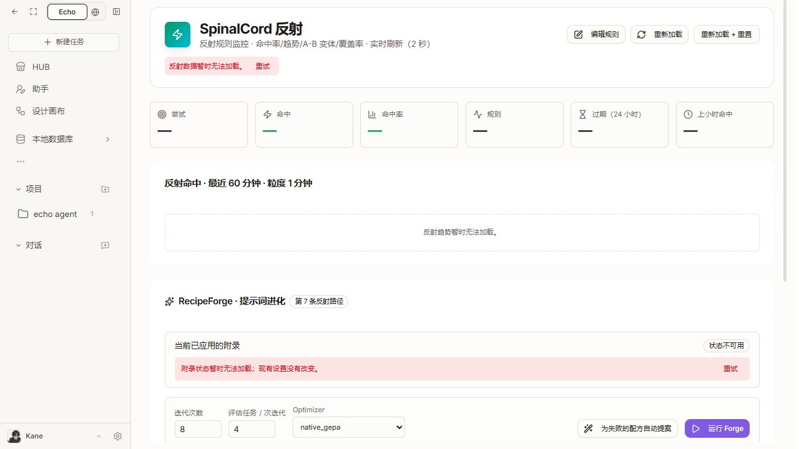

# 全量走查后的前端整改

更新至 2026-09-07，`D:/echo agent`。已完成前端整改、主应用与 7 个工作台构建，以及通过正式安装流程更新运行副本。25 个定向测试文件通过，240 项通过、2 项原有跳过。当前正式本地入口为 `http://localhost:3310`，后端为 `127.0.0.1:8310`，数据目录为 `.codex-run/octopus`。

原走查见 [audit.md](audit.md)，24 项问题见 [findings.json](findings.json)。原先 326 条记录包含重复复核、错误态、条件受阻和响应式变体，并不是 326 个窗口全部验收通过。本轮对共用组件做定向回归和实际页面复核，没有重新宣称所有窗口、所有提交路径均通过。

## 按问题落实

|编号|本轮修改|验证与剩余边界|
|---|---|---|
|F01 服务异常崩溃|存储人物/标签列表检查响应结构；规则统计和基因锁读取校验；错误局部呈现并可重试。|畸形数组测试通过；规则故障页实际可浏览。NAS 成功扫描依赖服务恢复。|
|F02 伪造文件数|移除 Applications 142、Pictures 8426 等生产错误路径中的演示目录与计数；未知显示未读取。取消打开存储页就自动下载视觉模型。|源码检查和错误分支验证；未执行真实下载或扫描。|
|F03 健康状态混淆|运营面板未读取时显示不可用；检测不到显存不再写成 0 GB；通过检查不再同时突出 error；结构化状态使用可读文字。|状态格式化回归通过。没有把后端 403/502 当作空数据或健康结果；未完成所有后端指标契约统一。|
|F04 完成任务仍标错|实时完成状态优先于历史步骤错误；保留当前真正运行失败；回执将已交付结果与过程警告区分。|历史错误与当前完成/失败组合测试通过；没有重新提交用户研究任务。|
|F05 插件可用性|读取后台 installable 标记，在卡片说明安装限制；分类权限/缺包/服务错误；连接状态读取失败提供就近重试；HUB 安装清单失败明确提示。ComfyUI 核对不完整不宣称可运行。|限制卡片与状态恢复测试通过。目录没有完整依赖预检字段时不能提前保证可运行；未改变管理员权限。|
|F06 导航与弹层|设置、移动侧栏在路由变化后关闭；邀请窗口提升到稳定父级，准备超时及失败在入口提示。|设置、邀请、侧栏回归通过；移动跳转遮挡层关闭已实际检查。未发送真人邀请。|
|F07 浏览器浮层|主题与桌面设置面板使用实色背景；小组件编辑使用标准 Dialog，Escape 优先关闭顶层；删除提示带目标名称。|组件和事件路径检查；不清空用户浏览器数据。|
|F08 手机画布|保留宿主返回 HUB；手机显式切换画布/对话；顶栏换行、工具收纳；项目资产改为可开关的整宽覆盖面板。|正式安装副本已更新；3310 宿主内嵌工作台在 390×844 下实际验证，资产面板可打开/关闭，之后可切换对话。|
|F09 模拟与真连接|演示预览明确标为演示；真实健康需明确连接信号；电脑状态读取失败不允许误操作；“主电脑已完成”改为当前对话状态。|相关工作台回归通过；原生设备和真实连接成功流程未验证。|
|F10 导航范围|命令面板与移动抽屉采用共用内置应用注册表，补齐应用入口、去掉重复项；HUB 说明本机应用范围。|导航回归通过。文件夹项目与协作项目仍是两个业务对象，没有合并数据模型。|
|F11 双引擎负担|自动模式收为运行设置入口；选择项说明用途与不可用原因；保留实际执行引擎标记。|引擎选择回归通过；模型与权限专家设置仍可访问。|
|F12 搜索与重复|上方应用也响应搜索；空结果带查询词与清除动作；分页按稳定 ID 去重；紧凑插件卡显示发布者；不展示 Skill 的裸 YAML 块标记。|目录、HUB、Skill 回归通过。后台只返回块标记时显示缺少描述，不臆造用途。|
|F13 能力作用范围|角色技能区分别说明全局停用、当前角色未选择、尚未就绪和实际有效；插件读取失败与未连接分开。|能力与角色回归通过；续查确认了正确运行实例。已安装应用使用“管理应用名”入口，保留重新安装和回退；更新不再改动侧栏固定偏好。|
|F14 空态恢复|开发工作台提供选择工作目录动作；成长/电商提供开始任务；产物空态支持报告、文档、文件并可返回对话；内部占位面板改为运行诊断入口。|工作台回归通过；依赖业务数据的下一级窗口仍受条件限制。|
|F15 平台提示|网页窗口操作使用真实返回/全屏动作；快捷键提示兼容 Ctrl/⌘；目录调用增加等待上限，保留路径输入及最近目录；自动化环境说明区分宿主。|目录选择、窗口控制、自动化设置回归通过。系统原生窗口不在浏览器工具可观察范围。|
|F16 表单识别|补充角色、邀请、自动化、权限开关和图标操作名称；凭据字段适配布尔/多行类型；空发送禁用。|角色可访问树、表单与开关测试通过。未宣称全站屏幕阅读器或 WCAG 合规。|
|F17 长弹窗|角色编辑使用最大高度、内部滚动、固定操作区，长 Prompt 限高；标准 Dialog 增加视口高度边界。|角色表单桌面窄窗和手机布局已取证；未保存角色配置。|
|F18 自动化计划|显示执行时区、首次检查预估、执行端、结果去向和离线行为；保存显示的时区；修正每小时频率编码；禁止空任务提交。|新建表单模拟接口测试通过；正确实例中的订阅工作台已更新。未创建实际计划或验证准点执行。|
|F19 资源预览|静态模板写明示例预览；社区/市场破图使用替代态；Skill 详情先显示正文，源码折叠。|新版设计模板和组件路径检查；外部图源与生成服务仍可能不可用。|
|F20 语言与帮助|结构化对象不再变成 [object Object]；中文化状态/角色创建说明；删除公开页面开发待办；恢复 ReAct 帮助入口；接入 Markdown/Mermaid 渲染。|ReAct 文档实际打开成功。产品、引擎与包版本未人为改成同一个版本号；历史设计明确标为归档。|
|F21 任务成果|普通角色工作台默认不强开终端；产物空态兼容研究报告等交付物；完成回执分开成果与警告。|工作台/状态回归通过。没有重写完整研究成果编辑器或重新运行研究。|
|F22 有副作用操作|插件卸载先说明具体目标及影响并确认，再执行清理；小组件删除命名目标；空标注和空创作请求不发送。|卸载前 API 未调用、取消与失败路径测试通过；没有实际卸载用户插件。|
|F23 完整目录|兼容矩阵增加查看全部/收起，不再只截取前 8 项。|源码与构建通过，所有返回条目可展开。|
|F24 视觉一致|角色创建/编辑采用现有主题令牌；关闭统一使用 X；窄窗规则页头部允许操作换行，避免标题挤成竖排。|900×700、390×844 角色表单已取证；角色展示 HUD 保留原有个性视觉。|

## 本轮实际复核步骤

1. **HUB 搜索与目录**：无匹配时上方应用和下方插件均不保留不相关结果；发布者和明确操作名称可见。插件卸载只在测试中确认执行，浏览器没有删除用户插件。
2. **规则错误页**：依赖不可用时保留导航与页面结构，数字显示破折号，提供重试；页头布局已修正。
3. **角色创建**：900×700 和 390×844 下表单可阅读、可滚动，创建/返回动作可找到；没有提交。
4. **帮助**：ReAct 文档可加载，归档设计与当前操作入口分开说明。
5. **设计画布宿主**：390×844 的返回 HUB、画布/对话切换可见。发现已安装副本比新构建旧，因此没有将这条路径当作新版资产面板验收。
6. **设计新版构建**：单独预览本轮产出的包，390×844 下资产覆盖面板打开/关闭成功，对话完整显示，空发送禁用。未执行创作、上传或调用付费模型。
7. **订阅**：实际环境显示未安装和应用中心入口；执行预览、时区请求和空提交由组件测试验证，未称真实调度成功。

选取的本轮证据：

其余截图及 DOM 在 `remediation/`。`mobile-canvas-chat.png` 是中间版本，应以 `new-build-mobile-chat.png` 为最终新版证据。

## 验证记录

- 定向回归：19 个文件，224 passed / 2 skipped，日志 `.codex-run/ux-regression-handoff.log`。
- TypeScript：`tsc --noEmit` 通过，日志 `.codex-run/ux-typecheck-handoff.log`。
- ESLint：本轮检查无错误；实时对话页保留一条既有 `executionSelection` 依赖警告，没有为消除警告改变其业务语义。
- 主应用生产构建通过：`.codex-run/ux-build-handoff.log`。
- 7 个工作台构建通过：projects、self_evolution、design、narrative_studio、paper-trading、intelligence、community，日志 `.codex-run/ux-workbenches-complete.log`。
- `git diff --check` 通过；其他任务的运行时代码仍有并发变更，不纳入本轮前端修复归属。

## 续查与实际生效（2026-09-07）

此前把 3000/8000 与当前正式本地实例混在一起，且把已安装应用的菜单按钮名称当成了它的全部功能。续查已纠正这两个判断：正式启动入口使用 3310/8310 和 `.codex-run/octopus`；原本标为“从侧栏移除”的按钮实际上会打开包含重新安装、回退、卸载的菜单，现已改为准确的“管理应用名”。没有通过修改账号权限、覆盖安装目录或手写信任记录绕过生命周期。

- **安装生效**：通过 HUB 的“重新安装”更新 projects、paper-trading、design、narrative_studio、self_evolution、intelligence、community。正式接口返回 200；运行副本与最终构建的文件校验结果另存于 `remediation/live-package-verification.json`。后续重装更新保留侧栏偏好。
- **消息渠道**：补齐页面读取、绑定、解绑和探测请求的登录头；助手改用不发生重定向的 `/api/channels`，并解析后台真实列表格式，兼容旧格式。实际页面读取到 26 个渠道、0 个已连接；渠道、角色、团队接口均为 200。没有连接外部机器人或更改绑定。
- **规则与治理**：补齐请求登录头，保留调用方请求字段，拒绝把 HTTP 403 当成保存成功。实际已读取 7 条反射规则与 Lv 2 基因锁状态，相关接口均为 200；没有修改治理模式、成熟度或执行紧急锁定。
- **本地数据库**：确认独立 `octopus-storage` 服务尚未安装，启动探测返回 `not_found`。立即显示缺失原因，停止无意义的 20 轮重试；错误提示保持可见，目录错误转换为可理解文字，离线时禁用扫描与模式切换。尚未完成真实文件扫描。
- **手机设计工作台**：在 3310 宿主的实际安装版中复核 390×844 资产面板开关、对话切换和返回 HUB；检查后恢复默认窗口尺寸。
- **订阅新建窗口**：实际安装版可正常打开，时区、首次检查、执行端和离线行为可见；结果入口名称校准为实际的“执行历史”。空任务不可提交，检查后取消关闭，没有创建计划。

最终新增证据：`remediation/live-mobile-assets.png`、`live-mobile-chat.png`、`live-reflex.png`、`live-channels.png`、`live-storage-uninstalled.png` 及对应 DOM。它们补充并取代上文独立预览或旧实例对当前运行环境的判断。

最终验证：25 文件 / 240 passed / 2 skipped（`.codex-run/ux-continuation-regression.log`）；TypeScript 和本次 ESLint 检查无错误或警告（`ux-continuation-types.log`、`ux-continuation-lint.log`）；主应用生产构建通过（`ux-continuation-build.log`）；全部 7 个工作台重新构建通过（`ux-followup-workbenches.log`）。

末次订阅入口文案校准后，订阅包与主应用再次构建通过，自动化表单 2 项定向测试通过（`ux-intelligence-final.log`、`ux-automation-final.log`），并重新通过正式流程更新订阅包。

## 仍需环境或实际业务条件的路径

1. **本地知识库**：当前机器缺少独立存储服务，文件扫描、OCR 与语义索引不能标为可用；前端已明确显示缺失原因。
2. **外部连接与原生设备**：云插件账号、外部机器人、模型服务与原生电脑的成功路径仍取决于对应服务和用户授权；没有通过虚构连接状态或放宽服务权限掩盖条件限制。
3. **没有执行的路径**：真实任务提交、公开分享/发布、渠道授权、交易、原生文件选择、实际计划调度，以及需要现有数据的详情页，仍按原走查边界记录。

正式开发服务已按 `scripts/start-local.ps1` 恢复并继续运行。访问 3310 使用当前版本；此前 3000/8000 的检查结论保留为历史记录，不代表当前实例状态。未修改账号权限、模型凭据或后端安全配置。
