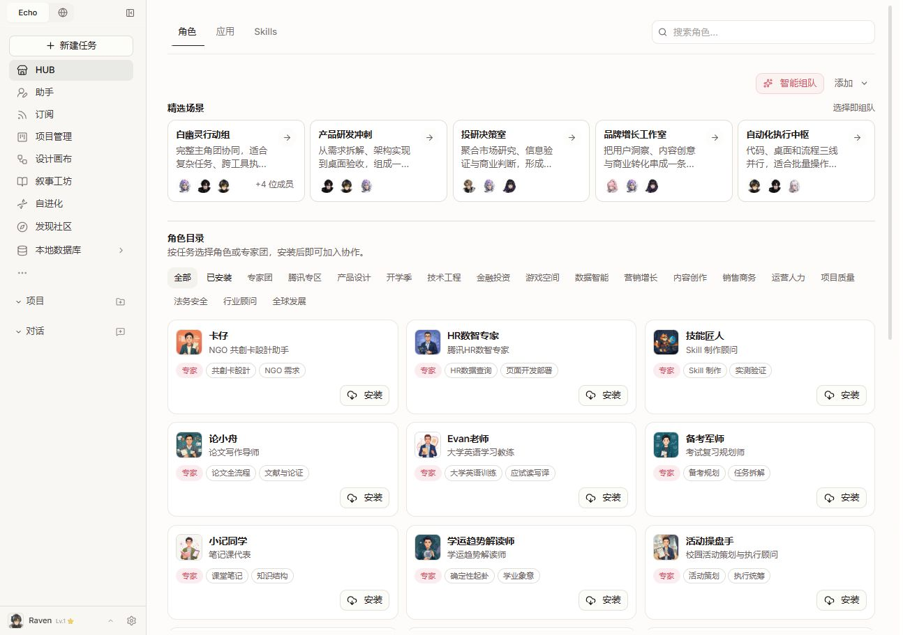
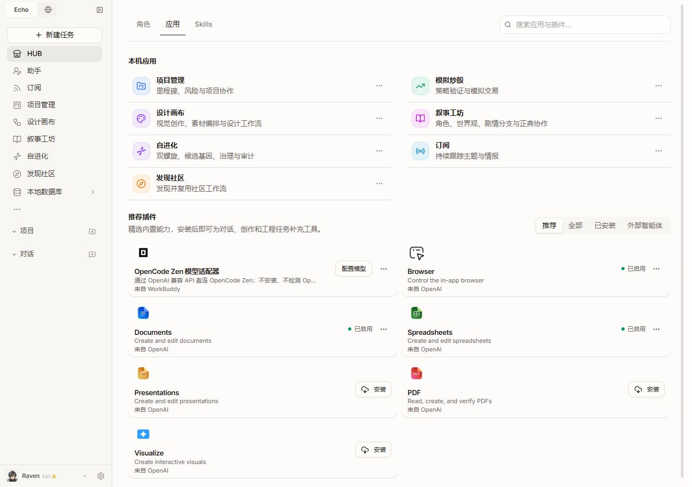
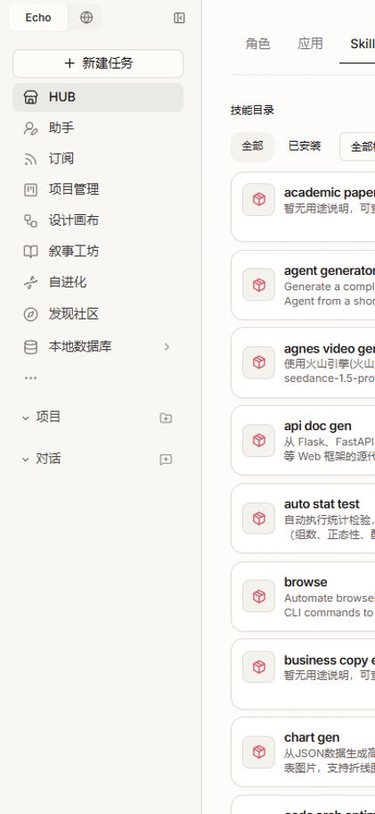
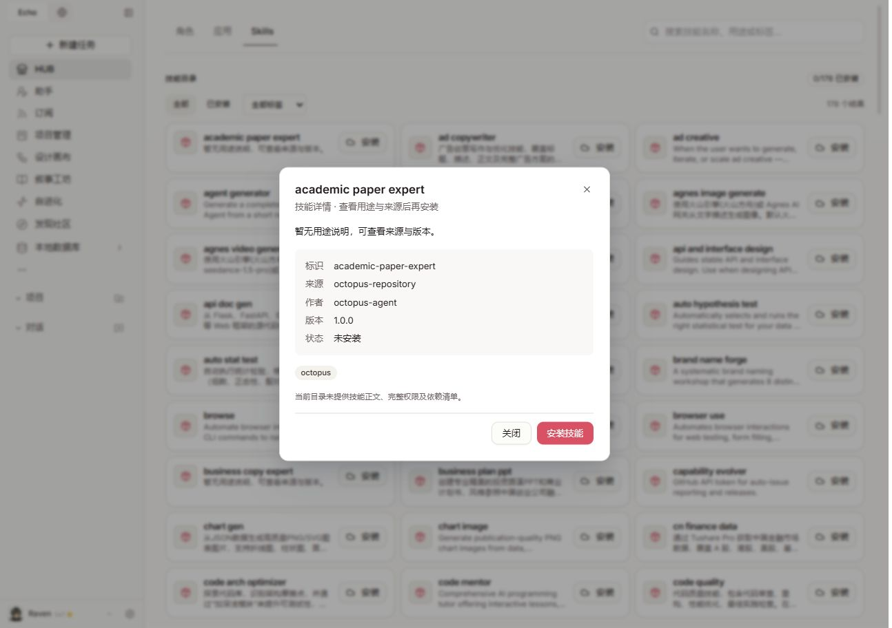

# HUB 优化验证 · 2026-09-08

本轮在现有前端上修改，未安装、停用或卸载真实插件。

## 已完成

- 角色场景改为紧凑中性色卡片，成员头像并排；宽屏五列，窄屏允许横向浏览。
- 角色分类完整换行展示，补充 aria-pressed；新增已安装筛选，切换后重置分页。
- 角色目录命名与外部智能体区分；详情删除重复职业字段。
- 搜索提示明确当前页面范围，新增清空按钮。
- Skills 安装总数从完整目录计算，搜索结果数量独立显示；新增安装状态、真实目录标签筛选和空状态恢复入口。
- 技能名称优先使用本地中文名，否则将标识分隔符转换为空格；原始标识保留在详情中，安装仍使用原始 ID。
- Skills 列表和详情共用描述清理，裸 YAML 标记不再显示；缺失的源内容仍明确显示暂无说明，不编造用途。
- Skills 卡片固定横向排列，详情操作固定在底部右侧。
- 插件状态与操作分开；停用、断开和卸载统一收入管理菜单，保留权限与确认流程。
- 外部智能体空状态增加注册入口，收紧空面板高度。

## 验证

- 54 项测试通过：HUB 页面、Skills 搜索与安装状态、插件授权会话恢复与清理、卸载权限和确认。
- TypeScript `tsc --noEmit` 通过。
- 1294×912 实际页面检查：角色、Skills、详情、应用、插件菜单、外部智能体。
- 390×844 检查：角色分类换行、局部场景滚动、Skills 卡片、搜索零结果与稳定安装总数；页面未发生横向溢出。

远端目录中英混杂、内容缺失仍需要目录提供方或后续内容整理处理。本轮修复展示和交互，不宣称已逐项改写 178 个技能或验证全部插件安装。
