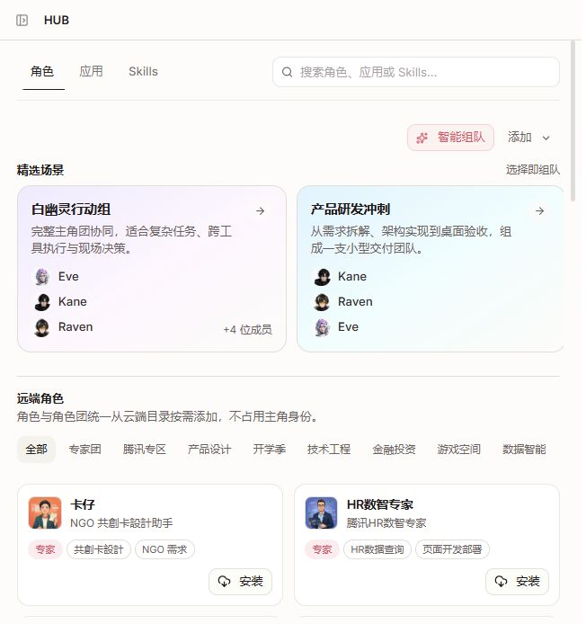
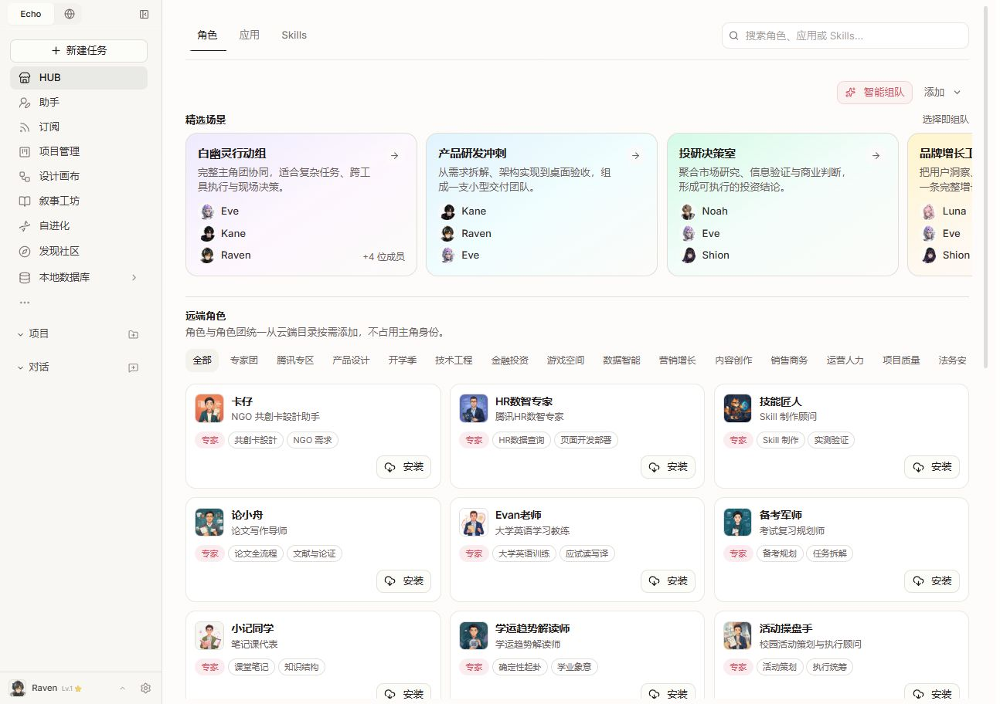
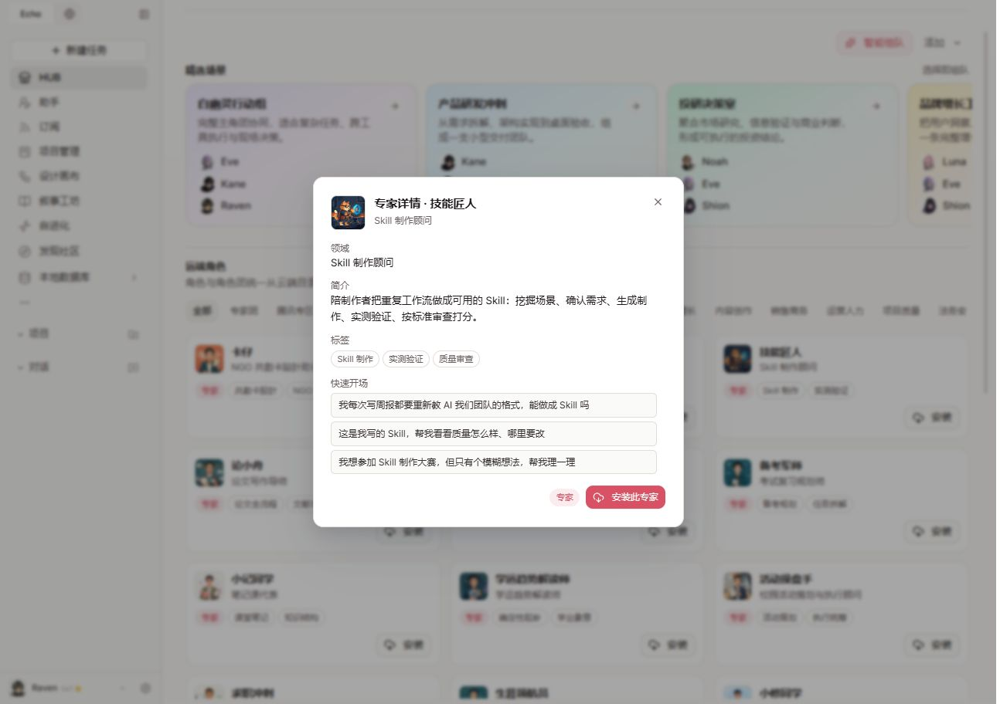
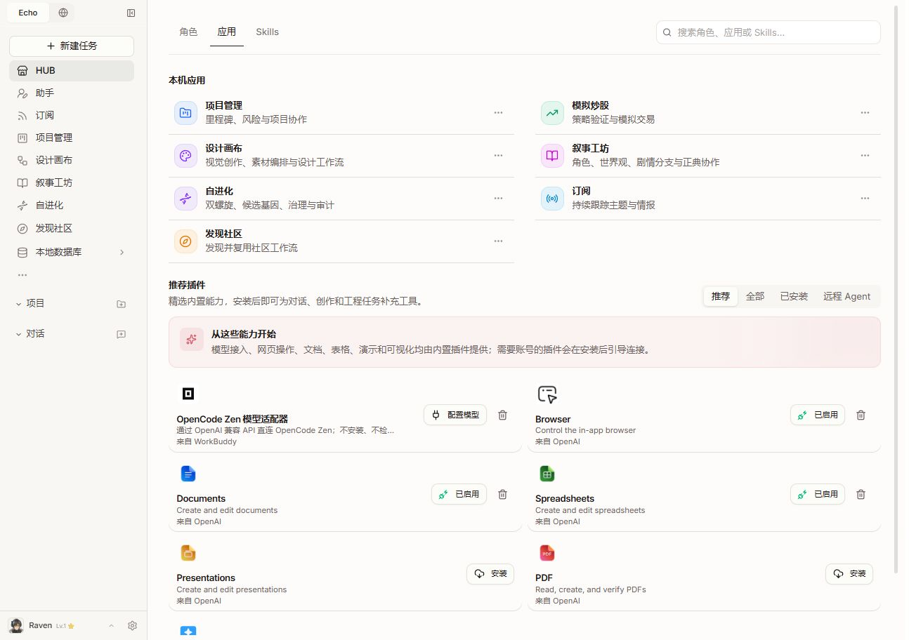
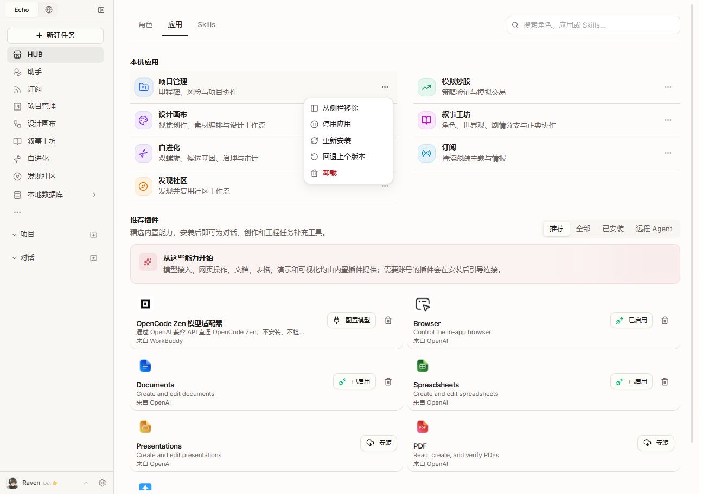
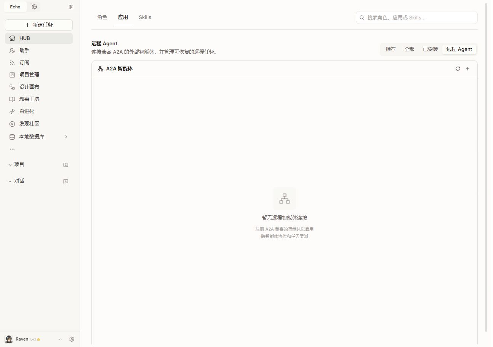
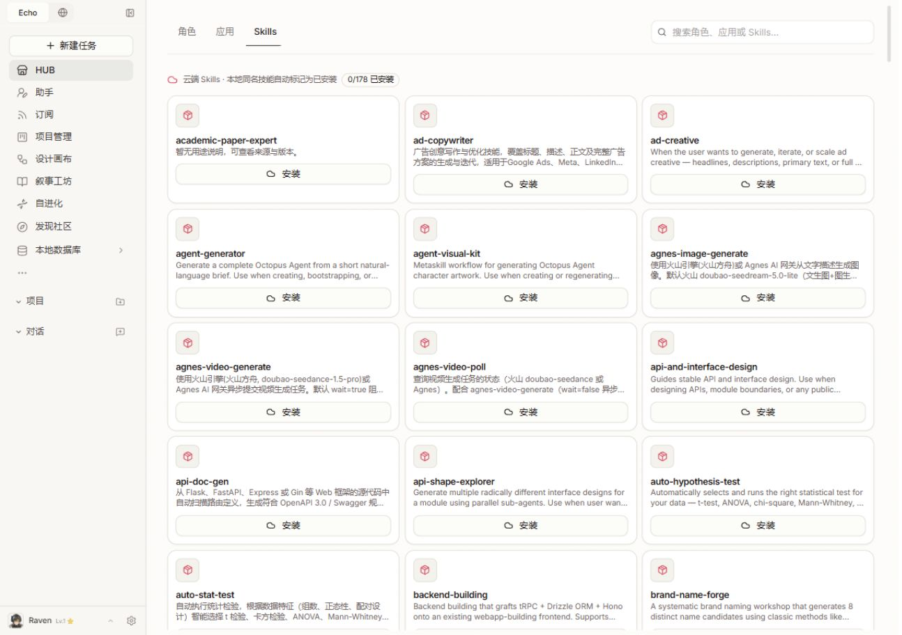
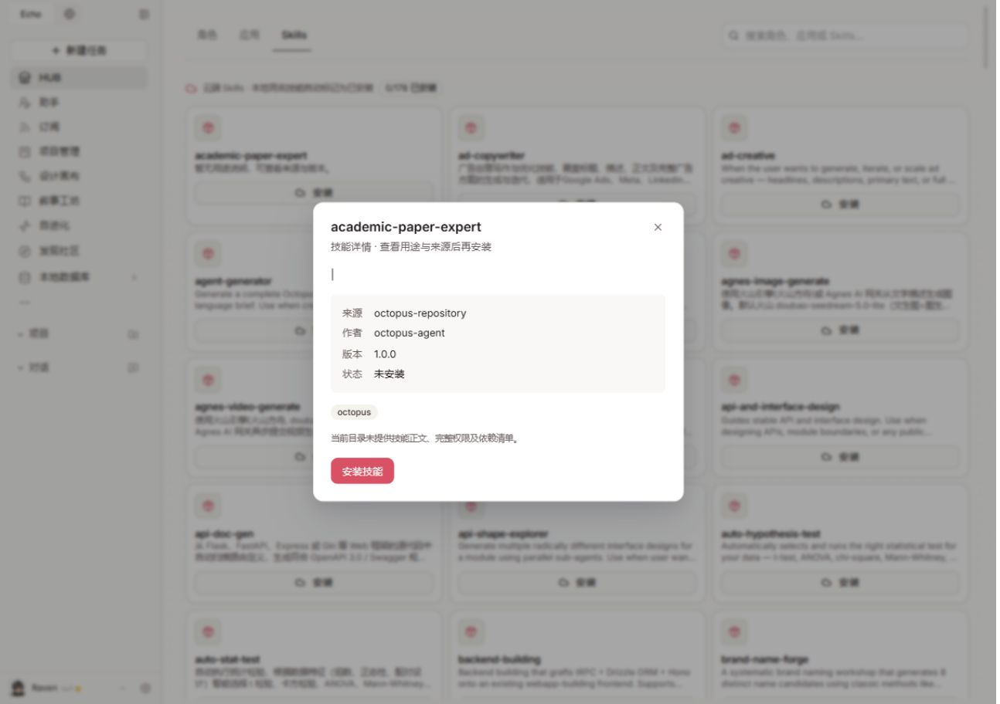
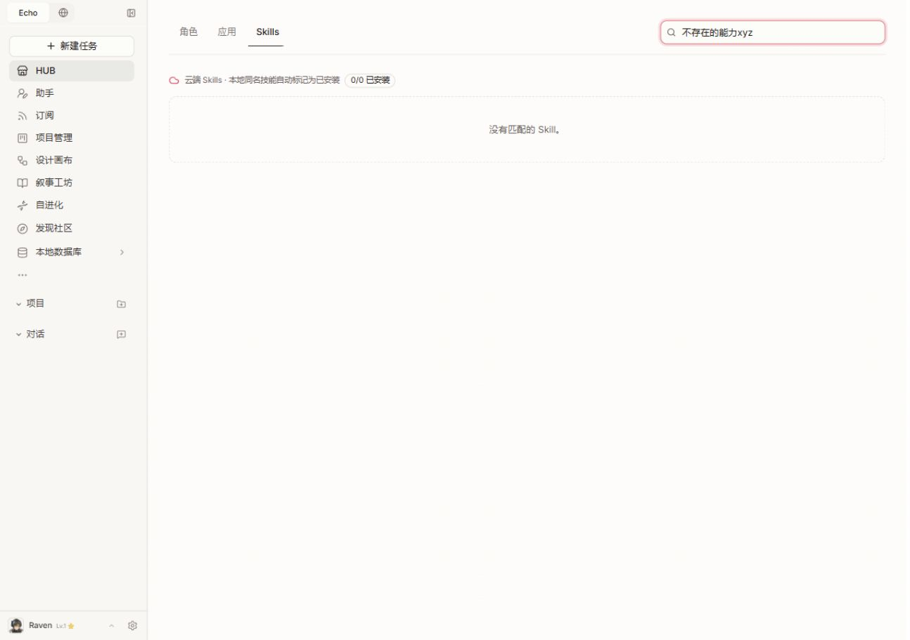
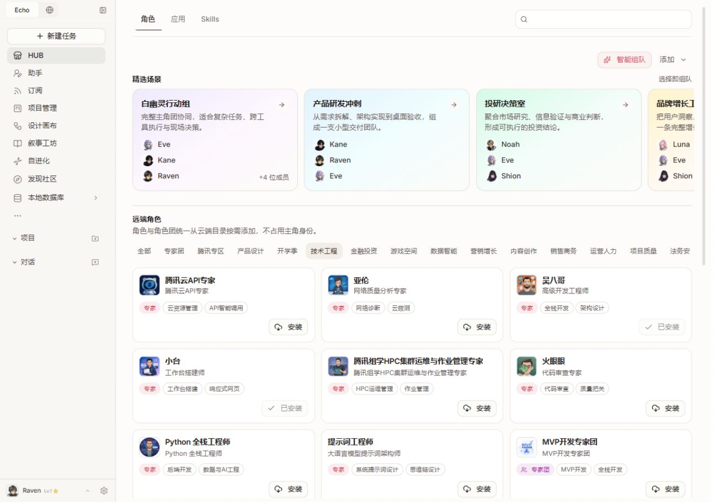

# HUB 体验走查 — 2026-09-08

结论：三页的基本结构可保留，优先整理检索、目录内容和安装状态，而非扩大文字或增加装饰。本轮仅审查，没有修改 HUB 代码、安装插件、启动场景或注册外部服务。

## 优先级

1. **P1 — 修复技能目录内容。** academic-paper-expert 的卡片没有用途说明，详情正文仅为 `|`。应修复描述提取或数据源，并用完整用途、输入/产出、前置条件帮助选择。单凭页面不能断言是哪一层解析错误。
2. **P2 — 统一检索与筛选。** 角色有 421 个目录条目，Skills 有 178 个；角色分类横向超出屏幕，Skills 没有可见分类/已安装筛选。保留三个页签，为各页提供同位置的分类、已安装状态与结果数量，明确搜索范围。
3. **P2 — 分离总量与搜索结果数量。** Skills 未搜索时显示 `0/178 已安装`，无结果时变成 `0/0 已安装`。应保留总安装量，把“找到 0 项”独立显示；提供清空搜索入口。此观察不代表安装检测一定错误。
4. **P2 — 整理技能名称与摘要。** 列表普遍使用英文 slug、相同占位图标及长触发说明，中文和英文混排。建议显示易懂名称、一句用途和来源；slug 与完整触发规则放到详情。用途相似的条目应标明差异，不能仅凭相似描述直接合并。
5. **P2 — 统一应用与插件管理。** 本机应用通过菜单管理，插件直接暴露配置/启用/卸载，角色安装后的首要操作又只显示“已安装”。建议统一“状态 + 下一步操作 + 更多菜单”，卸载移入更多菜单，已安装角色提供清楚的使用入口。
6. **P2 — 调整角色首页重心。** 场景卡片高约 186px，首屏只能显示三个完整场景，分类也横向截断。建议缩短场景卡片，把成员改成紧凑头像组，补明确横向导航；让角色搜索/筛选更接近首屏顶部。
7. **P2 — 补分类选择的可访问状态。** 点击“技术工程”后结果确实改变，但该按钮没有 aria-pressed 或 aria-selected，选中仅由样式体现。应补语义并验证键盘焦点、横向滚动与结果播报。
8. **P3 — 解释远程概念及改善空状态。** 角色页“远端角色”和应用页“远程 Agent”实际上承载不同用途，后者已有 A2A 说明但位置容易混淆。空状态中央应提供“连接外部智能体”按钮，而不是只在卡片右上角放加号。
9. **P3 — 统一详情和卡片视觉。** 角色详情底部主操作在右，技能详情在左；Skills 卡片整行安装按钮与插件页的小按钮不一致。可统一边距、摘要行数和操作位置，继续保持小字号、淡底色和克制的卡片边界。

## 逐步证据

### 1. 角色页，652 × 694 — 可用，横向内容不易发现

保留了清楚的三页签和搜索。场景及分类超出横向空间，无明显左右操作按钮。

### 2. 角色页，1294 × 912 — 可用，目录选择成本偏高

场景先占据大块面积，远端角色目录排列密集。“我的/已安装角色”不是当前页面的明显入口。

### 3. 远端角色详情 — 内容基本完整，快捷开场不够明确

技能匠人详情有简介、标签和快速开场，是优点。快速开场视觉像按钮，DOM 中却是普通文本；建议做成明确示例，或提供可操作的复制/安装后使用入口。本轮未启动对话。

### 4. 应用页 — 分类可识别，管理方式和文案风格不统一

本机应用和插件已有分区。插件说明中仍出现 CLI、流式输出、兼容 API 等实现细节，与面向用户的应用用途并列。

### 5. 项目管理菜单 — 操作完整，但状态信息与下一步分散

含侧栏移除、停用、重装、回退和卸载。仅打开菜单，没有执行这些操作。

### 6. 远程 Agent 空状态 — 有说明，行动入口偏弱

页面明确提及 A2A，但中央只有说明，注册入口是远处的小加号。没有注册或连接外部服务。

### 7. Skills 目录 — 当前最需要优化

178 个条目以英文标识排序，描述长短、语言不一，许多说明直接使用开发/调用规则。首屏没有可见的用途分类或已安装筛选。

### 8. academic-paper-expert 详情 — 确认有内容缺陷

正文只有竖线，虽然有来源、作者、版本和缺失信息说明，但缺少足够用途信息。需修复数据展示；未安装验证后续步骤。

### 9. Skills 无结果搜索 — 能过滤，恢复和计数需改进

输入不存在的能力后显示无结果，安装统计随过滤变为 0/0；没有可见清除按钮或搜索建议。

### 10. 角色分类“技术工程” — 过滤生效，缺少选中语义

出现工程类角色以及已安装条目，说明筛选与部分状态反馈存在。选中按钮仅靠背景/字重表示，ARIA 选择状态缺失。

## 建议实施顺序

先修技能描述与搜索统计 → 再统一筛选/安装状态/详情入口 → 最后收紧场景卡片、统一视觉。保持角色、应用、Skills 三个一级页签；无需额外增加首页大标题、介绍横幅或更多一级入口。

## 验证边界

本轮在真实运行页面检查三页及代表性详情、应用菜单、远程连接空状态、搜索、分类，以及 652px/1294px 两种宽度。没有遍历所有 421 个角色或 178 个技能，没有安装/卸载/启停、真实任务执行、认证连接、完整键盘测试或对比度测量，因此不宣称全量功能或 WCAG 合规。结束后恢复原角色页及原视口。
