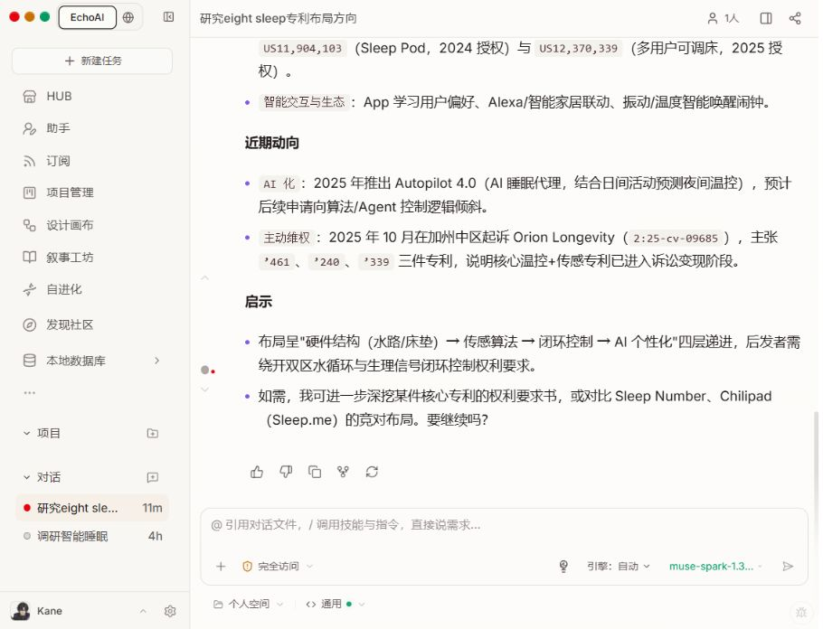
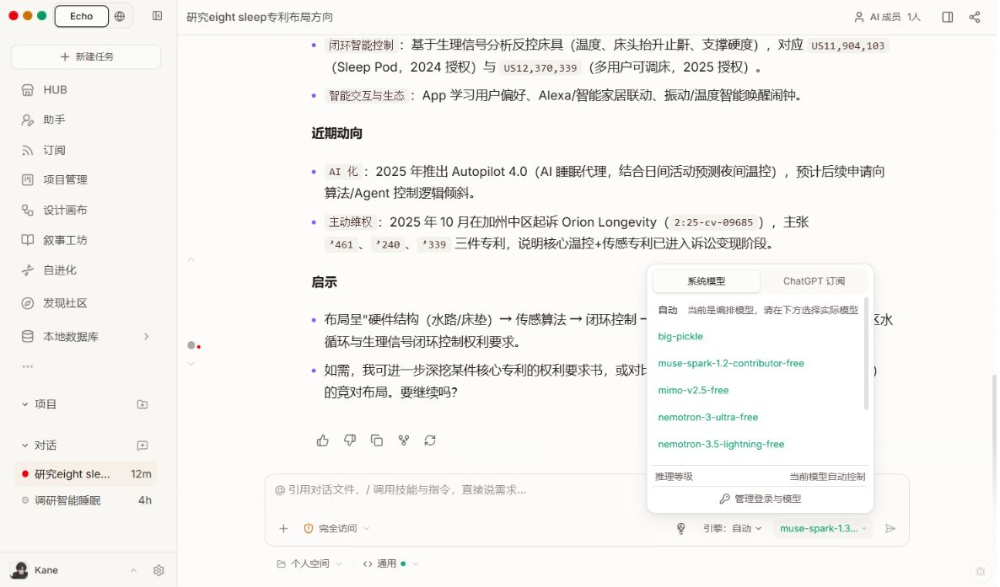
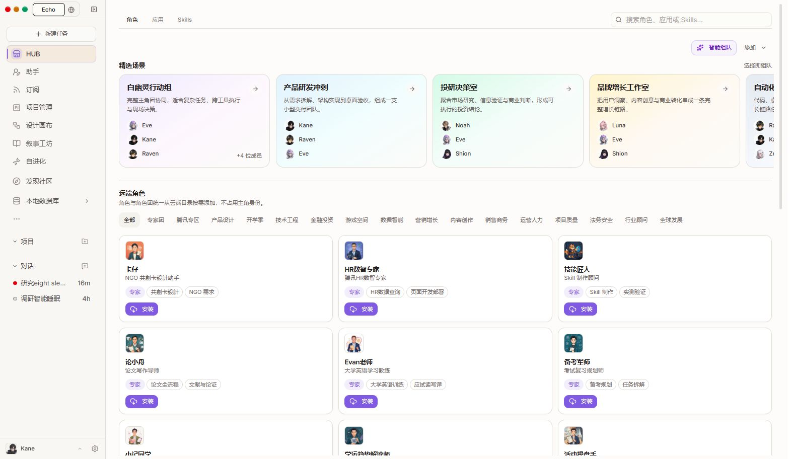

# Echo 前端 UX/UI 走查

日期：2026-09-06。对象：本地运行中的 Echo；从当前研究对话进入模型菜单，再进入 HUB，最后返回原对话。三张截图均在本次走查中直接采集、保存并打开核验。未修改业务代码、模型选择或任务内容。

## 结论与范围

界面的浅色基底、轻边框、持续可见的输入框，以及折叠的过程回放，已经形成可用的基础。最有价值的改进是统一任务状态、降低模型与执行设置的理解成本、让研究结果更容易核验和保存，其后再优化导航与视觉细节。

本次是三个主要界面的定性走查，不是全站验收。未执行新的付费请求、安装插件或重跑任务。窗口尺寸在走查期间发生变化，因此这些截图不能用来证明固定断点下的响应式表现。研究内容本身未做事实核查；页面中的专利、日期等仅作为“结果如何呈现”的证据。

## 1. 阅读研究结果：可用，状态一致性需要优先处理

**优点**：正文有标题、列表和合理行距；输入框持续可见；过程回放可以折叠，避免执行过程淹没结果。

**P1：任务状态相互矛盾。** 当前结果已经返回，历史中也显示“先前尝试失败，后续已恢复”，但侧栏红点对应的可访问名称仍是“异常待处理”。返回同一对话、加载完成后仍观察到这一状态。用户无法直接判断是否还需操作。

建议把当前一次运行的状态作为主要显示依据，区分“执行中、等待你处理、已完成、失败”；已恢复的历史失败收在过程详情中。若红点实际来自另一个仍未解决的步骤，点击后应定位到该步骤并解释原因。验收应覆盖失败后成功重试、切换模型恢复、刷新及跨页面返回。

**P1：研究结果缺少直接核验入口。** 本次答复包含专利编号、统计与年份，但在结果正文及其可访问树中未见对应的可点击来源链接；页尾主要是评价、复制、派生和重新生成。

建议为研究类结果展示真实来源标记与来源卡片，提供“保存为文档”入口。来源必须关联实际工具返回的 URL/标题/时间；需要输出数据配合，不能只由前端补造引用。是否全站已有其他导出功能，本次未作断言。

**可访问性风险**：小图标与浅色次要文字需要检查实际点击范围、焦点可见性和对比度；红点不应成为状态的唯一视觉说明。可访问树已有多个按钮名称，值得保留。

## 2. 选择模型与配置输入区：功能齐全，理解成本偏高

**优点**：模型可以就地切换，菜单有账户/模型管理入口，不必离开任务寻找配置。

**P1：配置维度过多。** 输入区附近同时出现权限、执行引擎、模型、工作空间、模式和一个表示“只聊想法”的图标；模型菜单还有“系统模型 / ChatGPT 订阅”和“当前是编排模型，请在下方选择实际模型”。普通用户需要先理解底层关系才能判断该选什么。

建议默认保留工作空间、任务模式和模型的简洁摘要；把引擎和推理强度等集中到“运行设置”。权限继续保留明确可见的文字状态。模型菜单的“自动”应能选到实际可运行的模型，无法使用时显示原因和可执行下一步。

**P2：模型名称与状态难以扫读。** 多数列表项直接展示类似 `muse-spark-1.3-contributor-free` 的标识，当前模型在输入框中被截断。列表没有清晰区分“免费”“当前选中”“已验证可用”“最近失败”等含义。

建议显示简短名称，例如“Muse 1.3”；提供方、免费属性作为独立标签，完整标识放在详情中；选中态使用勾选。可用性由真实检测/请求结果提供，并标明检测时间，不把颜色等同于可用性。本次未重新测试各模型的实际服务状态。

**可访问性风险**：应补测菜单键盘顺序、选择后焦点恢复、缩放后的截断和滚动；Escape 关闭菜单在本次可用。不能据此声称完整键盘支持。

## 3. HUB 与侧栏导航：内容丰富，入口关系需要收敛

**优点**：场景卡片包含用途描述和成员；搜索、类别筛选和角色卡片能支撑发现新能力；整体风格与对话页一致。

**P2：导航混合不同层级的概念。** 侧栏把 HUB、助手、订阅、项目管理、创作应用、自进化、社区和本地数据库并列，下方又有“项目”和“对话”。“项目管理”与“项目”的区别没有就地说明。HUB 角色页又同时呈现场景、组队和大批远端角色。

建议侧栏突出任务、项目和常用应用，其他入口通过能力中心或可自定义的更多菜单进入；明确区分“项目总览”与具体项目列表。HUB 可使用中文“能力中心”，统一“角色 / 应用 / 技能”的语言。首页优先展示已添加与最近使用的能力，再展开完整目录。

**P2：角色信息可更贴近任务。** 保留现有角色故事与视觉风格，但场景卡片首先说清能交付什么，例如研究报告、设计方案、可运行工程；人物介绍和世界观放在详情中。大量目录分类可先展示常用项，其余用“更多分类”展开，并保留当前筛选标签。

**可访问性风险**：场景采用横向溢出列表，右侧下一张卡片仅露出一部分；应有明确的滚动/翻页方式，并补测键盘访问。筛选文字、次要描述和安装按钮的实际触控范围也需要测量。

## 建议落地顺序

| 顺序 | 工作 | 验收重点 |
| --- | --- | --- |
| 1 | 统一当前运行状态与历史失败展示 | 失败后成功恢复，正文和侧栏状态一致；待处理项可定位 |
| 2 | 简化输入区与模型菜单 | 一眼看懂当前空间、模式、模型、权限；高级设置可找到；模型标签含义明确 |
| 3 | 研究结果的来源与文档交付 | 引用可打开真实来源；保存入口清晰；缺失来源如实显示 |
| 4 | 导航分组、HUB 常用能力与命名 | 能区分项目总览、具体项目与应用；容易回到常用能力 |
| 5 | 在现有主题上打磨可读性与操作尺寸 | 检查文字对比度、焦点、点击范围、200% 缩放与窄窗口 |

## 实现参考与验证限制

已检查现有 `frontend/src/styles/globals.css` 中的主题、前景/弱化文字和圆角变量，以及现有 sidebar/model-picker 组件。优化应继续复用这些语义变量、菜单与按钮组件，避免另起一套视觉体系。

状态问题可从 `frontend/src/core/threads/sidebar.ts` 与 `frontend/src/components/workspace/workspace-sidebar.tsx` 的状态汇总与实时事件更新继续排查；这里是定位入口，不是已证实的唯一根因。模型显示可从 `frontend/src/components/workspace/model-picker.tsx` 的 `display_name` 等元数据开始。

尚未完整验证：手机布局、暗色主题、200% 缩放、屏幕阅读器、键盘全流程、实际颜色对比度、插件安装链路和项目管理内部流程。当前结论不代表 WCAG 合规审查。页面开发服务在本次期间有热更新，截图中的品牌文字应视为当时状态，不据此判定长期不一致。
