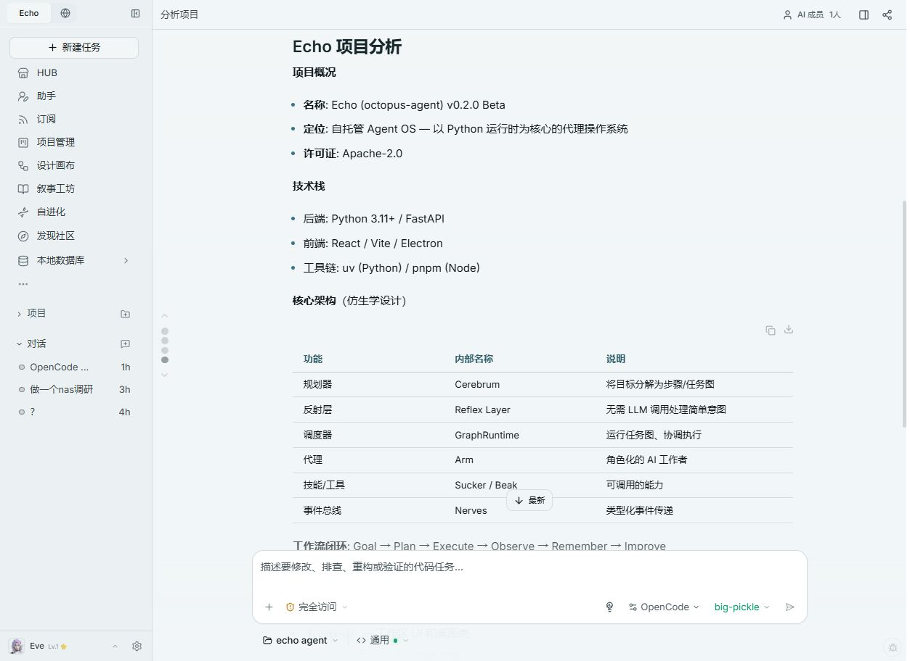

# Zen 模型不可用与项目分析恢复

2026-09-08，任务 `tcrw3P5HRdDAXtWW7Aoi5P`（分析项目），工作区 `D:/echo agent`。

## 根因与实测

| 路径 | 本次实际结果 |
| --- | --- |
| Zen `/models` | HTTP 200，仍列出 `deepseek-v4-flash-free` |
| DeepSeek → Zen Chat Completions | 最小请求 HTTP 400，`Model is unavailable` |
| Muse 1.3 → Zen Responses | 最小请求 HTTP 400，免费层仅支持 OpenCode |
| 官方 OpenCode 1.18.29 的 `/provider` | 7 个免费模型，没有 DeepSeek |
| OpenCode → big-pickle | 两次独立最小请求均返回 `OK` |

模型列表中的条目不保证推理可用。此次 DeepSeek 的失败发生在上游模型请求阶段；换到 OpenCode 后，该模型又不在引擎目录内。原实现把后一种 HTTP 500 笼统显示成“OpenCode 本地引擎连接中断”。

后台另外出现的 Codex 插件目录认证失败会退回 Echo 本地能力，并非这次 DeepSeek 模型错误的原因。

## 恢复与修复

- 当前对话选择 `OpenCode + big-pickle`，重试原始“分析项目”诉求。真实任务完成，页面显示分析结果和 11 步目录/文件读取过程；工作台显示 `read_file 已完成`。
- Echo 原生执行采用统一的安全中文模型错误，保留 HTTP 状态用于诊断。
- 明确区分“模型不可用”和“Zen 免费层要求 OpenCode”，Codex 包装错误也能显示相同的操作提示。
- 前端对历史英文错误和实时错误进行一致处理。
- OpenCode 启动后、提交任务前读取官方模型目录，拒绝不在目录中的选项。HTTP 模型错误与本地连接错误分别处理；错误提示不回显供应商原始响应。

## 验证

165 项相关测试通过：原生错误/OpenCode 24 项，模型路由/Responses 桥接/Codex 事件 102 项，前端错误和消息结果 39 项。TypeScript、ESLint、Ruff 和改动空白检查通过。

修改后的真实 OpenCode 启动流程再次验证：DeepSeek 在提交前得到明确的模型选择错误，big-pickle 正常返回 `OK`。后端已重载，8310 健康接口与 3310 前端均返回 HTTP 200；恢复原本地账号后，分析结果和所选引擎/模型仍在。

这些实测证明当时的连通性和任务执行恢复。DeepSeek 的上游可用性没有被本地修复；该次生成的项目分析内容未作为全面代码审计结论验收。

