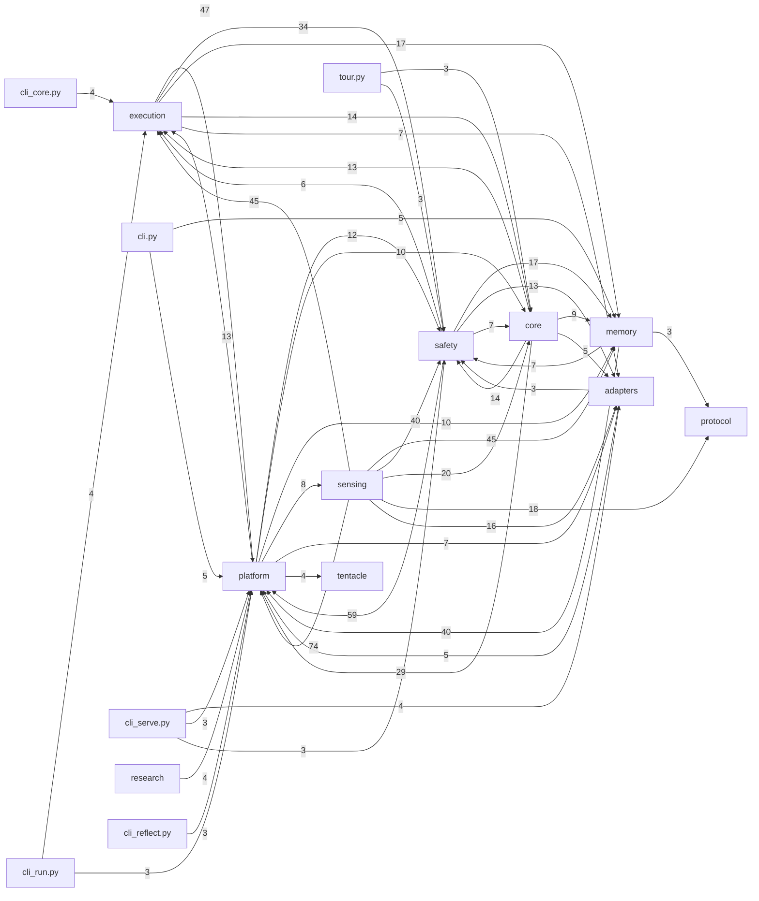

# 后端架构 · Backend

> Python runtime · 分 6 个子系统 · 左侧树展开看每个子系统详情。

| 子系统 | 目录 | 职责 |
| --- | --- | --- |
| Runtime 核心 | `runtime/execution/`, `runtime/core/` | 执行器 · 规划 · 技能注册 · 心跳 |
| Safety | `runtime/safety/` | 宪法 · 免疫 · 生命周期 hooks |
| Memory | `runtime/memory/` | Journal (genome) · Context (hemolymph) |
| Sensing | `runtime/sensing/` | Eyes (model router) · Siphon (HTTP API) |
| Adapters | `runtime/adapters/` | MCP · Channels · 第三方集成 |
| Agents | `agents/` | 预置 agent 的 profile / memory / workspace |

## 依赖关系（自动计算）

每个子系统被**多少**子系统引用 · 静态 AST 扫描 ``from runtime.X ...`` 语句得出。
前端 Wiki 面板会把下面的 ```mermaid``` 渲染成真图。



