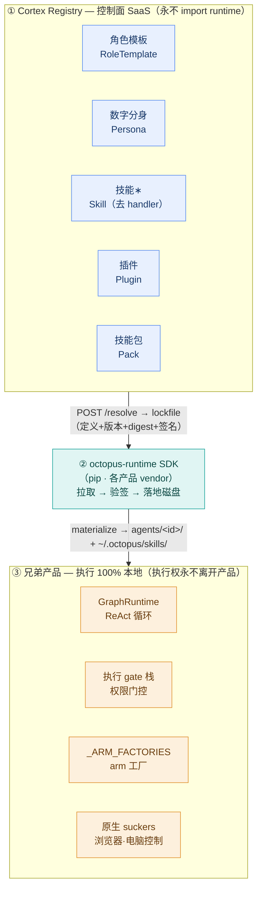

# Capability Plane — 共享能力中台设计

> 把 octopus 的**角色模板 / 数字分身 / 技能 / 插件 / 技能包**抽成一个独立的、多租户的 **SaaS + API**,让多个同级产品**复用而不必各自 fork** 代码库。
>
> Status: **Proposal**（待评审 / 待拍板）· Scope: 跨仓库产品级架构 · Owner: TBD
>
> 本文由一次 26-agent 调研工作流产出(map → 3 套架构对抗评分 → 综合),结论尽量带 `file:line` 实证;完整原始结果见文末「Provenance」。

---

## 0. TL;DR(先认清最诚实的那条)

**这五块没法"全部"去 fork。** 技能的 `handler` 是一个**必填的 Python `Callable`**(`runtime/execution/suckers/registry.py:39`),绑死 playwright / pyautogui / httpx 与各产品的执行 gate 栈。要把它做成服务端可执行,就得 `import` 整个 391 模块的 runtime(`runtime/__init__.py:23-50` 是 eager-import 墙)——那正是我们要消灭的耦合。所以 **执行代码天然仍留在每个产品里**。

但今天真正在**重复 fork 的不是执行代码,而是数据**:`agents/<id>/` 整个目录被复制粘贴(这是被记录在案的 #1 复用方式)。**能做、且高价值的,是把这份"数据 fork"变成一个共享的、版本化的多租户 registry**;执行代码改成靠 manifest「广告 + 校验」而非拷贝。

> **一条硬规则贯穿全文:定义(definitions)过线,代码执行权(execution authority)永不离开产品。**
> Cortex 是"公证处 + 目录 + 版本解析器",**不是执行宿主**。

三套候选架构在「能否终结 fork」维度评委都只给 3/5——**这是不可消除的物理事实,不是设计缺陷**;诚实地把目标限定在"消灭数据 fork"是最大的可信赢面。

---

## 1. 背景与目标

### 问题
多个同级产品想复用 octopus 的能力资产(角色模板、数字分身、技能、插件、技能包),今天的复用方式是 **fork + 复制 `agents/` 目录树**,导致:
- 资产在各仓库间漂移、无法统一升级;
- 没有版本/锁定语义(一次性拷贝);
- 没有租户/治理/市场。

### 目标
- 资产成为**单一事实源**:版本化、不可变、可被多个产品按引用消费。
- 产品**按 pin 升级**(npm/cargo 模型),而不是 git-vendor 整棵树。
- 多租户 + 治理 + 市场。

### 非目标(v1)
- 不在服务端执行技能(见 §6 / 决策 ②)。
- 不托管数字分身的可变状态/会话/PII(见 决策 ④)。
- 不做多语言客户端代码生成(见 决策 ①,推迟到有真非 Python 产品)。

---

## 2. 现状盘点(实证 — 决定能不能盖楼)

| 能力 | 成熟度 | 抽取难度 | 关键事实(file:line) |
|---|---|---|---|
| 角色模板 | 🟢 production | 中 | 目录即模板;`loader.load_agent` 把 parse 与 instantiate 揉在一起,需拆。模块顶导入 GraphRuntime + 7 个 arm 工厂(`loader.py:34-44`)。**model-drop bug**:Agent ctor `loader.py:505-516` 从不传 `model=`。 |
| 数字分身 | 🟢 production | 中 | = 模板实例化 + 可变状态(soul/profile)。`did` 字段只写不读(死)。 |
| 技能 | 🟢 production | 中 | `Skill.handler` 必填 Callable(`registry.py:39`)= **耦合根源**;但**元数据模型很轻**(Skill 去掉 handler 后只依赖 pydantic)。 |
| 插件 | 🟡 partial | 中 | 市场 API + 前端**已存在**,但后端是 vaporware:`DEFAULT_REGISTRY_URL` 指向 404 的 GitHub registry;`publish()` 只打印"去提 PR"。 |
| 技能包 | 🟡 partial | 低 | `agent_packs.py` 近乎可直接搬(唯一 runtime 依赖是 `agent_avatar`,后者只用 `html.escape`+`pathlib`);但 `import_agent_from_pack` 写死了金融垂类(`agent_packs.py:164-206`)。 |
| 存储底座 | 🟢 production | **高** | 全是本地磁盘 JSONL/Markdown,单写者本地盘;**无 tenant 列**(全仓 grep 确认);`StateStore` 的 File/SQLite 后端从未实例化(scaffold)。 |
| API / 租户 | 🟡 partial | 中 | auth 加密可逐字搬(`identity.py`/`web_auth.py` 零 runtime 依赖、抗 alg-confusion HS256);但 `require_auth=False` 处处如此(`app.py:544,574,617,641,654,662,678`);IdentityStore 内存易失;零 tenant。 |

### 已有、可直接复用的基建(不是从零造)
- `runtime/execution/misc/agent_packs.py` — **runtime-free** 纯数据扫描/导入器,17 个 agent 就是这么导入的。
- `runtime/safety/auth/identity.py` + `runtime/adapters/web_auth.py` — 零 runtime 依赖,可**逐字搬**。
- 插件/技能市场的 **API 契约 + 前端已存在**:`skill_market_router` / `plugin_hub_router` / `agent_world_router`,以及前端 `plugins/api.ts`。这是"绿地建在已就绪的契约上"。
- 跨语言消费**已被证明是真的**(ADR-008):同一份 `SKILL.md` 同时喂 Python `market_skills`、`tentacle/llm SkillManifestLoader`、Kotlin `SkillManifest.kt`。

### ⛔ 死代码,**不要在上面盖楼**(实证零消费者)
- `runtime/execution/arms/skill_manifest.py`(`SkillDefinition`/`SkillBuilder`/`BUILTIN_SKILLS`)— 零消费者。
- `StateStore` 的 `FileBackend`/`SQLiteBackend` — 从未实例化。
- `did` 字段 — 只写不读。
- social/ratings/memory stub 端点 — 返回 `[]`。
- 不要为了 `SkillSpec` 去 import `tentacle.llm`(会拖进 LLM/chat 层)——重新实现那个小 dataclass。

### ⚠️ 两个同名 `register_all`,别测错(2026-07-01 registry 消费端调查实证)
仓库里有 **两个不同的 `register_all(registry)`**,名字一样、行为完全不同:

- `runtime.execution.suckers.builtins.register_all` —— 手测/脚本常 import 这个(名字直觉)。
  内部 `_market_skills_dir = skills/public if 存在 else all_skills`(**二选一**,skills/public 优先)。
- `runtime.execution.all_skills.register_all` —— **`builder.py` 的 `build_from_config`(真实
  `octopus serve` 走的路)用的是这个**,不是上面那个。它按 `_GROUP_REGISTRARS` 逐组注册(builtin/
  fs_search/web/git/shell/computer/browser/…),其中 `"market"` 组调用
  `register_market_skills(registry, respect_enabled_flag=False)`**不传 `all_skills_dir`** →
  落到 `market_skills.py` 里的默认值 `runtime/execution/all_skills/`;**注册完这一组之后**,函数末尾
  **再额外调一次** `register_market_skills(..., all_skills_dir=skills/public, ...)`。

**结果:生产环境两个目录都会被注册,不是二选一,是叠加**(`skills/public` 里跟 `all_skills` 同名的会被
`register_market_skills` 内部的 `if registry.has(name): continue` 去重逻辑跳过,只净增新名字)。

**含义**:
1. `runtime/execution/all_skills/`(136 个目录、约 227 个技能名含 `aliases:` 展开)是**内置技能层**,
   跟 `browser_skills`/`git_skills`/`computer_skills` 同档次,**从设计上就不经 registry 分发**——
   不是"该同步没同步"的缺口,是分类不同。
2. `skills/public/` 才是"停止打包/registry 消费"这条线要处理的**外置层**,registry 与它精确 1:1
   镜像(实测:registry 技能数 == `skills/public` 目录数,零缺口)。
3. **手测 skill 注册数时,务必 import `runtime.execution.all_skills.register_all`**,否则数出来的
   总数(以及 `has(x)`/`trusted_source` 归属)跟真实 `octopus serve` 环境对不上。
4. 活 server 判断技能来源看 `trusted_source` 字段:`skill://all_skills/<name>` vs
   `skill://public/<name>`(经 `/api/skills` 暴露)。**已跑的 server 进程只在启动那一刻注册一次**——
   之后 `skills/public/` 再怎么变,不重启就不会反映到这个进程的内存注册表里。

---

## 3. 推荐架构(评分 20 vs 19/19 胜出)

**赢家 = Control-plane SaaS（"Cortex Registry"）**,并嫁接两个亚军的最佳点:(1) 把 runtime-free 的读/解析半边做成**真 pip 包**让兄弟 vendor(而非各写 client glue);(2) 采用**三种 skill kind**作为线上契约,决定性解决"技能是 callable"的问题。

### 三个 deployable



- **(A) Cortex Registry SaaS** — Postgres + 对象存储 + 无状态 FastAPI。**永不 import runtime**。拥有:租户/RBAC、不可变版本、签名、版本-DAG 解析器、市场。
- **(B) octopus-runtime SDK**(pip,各产品 vendor)— 瘦客户端(httpx + pydantic + 内容寻址缓存 + 验签 + materializer + bind hooks)。拉取 pin 好的 lockfile,落地到**与现有完全一致的磁盘布局**,绑到产品自己的 runtime。
- **(C) 产品**保留 100% 执行:GraphRuntime、ToolExecutor gate 栈、`_ARM_FACTORIES`、原生 suckers、ReAct 循环。

### 🔑 基石重构(唯一的、解锁一切的那一刀)
把 `loader.load_agent` 拆成:
- `parse_template(dir) -> TemplateSpec`(**纯函数**:profile + 组合后的 SOUL + arm_ids + private_skills + capabilities + budget + **model**[修 bug];把 live-memory / Constitution 注入**参数化移出** `_compose_soul`);
- `instantiate(spec, runtime) -> Agent`(`_build_arms` 那半)。

SaaS 与 SDK 都只消费 `parse_template`;只有 SDK 调 `instantiate`。

---

## 4. 资源模型(五块 → API 资源)

五个一等公民资源,**全部租户隔离、发布即不可变**(发布 = 新版本,绝不原地改)。**Arm 不是 SaaS 资源**(它是产品侧代码),只存其静态元数据。

1. **RoleTemplate(角色模板)** — 把 skills + arms 组成 agent 蓝图。
   字段:`{id, tenant_id, name, icon, description, model{provider,name}「一等公民,修 loader.py:505 的 model-drop bug」, capabilities{}, budget{max_tokens,max_usd,max_iterations}, category, tags, arm_ids[], extra_affinity[], private_skills[], soul_document_ref「SOUL/IDENTITY/AGENTS/BOOTSTRAP/USER-seed/TOOLS 作为子资源,故 live memory 层不被烤进去」, skill_refs[{skill_id, version_constraint}], provenance{creator,source,templateId}, version, status(draft|published|deprecated|yanked)}`
   关系:`uses Skill[]`(按 pin 约束);`references Arm[]`(按名,对 ArmManifest 校验)。

2. **Skill(技能)** — 现有 pydantic Skill **去掉 handler `Callable`**。
   字段:`{name, tenant_id, version, description, summary, affinity[], cost_profile, trusted_source, kind(prompt_pack|code_backed|native_builtin), requires[], runtime_compat(semver range), bundle_ref(对象存储 digest), atomic_tools_required[], tests[]}`
   handler **永不过线**,客户端再生(见 §6)。

3. **Persona(数字分身)** — 实例化一个模板,带身份的可变实例。
   字段:`{id, tenant_id, template_ref(id@精确version), display_name, overrides{soul_patch, model, capabilities, budget}, twin_binding{twin_agent_id, speak_mode}, state_pointer(opaque,v1 产品本地)}`
   `did` 字段**丢弃**(只写不读)。关系:`instantiates` 恰好一个 `RoleTemplate@version`(pin 死,故活体 twin 的"声音"不会因模板升级悄然改变)。

4. **Plugin(插件)** — 引用容器。
   字段:`{id, tenant_id, version, manifest_kind(codex|claude|module), manifest, provides{skill_refs[], template_refs[], mcp_servers[](带凭据需求标志), apps[], webhooks[]}, code_bundle_ref?, trust_tier}`
   关系:`provides Skill[] + Template[]`。

5. **Pack / 技能包** — 分发超级包。
   字段:`{id, tenant_id, version, includes{template_refs[], skill_refs[], plugin_refs[], persona_seed_refs[]}「按引用,非拷贝,故去重 + 共享升级生效」, normalized_preview(AgentPackPreview 形状), warnings[], lockfile_ref}`
   关系:`bundles Template[] + Skill[] + Plugin[]`。

➕ **ArmManifest(`arm://`,静态只读元数据)** — `{product_id, product_release, arm_id, display_name, affinity[], advertised_skills[]}`。**不可执行**,按产品 release 发布;替代今天需要 GraphRuntime 才能枚举的 `GET /api/arms`。`Template.arm_ids` 在**发布/pin 时**对它校验(把 `loader.py:438-443` 那类"未知 arm 启动时炸"提前到 pin 时)。

---

## 5. API 草图

```
POST /v1/tenants/{t}/resolve
     body={requirements:[{kind,id,constraint}]}
     -> 全 pin lockfile {entries:[{kind,id,version,digest,bundle_url}], conflicts:[]}
     # SDK 在启动时只打这一发

GET  /v1/tenants/{t}/templates
GET  /v1/tenants/{t}/templates/{id}@{version}       # 解析后的 TemplateSpec + soul 引用
POST /v1/tenants/{t}/templates                       # 发布新不可变版本(parse_template + arm-manifest 校验)

GET  /v1/tenants/{t}/skills/{name}@{version}         # Skill 去 handler 元数据
GET  /v1/tenants/{t}/skills/{name}@{version}/bundle  # 签名 SKILL.md tarball(对象存储 redirect)

POST /v1/tenants/{t}/personas       body={template_ref}
GET  /v1/tenants/{t}/personas/{id}/instantiate-spec  # 解析后的 TemplateSpec + overrides(喂给 instantiate())

GET  /v1/tenants/{t}/packs/{id}@{version}
POST /v1/tenants/{t}/packs/{id}/resolve              # 展开成 pin 闭包
POST /v1/tenants/{t}/packs/preview                   # runtime-free agent_packs 扫描

GET  /v1/arms?product={id}&release={r}               # 静态 ArmManifest,替代 runtime 绑定的 GET /api/arms
GET  /v1/marketplace/search?q=&kind=&affinity=
POST /v1/tenants/{t}/{kind}/publish                  # 真发布管线(替代打印 PR 指引的 stub)

POST /v1/auth/token ; POST /v1/auth/api-keys         # HS256 mint / sha256 keys(搬自 identity.py)
POST /v1/tenants ; GET|POST /v1/tenants/{t}/members  # org→members→roles(净新增)
POST /v1/tenants/{t}/{kind}/{id}/versions/{v}:deprecate | :yank   # 治理生命周期(cargo 风格 yank)
```

---

## 6. 技能 = Python callable —— 决定性解法(三种 kind)

SaaS **分发 manifest/blob,自己执行任何东西**;handler **永远在客户端再生**。

| kind | 过线的是什么 | 怎么执行 / 风险 |
|---|---|---|
| **prompt_pack**(主力 / 默认 / 零信任) | 自包含 `SKILL.md`(frontmatter+body+scripts/+resources/)**零代码** | 客户端用现有 `market_skills._make_prompt_handler` **本地再生** handler(返回指令文本 + 资源路径);真正干活的是产品里**已有的原子技能**(web_search/fetch_url/exec_shell/ipython)。即 ADR-008 单源模式。**零代码过线、零信任风险**。 |
| **code_backed**(v2 才上 / 受控) | **签名不透明** Python tarball + `SKILL.md handler: <module>:<func>` | SaaS 只当 blob 存、**绝不 import**;客户端验签后用 `md_loader._resolve_handler`(importlib)在自己的信任策略下加载。**⚠️ 安全坑**:`exec_module` 在执行 gate 栈生效**之前**就跑模块级代码 = **import 时 RCE**。故必须:子进程沙箱 import + 强制验签 + 租户级 opt-in allowlist。**v1 直接禁用。** |
| **native_builtin**(重型 suckers,浏览器/电脑) | **只存元数据**(name/summary/affinity/cost_profile/capability group) | 无法做成可移植产物(实证明确);实现 ship 在每个产品里。模板引用了产品没实现的 builtin → **resolve 时对产品的 builtin-manifest 校验失败**。 |

**写回**:`catalog.publish(resource, from_dir)` 把本地改过的模板/技能经 `parse_template` / `_parse_frontmatter` 校验后 → 新 draft 版本。**本地迭代和分发同格式 → 没有 fork 的动机。**

---

## 7. 数据模型

**SaaS = Postgres(关系元数据/租户/RBAC/版本-DAG)+ 对象存储(S3/MinIO,不可变内容寻址 blob)。** 不用"文件当库"(现有 JSONL/MD 底座单写者本地盘、不可扩;`StateStore` 的 SQLite/File 后端是未接 scaffold,排除)。

- **租户(最大的绿地项 — 实证全仓无 tenant 列)**:`tenants(tenant_id,name,plan)`、`memberships(tenant_id,actor_id,role)`、`api_keys(tenant_id,sha256_hash,scopes)`、`grants(tenant_id,resource_urn,consumer_tenant_id|product_id,allowed)`。每个资源行带前导 `tenant_id`;特殊 `public` 租户持有共享市场命名空间。
- **资源表**(均 `(tenant_id,name,version)` 唯一 + 不可变 + sha256 digest + 签名):`templates`+`template_versions(jsonb spec)`、`soul_documents`(markdown 分段,可寻址,故 memory 层不被烤进去)、`skills`+`skill_versions`、`personas`、`plugins`+`plugin_versions`、`packs`+`pack_versions`。
- **边表**(由 `/resolve` 走 DAG):`template_skill_refs`、`template_arm_refs`、`pack_contents`、`plugin_provides`、`persona_template_ref`;`arm_manifests`(静态、无 runtime);`lockfiles`+`resolutions`(缓存)、`publish_audit`、`capability_policies`、`trust_tiers`。
- **制品 blob**(对象存储,内容寻址 sha256,签名):prompt_pack SKILL.md tarball、code_backed python tarball(v2,签名)、soul/template markdown、pack tarball、avatar/visuals。**相同字节跨租户去重,但每次读都按 index 行的 `tenant_id` 复查**(堵住"按 hash 解析"的越权后门)。
- **客户端 store 不变 + 文件优先**:落地的 `agents/<id>/` 树、`~/.octopus/skills/<name>/`、`~/.octopus/catalog-cache/`(digest-keyed),加产品现有 `data/`(threads JSONL / trace sqlite / 三层 MEMORY.md)。分身会话/学习状态 v1 **按构造留在产品本地 + 租户本地**。

---

## 8. 多租户与鉴权

**实证缺口**:全仓无 tenant/org/owner 列;`require_auth=False` 处处;IdentityStore 内存易失重启丢。→ 租户**全新建**,但 auth **加密逐字搬**(`identity.py`/`web_auth.py` 零 runtime 依赖、抗 alg-confusion HS256)。

- **实体**(净新增,Postgres):Tenant(org) → Membership → Role,加每租户 Service Account(sha256 哈希 API key)。
- **隔离**(**存储级**,非应用层行过滤):每行带前导 `tenant_id`;每端点 `/v1/tenants/{t}/...`;FastAPI 依赖从已验 JWT/key 注入 `tenant_id`,缺 scope = **硬错误**(替代实证不充分的 `thread_state_router._can_access` 软过滤——它 no-op 成世界可读)。**默认 DENY**(绿地无迁移成本,不像翻 50-router 单体)。
- **共享**:三种可见性 private / org-shared / public;`grants` 表控跨租户消费。兄弟按**引用**把共享/公共资源拉进自己的 lockfile(resolve 把 bundle 拷进产品本地缓存,执行留在租户本地)——**共享供给,而非 fork**。
- **生产姿态**:MVP 用 HS256(搬来的库);**多租户生产要换非对称 RS/ES256**(单一共享对称密钥泄露 = 伪造每个租户的 token = 租户级爆炸半径)。
- **诚实限制**:SaaS **强制不了进程内隔离**。实证的全局单例 SkillRegistry 意味着多租户的**兄弟产品**必须自己做 registry-per-tenant;SDK 给出 `$CAP_HOME/tenants/{t}/...` 布局和模式,但强制是产品的责任。

---

## 9. 版本策略(npm/cargo 模型)

修复实证缺口(import = 一次性拷贝,无升级/lockfile;`publish()` 只打印 PR 指引)。

1. **不可变版本**:每次发布产生新 `(resource_id, semver, content_digest)` 行,published 永不改(sha256 digest 即完整性保证)。标准化已潜伏的 semver:PATCH=soul/描述/资源编辑;MINOR=增量;MAJOR=破坏(移除 arm、改 capability 默认、改 skill schema)。加 `runtime_compat`(range,搬自 SKILL.md `min_octopus_version`)使产品拒绝其 runtime 撑不住的技能。
2. **Pinning**:每个兄弟提交 `octopus.lock`(逐资源精确 version + digest)。启动拒绝任何 digest 与 lock 不符的制品(防篡改 + 防漂移)。Persona 把 `template_ref` pin 在**精确版本**——活体 twin 的声音不会因模板升级悄然改变。
3. **跨资源 DAG 解析**:`POST /resolve` 走边表(template→skills 按约束;pack→{templates,skills,plugins};plugin→skills)返回**一份全 pin lockfile**,**或**带冲突集**响亮失败**(沿用 loader 的 fail-loud,从启动时移到 pin 时)。arm 引用对每 release 的 ArmManifest 校验,pin 时抓 arm 版本歪斜。
4. **安全升级**:`catalog.outdated()` 比对 lock vs 最新兼容;`catalog.upgrade()` 在 range 内重解析,显示 semver 分级 diff(含新 MCP 凭据警告),人审新 lock。MAJOR 绝不自动。Deprecate(可解析+警告)vs yank(除非已 pin 否则解析失败,cargo 风格)。
   - ⚠️ **"共享"是 pull-on-sync,不是 live**。安全 yank 只在下次 sync 才到兄弟;对**正在作恶的 code_backed 版本**,Phase 4 加 push/kill-switch。

---

## 10. 兄弟产品如何消费(SDK 流程)

`octopus-runtime` pip SDK 是主路径;registry 是**装机时供应商,不在回合热路径**。

1. **依赖**:产品在 `pyproject` 加 `octopus-runtime` + `octopus.lock`(逐资源 `name@version`+digest)入库。**这就是 fork-killer:pin 取代 git-vendor `agents/` 树。**
2. **启动同步**(一次网络调用,离热路径):`catalog.sync(lockfile="octopus.lock")` → 对 pin 的 lock 打一发 `/resolve` → 对 `~/.octopus/catalog-cache/` digest-diff → 只下变更的签名 bundle → 验签 → **落地到现有布局**:templates+personas → `agents/<id>/`(profile.jsonc + agent-core/*.md + tool-registry.jsonc + avatar);skills → `~/.octopus/skills/<name>/`(SKILL.md + meta.json,与 `SkillMarket.install` 一致)。暖缓存可离线;**冷缓存 + registry 宕**是唯一硬失败(把 last-known-good 烤进部署镜像缓解)。
3. **绑定**(进程内,无网络):产品**现有启动路径不变** —— `load_all_agents(runtime)` 扫落地的 `agents/`,`register_all()` 扫落地的 skills,`_ARM_FACTORIES` 用数据给的 `arm_ids` 绑 arm。热重载 watcher 仍在落地树上工作;编辑经 `catalog.publish()` 回写为新 draft 版本(本地迭代 = 分发,同格式 = 无 fork 动机)。

---

## 11. 抽取接缝(有序,带实证)

| # | 难度 | 接缝 | 动作 |
|---|---|---|---|
| **0** | 中 | **拆 loader**(prereq,repo 内) | `loader.py:34-44` 顶层 import GraphRuntime+arm 工厂;`load_agent`(:468)融合 parse+instantiate;ctor(:505-516)从不传 `model=`(bug);两个 `_memory_tier_paths`(一个 shadow)。→ 抽 `parse_template(dir)->TemplateSpec`(纯,model 修复,live-memory/Constitution 注入参数化移出),留 `instantiate(spec,runtime)->Agent`;删 shadow。**解锁 SaaS 摄取 + octopus 自当首个消费者**。 |
| **1** | 低 | **逐字搬 auth 库** | `identity.py`/`web_auth.py` 零 runtime 导入。→ 拷进 SaaS,IdentityStore 换 Postgres,加 Tenant/Membership/ApiKey,翻默认 DENY,采用 `create_*_router(*, identity_store, require_auth, jwt_*)` 签名约定。 |
| **2** | 低 | **vendor pack 引擎** | `agent_packs.scan_agent_pack` + `PackModule`/`AgentPackPreview` + `agent_avatar`(~900 LoC)原样拷;`import_agent_from_pack` 从写死金融(`:164-206`)**重写**成通用版本化安装器。 |
| **3** | 中 | **skills 元数据读模型** → 独立 skills-core | 包初始化处耦合严重(`runtime/__init__.py:23-50` 是 eager 墙)但**数据模型轻**。→ 抽 Skill(去 handler)、`market_skills._parse_frontmatter`、`md_loader` frontmatter 解析进 skills-core,**绝不 import `runtime/__init__`**,直接 import 叶子模块;vendor `atomic_write_json`。 |
| **4** | 低 | **静态 arm-manifest** 替代 runtime 绑定的 `GET /api/arms` | 产品**构建时**从 `arms/presets.py` 生成 `arm-manifest.json`;SaaS 在发布/resolve 时对它校验 `template.arm_ids`。 |
| **5** | **高(绿地)** | **市场后端 + 解析器 + 签名** | 建 Postgres + 对象存储 registry,**建在已有 API 契约形状上**(`skill_market_router`/`plugins_router`);加真发布、内容寻址签名、版本-DAG `/resolve` 求解器 + lockfile。**勿建在 `arms/skill_manifest.py`(死)的 schema 上。** |
| **6** | 中(新) | **octopus-runtime SDK 包** | 瘦客户端(httpx+pydantic+缓存+验签)、materializer(写 `agents/<id>/` + `~/.octopus/skills/`)、bind hooks(`instantiate`、`rehydrate_skill_handler`)。生成 OpenAPI;非 Python 客户端 codegen 推迟到有真 polyglot 兄弟。 |

---

## 12. 关键决策(会改变架构,需拍板)

| # | 决策 | 推荐 |
|---|---|---|
| ① | **多语言 vs 纯 Python 兄弟** | REST+OpenAPI 当**唯一契约**(逼数据模型语言中立),但 P1-3 **只发 Python SDK**,有真非 Python 兄弟再 codegen。**注意**:非 Python 兄弟还得用它的语言重实现 executor gate 栈 + 原子技能——"语言无关"指**定义**,不是开箱即用的执行。 |
| ② | **只 registry vs 也托管执行** | **只 registry,不可妥协**(托管执行 = import 391 模块 + 中心化任意代码执行)。这是整套设计的脊梁。 |
| ③ | **code_backed 代码怎么到客户端** | v1 = **禁用**(prompt_pack 覆盖主流场景、零代码过线);v2 = 签名不透明 blob + 强制验签 + 租户 allowlist + **子进程沙箱**(治 import-time RCE)。绝不静默用"代码须已在 PYTHONPATH"(那是藏起来的 fork)。 |
| ④ | **分身可变状态放哪** | v1 **产品本地**(SaaS 只存静态定义 + overrides);提供显式 export bundle(定义+会话+标注的全局 MEMORY.md 层)以求可移植,而不把 Cortex 变成有状态 PII 库。 |
| ⑤ | **默认 deny + loader 拆分先落哪** | SaaS **默认 DENY**(绿地无迁移成本);loader 拆分先落 **octopus-agent(P0)**——它是同时解锁 SaaS 摄取与 octopus-自当首消费者的前提,还顺手修 model-drop bug + 删死码。 |

---

## 13. 路线图

| 阶段 | 目标 | 交付 |
|---|---|---|
| **P0 基石重构**(repo 内,~1-2 周) | 让目录可抽而不碰执行;修两个实证 bug | 拆 `loader.load_agent` → `parse_template`(纯,model 一等公民)+ `instantiate`;参数化移出 live-memory/Constitution 注入;删 shadow `_memory_tier_paths`。现有 `agents_router` 端点 + `load_all_agents` 全过。**还没 SaaS。** |
| **P1 MVP**(端到端,1 兄弟 1 能力) | 证明"定义过线/执行本地",最低风险能力、零代码过线 | 最小 SaaS(Postgres + 对象存储 + FastAPI,搬来的 `identity.py`,单硬编码租户、默认 DENY;**仅** Skill(prompt_pack);**仅** `POST /publish`、`GET /skills/{name}@{v}/bundle`、`POST /resolve`[平凡 pin,无 DAG])。最小 SDK:`sync()`→resolve→下载+sha256 校验→落 1 个 SKILL.md。**首个兄弟 = octopus-agent 自己**:从自己树里删一个 prompt_pack 技能(如 `deep-research`),发到 SaaS,带 `octopus.lock` pin 它启动,确认 `register_all()` 拾起落地技能、ReAct 循环经再生 handler + 原子技能跑通。**成功 = 字节级一致 + 来自 registry 非 repo + 启动后杀掉 SaaS 零影响(暖缓存证明离热路径)。** |
| **P2** | 真多租户 + 安全版本 | Tenant/Membership/ApiKey 表 + 每行 tenant_id + 租户作用域 FastAPI 依赖(fail-closed);cosign 风格发布签名 + 装机验签;semver + 不可变版本 + `/resolve` DAG 求解器(响亮冲突)+ lockfile;加 RoleTemplate(经 parse_template)+ 静态 ArmManifest + 发布时 arm_ids 校验。**第二个兄弟或第二租户按引用消费共享模板**(证明无-fork 共享)。 |
| **P3** | 补齐五块 + 真市场 | Plugin + Pack(按引用、去重);Persona(仅定义+overrides;状态产品本地;export bundle 含外置全局 MEMORY.md);把现有 `skill_market_router`/`plugins_router`/`agent_world_router` 前端**接到 live 后端**;真发布管线 + 市场搜索;deprecate/yank 生命周期。 |
| **P4** | 收高危/高值 | code_backed(签名 blob + 强制验签 + 租户 allowlist + **沙箱子进程 import**);为首个真非 Python 兄弟做 OpenAPI 客户端 codegen;可选 persona-state 同步服务。 |

---

## 14. 风险

- **fork 没全灭**(评委一致 3/5):native_builtin(playwright/pyautogui 绑定)、arm 工厂、executor gate 栈是产品绑定代码,**天然各自持有**。赢面在**数据**(模板/分身/prompt 技能/包/插件 manifest——今天被字面复制的面),不是全部代码。预期要设对:新兄弟仍 vendor 一个 runtime,只是不再复制目录。
- **集中化风险**:一个多租户 SaaS 握住全部 5 个 registry + 租户密钥 + 签名钥 = 单一高价值靶,被攻破会**一次性毒化每个下游**——**绝对爆炸半径比今天各自孤立的 fork 更大**。需非对称签名、密钥托管/轮换/吊销设计(尚未细化)+ 非对称 JWT。
- **首启冷缓存 + registry 宕**是唯一硬失败(暖缓存全离线)。缓解:last-known-good 烤进部署镜像;明确"全新部署 / 干净 CI runner 启动时硬依赖 SaaS"。
- **code_backed = 真 RCE 面**(P4):`exec_module` 在 gate 前跑模块级代码,验签后 importlib **不够**,必须子进程沙箱。v1 禁用正是为推迟它;若顶不住压力提前塞进早期 = 最大爆炸半径漏洞。
- **基石重构有爆炸半径**:每个 `agents_router` 变更端点今天没 GraphRuntime 就 503;拆 parse/instantiate 须保住这些调用点;`_compose_soul` 的 live-memory/Constitution 注入参数化移出时**不能改变 17 个活体 agent 依赖的组合后系统提示字节**(静默行为漂移风险)。
- **arm 版本歪斜**:arm 在产品代码、被 SaaS 模板按名引用;每 release 的 ArmManifest 在 pin 时抓断裂,但**前提是每个产品都忠实地每 release 重发 manifest**——这是流程纪律,非技术保证。
- **消费侧租户隔离 SaaS 强制不了**:全局单例 SkillRegistry 意味着多租户兄弟若 registry-per-tenant 接错,会进程内跨租户泄露定义/分身/记忆。SDK 给模式,强制不了。
- **拷贝-vendor 的资产会漂移**:`agent_packs`/`identity.py`/frontmatter 解析器拷走后会与演进中的 octopus 原件分叉——实证此仓已有**三份并行 SKILL.md frontmatter 解析器**。须靠共享包边界或定期 re-sync。

---

## 15. 待解问题(Open Questions)

1. **谁拥有并运营 Cortex** —— octopus-agent 既是参考实现又是 registry 宿主,还是 registry 归一个中立共享服务团队?这决定"octopus 自当首消费者"是 dogfooding 便利还是治理冲突(registry 主控竞争兄弟的灰度)。
2. **code_backed 跨租户信任模型** —— 租户 A 能发布租户 B 的产品会 import 的 code_backed 技能吗?若能(公共代码市场),沙箱+签名权威+吊销设计变成 **P1 关键**,而非可推迟到 P4;若不能(仅私有租户),v2 可保持简单。
3. **是否真有 polyglot 兄弟** —— 决定 OpenAPI codegen 是 P4(纯 Python)还是要更早验证。
4. **分身可移植范围** —— "把活体 twin(连会话历史 + 学到的 MEMORY.md)在产品间搬"是真需求,还是仅共享定义即可?前者重开"trace schema 无 tenant 列"的 fork 级问题并强制 SaaS 持有 PII 状态。
5. **ArmManifest 怎么与各产品真 `_ARM_FACTORIES` 跨 release 同步** —— 手动发布步 / CI hook / runtime 自报端点?实证歪斜已存在(mobile arm 在 PRESET_FACTORIES 但不在 loader 的 `_ARM_FACTORIES`)且会跨兄弟恶化。
6. **迁移/共存** —— 兄弟仍跑旧融合 loader 期间,SDK 检测到未拆分 loader 应拒绝还是落地到 legacy 路径?在每个兄弟采用 parse/instantiate 拆分前,接缝会漏。

---

## Provenance

- 产出方式:26-agent 调研工作流 `wf_371c0363-216`(7 路并行测绘 → 3 套架构 → 15 路对抗评分 → 综合)。
- 评分:Control-plane SaaS **20** / Shared-package **19** / Hybrid **19**(满分 25;最强维度=解耦成本 5/5,最弱=终结 fork 3/5,普遍)。
- 完整原始结果(233KB):workflow 输出 `tasks/wpfgxxvoq.output`。
- 相关:ADR-005(agent-capabilities)、ADR-008(constitution-profiles / 跨语言 SKILL.md)。
